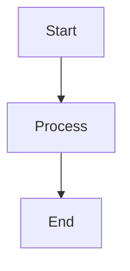

# Diagrams Directory

This directory contains Mermaid diagram source files that are used throughout the documentation.

## Structure
- `src/`: Contains the source `.mmd` files for all diagrams
- `rendered/`: Contains rendered diagrams (if using static images)
- `templates/`: Common diagram templates and styles

## Usage
1. Create new diagram files in the `src/` directory with `.mmd` extension
2. Use consistent naming: `[section]-[diagram-name].mmd`
3. Test diagrams using the Mermaid Live Editor before committing
4. Reference diagrams in documentation using relative paths

## Style Guide
- Use consistent colors from our theme
- Keep diagrams simple and focused
- Add comments for complex parts
- Include a title and description

## Common Colors
```
primaryColor: #326CE5
primaryTextColor: #fff
primaryBorderColor: #114BB7
lineColor: #114BB7
secondaryColor: #6C8EBF
tertiaryColor: #82B366
```

## Testing Process
1. Copy diagram source to [Mermaid Live Editor](https://mermaid.live)
2. Verify rendering and adjust as needed
3. Save working versions back to source files

## Example

