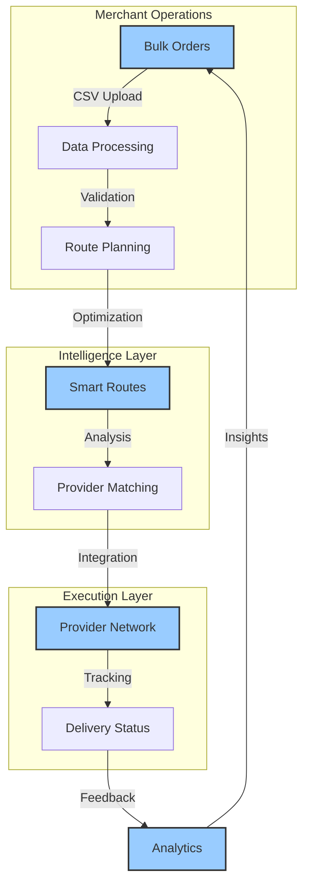
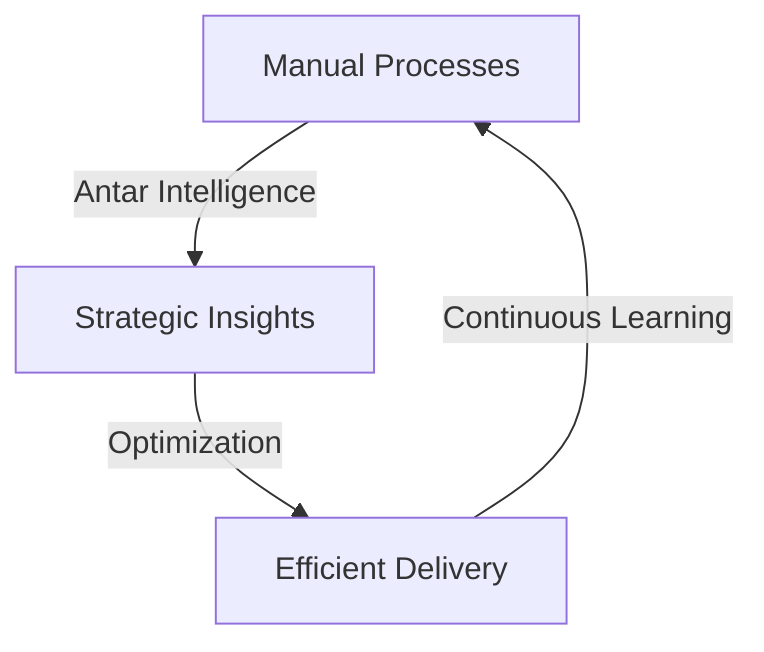
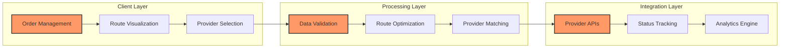
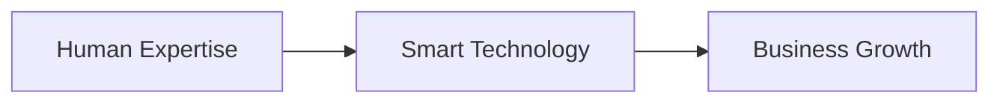
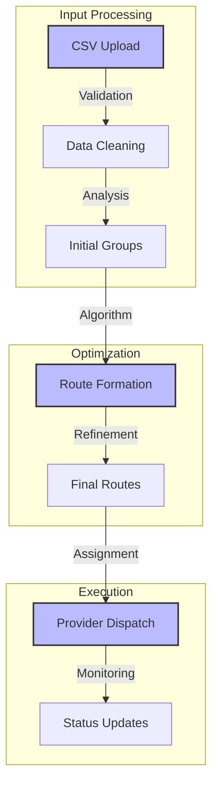
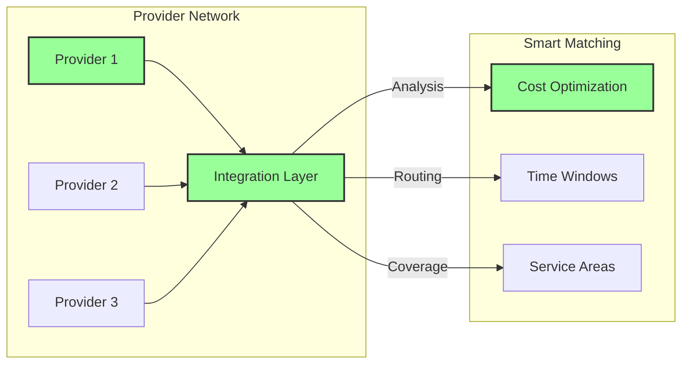
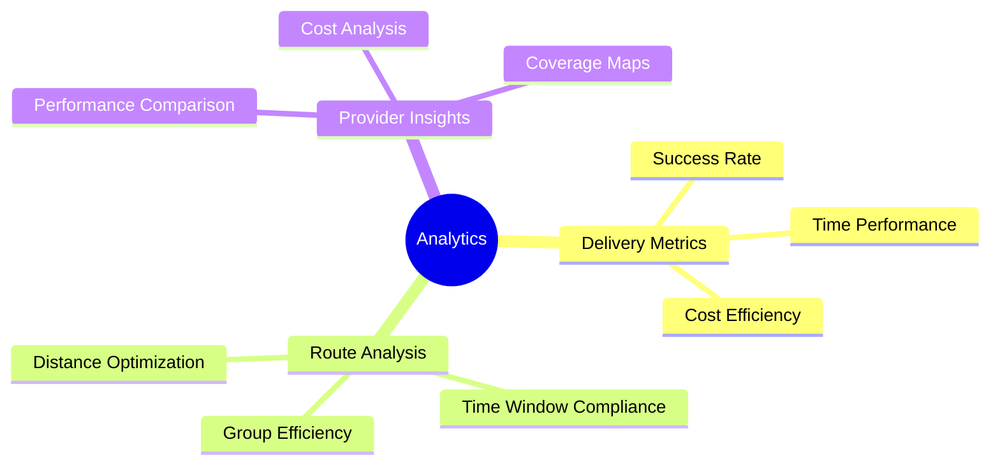

# Welcome to Antar

## Overview
Antar is transforming delivery operations across Southeast Asia through intelligent route optimization and seamless provider integration. Our platform empowers merchants to handle deliveries at scale, combining sophisticated processing capabilities with an intuitive interface that makes complex operations feel simple.

## The Hidden Cost of Ignorance

Mark stares at his screen. Another morning, another endless spreadsheet. Columns of delivery data stretch before him like an infinite desert of numbers. He's been doing this for years - manually tracking every shipment, believing this is just "how it's always been done."

What Mark doesn't know could be costing his company millions:
- Price variations across providers go unnoticed
- Routing inefficiencies bleed money silently
- Manual processes consume hours of productive time
- No real-time insights into delivery performance

In corporate offices across Southeast Asia, hundreds of Marks exist. Diligent workers trapped in a system that mistakes complexity for productivity.

**We don't just move data. We move businesses forward.**

## The Transformation: From Spreadsheets to Strategy

Mark's story isn't unique. It's a universal tale of potential trapped behind rows of data.

What if a spreadsheet could become a strategic weapon? What if those endless columns could whisper insights instead of demanding manual labor?

Antar doesn't just see logistics. We see the human potential buried beneath manual processes.

### How We Liberate Operational Intelligence

Imagine transforming Mark's daily grind:
- From manual data entry to strategic decision-making
- From isolated spreadsheets to connected insights
- From cost center to business accelerator

## Our Vision

Our platform creates a seamless connection between merchants and delivery providers:

## Our Vision: Intelligent Delivery Ecosystem

Our platform creates a seamless connection between human potential and technological innovation:

## Platform Architecture

Our system is built on three core layers that work together seamlessly:

## Platform Architecture: Turning Complexity into Clarity

Our system breaks down operational barriers:

Key Transformations:
- Data becomes strategy
- Complexity yields to simplicity
- Manual work transforms into strategic thinking

## Core Capabilities

### Intelligent Route Optimization

Our sophisticated routing system transforms complex delivery scenarios into efficient routes:

Key features include:
- Advanced grouping algorithms for optimal route formation
- Real-time distance and time window calculations
- Interactive map visualization for route review
- Manual adjustment capabilities for fine-tuning

### Unified Provider Integration

Connect with Southeast Asia's leading delivery providers through our intelligent integration layer:

Benefits include:
- Single integration for multiple providers
- Intelligent provider selection
- Automated cost optimization
- Comprehensive status tracking

### Business Intelligence

Make data-driven decisions with our comprehensive analytics suite:

## Documentation Overview

### Project Features
- [Bulk Upload Overview](./notebook/features/bulk-upload/README.md)

### Product Strategy
- Product Market Overview
- User Experience Insights

## Get Started

Transform your delivery operations with Antar. Our platform helps you:
- Process hundreds of orders efficiently
- Optimize routes automatically
- Connect with multiple providers seamlessly
- Track and analyze performance

Contact our team at hello@antar.my to learn how we can help your business grow.

*Antar - Delivering Southeast Asia, Intelligently*

*Last Updated: 2024-12-20T06:52:21+08:00*
