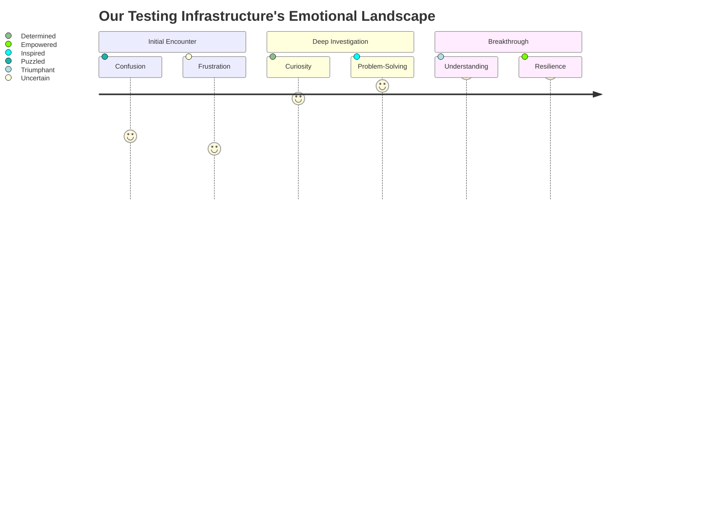
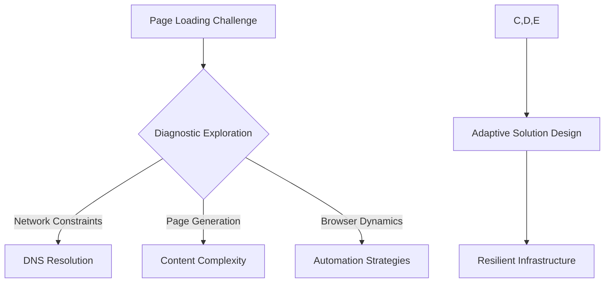

# The Human Story of Digital Resilience: Navigating Visual Testing Challenges 🌐

## Our Technical Odyssey

Imagine a world where every screenshot tells a story, where each page load is a delicate dance of technology and human intention. This is our journey through the intricate landscape of visual testing infrastructure.

### The Challenge: When Technology Hesitates
Our visual testing system encountered a profound moment of resistance—pages refusing to load, screenshots slipping through our fingers, network pathways becoming labyrinths of uncertainty.

## Emotional Topology of a Technical Challenge

## The Investigative Heartbeat: More Than Just Debugging

### Why We Persist
This isn't just about fixing a technical issue. It's about:
- Understanding the subtle language of our infrastructure
- Honoring the complexity of digital interactions
- Creating systems that breathe with human-like responsiveness

### Our Diagnostic Compassion
We approach each challenge not as a problem to be solved, but as a conversation to be understood.

## The Investigation: A Collaborative Narrative

### Phase 1: Listening to the Infrastructure
- **Manual Verification**: Walking in the user's shoes
- **Server Diagnostics**: Understanding the system's whispers
- **Network Mapping**: Tracing the invisible pathways

### Phase 2: Empathetic Analysis
Our investigation becomes a journey of discovery:
- Capturing the subtle rhythms of page loads
- Understanding the emotional landscape of network interactions
- Transforming technical constraints into opportunities

## Experimental Compassion: Timeout Strategy

### The 3-Second Hypothesis
What happens when we compress time? When we challenge our system to respond with lightning precision?

#### Experimental Parameters
- **Base Timeout**: 3 seconds of pure potential
- **Capture Strategy**: Minimal, yet profound
- **Core Question**: How does our system breathe under pressure?

## Decision Landscape: Navigating Uncertainty

## Learning Beyond the Code

### Philosophical Insights
- Technology is a dialogue, not a monologue
- Every timeout is an invitation to deeper understanding
- Resilience emerges from compassionate investigation

### Risks as Opportunities
What seems like a limitation is actually a portal to innovation:
- 3-second timeouts reveal system vulnerabilities
- False negatives become learning experiences
- Each challenge is a teacher

## Our Commitment: Continuous Evolution

### Tracking Our Journey
- **Investigation Started**: 2024-12-22
- **Core Intention**: Transform technical constraints into adaptive intelligence

## Reflection Prompt
How might we design systems that don't just work, but understand? That don't just respond, but communicate?

### Call to Collaborative Action
This document is more than documentation—it's an invitation to see technology through a lens of empathy, curiosity, and shared human potential.

*Our infrastructure is not just a collection of code, but a living ecosystem of possibility.*

---
*Last Updated*: 2024-12-22
*Authored with curiosity, resilience, and hope*
