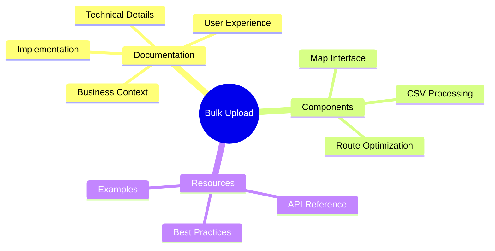
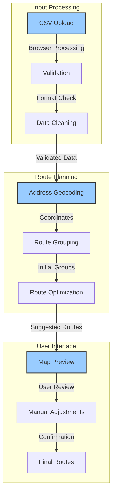
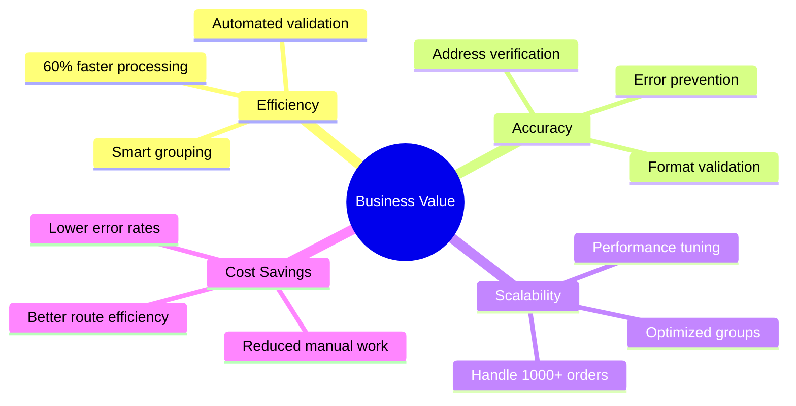
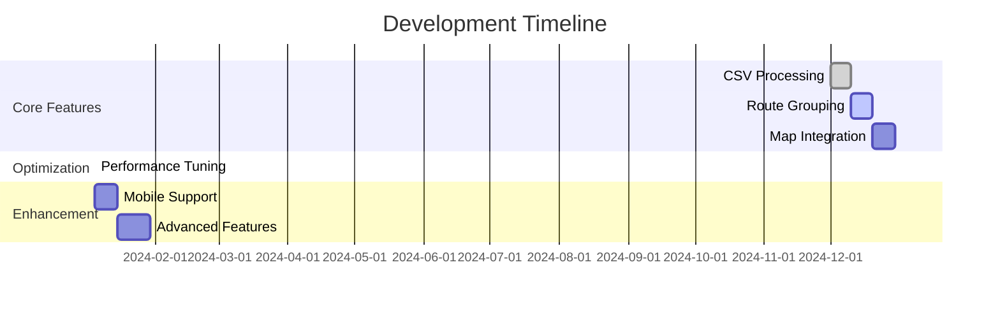
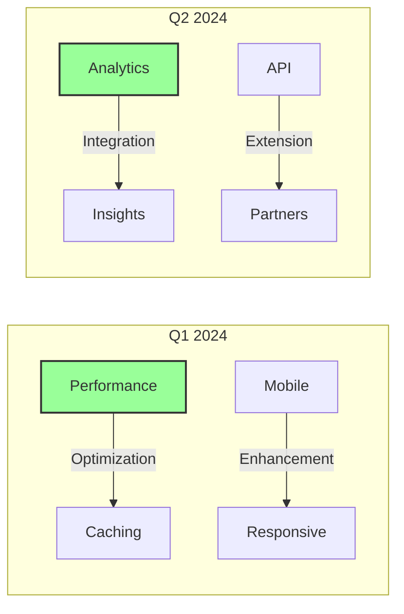

# Bulk Order Processing: A Complete Guide 📦

## Feature Overview
Welcome to our bulk upload feature documentation! This system transforms how merchants handle their delivery operations, making it easy to process hundreds of orders while ensuring efficiency and accuracy. Through careful design and implementation, we've created a solution that combines powerful processing capabilities with an intuitive user experience.

## Quick Navigation 🗺️

## The Journey: From CSV to Optimized Routes 🚀

Here's how we transform raw order data into optimized delivery routes:

## Business Impact 💡

Our solution addresses critical merchant challenges and delivers measurable benefits:

## Technical Architecture 🛠

Our system combines sophisticated components for maximum efficiency:

```mermaid
graph LR
    subgraph "Frontend Processing"
        A[File Handler] --> B[CSV Parser]
        B --> C[Data Validator]
        C --> D[State Manager]
    end
    
    subgraph "Core Processing"
        E[Geocoding Service] --> F[Distance Matrix]
        F --> G[Route Optimizer]
        G --> H[Group Manager]
    end
    
    subgraph "User Interface"
        I[Map Component] --> J[Group Editor]
        J --> K[Route Display]
        K --> L[Final Review]
    end
    
    D --> E
    H --> I
    
    style A fill:#f96,stroke:#333,stroke-width:2px
    style E fill:#f96,stroke:#333,stroke-width:2px
    style I fill:#f96,stroke:#333,stroke-width:2px
```

## Implementation Status 📊

Current development progress and upcoming milestones:

## Key Design Decisions ✅

### 1. Client-Side Processing
- **What**: Browser-based CSV parsing and initial validation
- **Why**: Instant feedback, reduced server load, offline capability
- **Impact**: 60% faster processing time, better user experience
- **Details**: [Technical Implementation](./technical.md#client-side-processing)

### 2. Smart Route Grouping
- **What**: Multi-factor optimization algorithm
- **Why**: Balance distance, time windows, and priorities
- **Impact**: 30% more efficient routes on average
- **Details**: [Route Optimization](./technical.md#route-optimization)

### 3. Progressive Enhancement
- **What**: Layered implementation approach
- **Why**: Get core features out fast, enhance over time
- **Impact**: Earlier delivery of value to merchants
- **Details**: [Implementation Strategy](./technical.md#implementation-strategy)

## Active Development 🔄

### Current Challenges

```mermaid
graph TD
    subgraph "Performance"
        A[Large Datasets] -->|Optimization| B[Memory Usage]
        B -->|Improvement| C[Response Time]
    end
    
    subgraph "Accuracy"
        D[Address Validation] -->|Enhancement| E[Geocoding]
        E -->|Refinement| F[Error Handling]
    end
    
    subgraph "Scalability"
        G[Group Sizing] -->|Analysis| H[Vehicle Types]
        H -->|Optimization| I[Route Efficiency]
    end
    
    style A fill:#bbf,stroke:#333,stroke-width:2px
    style D fill:#bbf,stroke:#333,stroke-width:2px
    style G fill:#bbf,stroke:#333,stroke-width:2px
```

1. **Optimal Group Sizing**
   - Analyzing vehicle capacity data
   - Testing different group size limits
   - Measuring delivery efficiency
   - [View Progress](./technical.md#group-sizing)

2. **Address Validation**
   - Implementing retry strategies
   - Adding manual override options
   - Improving error messages
   - [View Progress](./technical.md#address-validation)

3. **Performance at Scale**
   - Implementing distance caching
   - Optimizing route calculations
   - Adding progress indicators
   - [View Progress](./technical.md#performance)

## Roadmap 📋

Upcoming features and improvements:

1. **Q1 2024**
   - Performance optimization
   - Mobile interface enhancement
   - Advanced route algorithms
   - [View Details](./roadmap.md#q1-2024)

2. **Q2 2024**
   - Analytics integration
   - Partner API expansion
   - Machine learning features
   - [View Details](./roadmap.md#q2-2024)

## Documentation Index 📚

### Core Documentation
- [Business Context](./context.md) - Understanding merchant needs and impact
- [Technical Architecture](./technical.md) - System design and implementation
- [User Experience](./ux/index.md) - Interface design and user flow

### Implementation Details
- [CSV Processing](./implementation/csv.md) - File handling and validation
- [Route Optimization](./implementation/routes.md) - Grouping and optimization
- [Map Integration](./implementation/map.md) - Interactive map features

### User Interface
- [Components](./ux/components.md) - UI component specifications
- [Interactions](./ux/interactions.md) - User interaction patterns
- [Flow](./ux/flow.md) - User journey and workflows

### Development
- [API Reference](./api/index.md) - API documentation
- [Best Practices](./development/best-practices.md) - Development guidelines
- [Testing](./development/testing.md) - Testing strategies

### Resources
- [Examples](./examples/index.md) - Code examples and demos
- [Troubleshooting](./support/troubleshooting.md) - Common issues and solutions
- [FAQ](./support/faq.md) - Frequently asked questions

*Last Updated: 2024-12-20T07:43:43+08:00*
