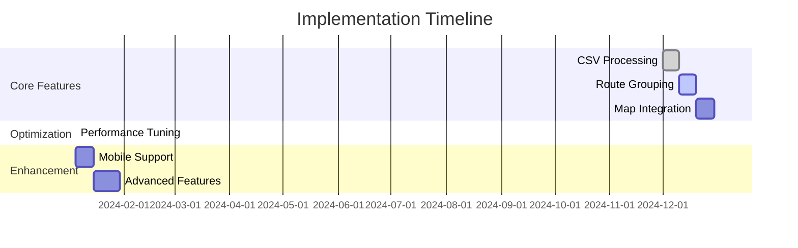

# Bulk Upload Implementation Overview

## Development Milestones

## Current Development Focus

### Implemented Features
- CSV file parsing
- Basic route grouping
- Initial map visualization

### Active Development
- Performance optimization
- Advanced routing algorithms
- Enhanced error handling

## Technology Stack
- Frontend: TypeScript, React
- Mapping: Mapbox GL JS
- State Management: Redux
- Testing: Jest, React Testing Library

## Related Documentation
- [Technical Architecture](/technical/architecture.md)
- [Performance Optimization](/technical/performance.md)
- [UX Guidelines](/ux/interface-guidelines.md)

*Last Updated: 2024-12-22*
