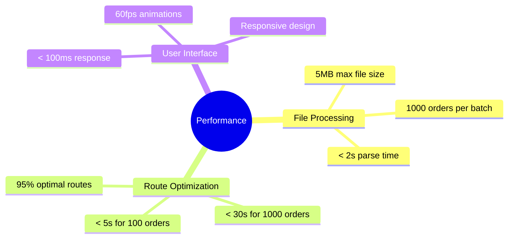
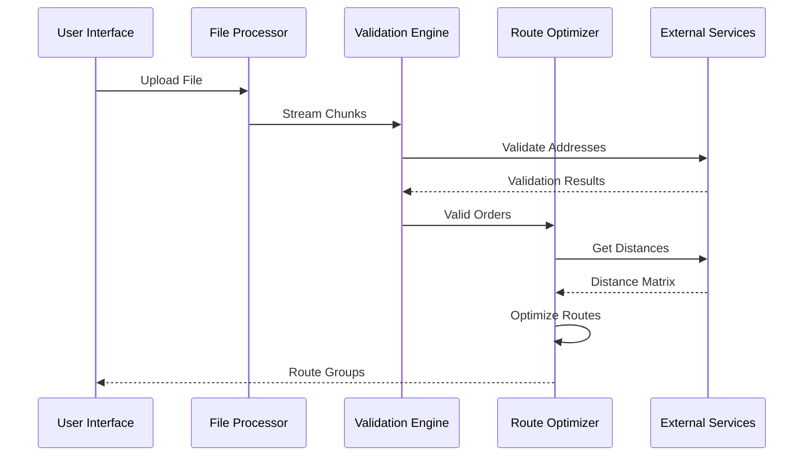
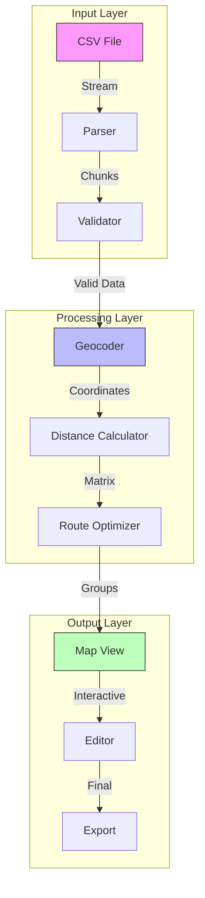
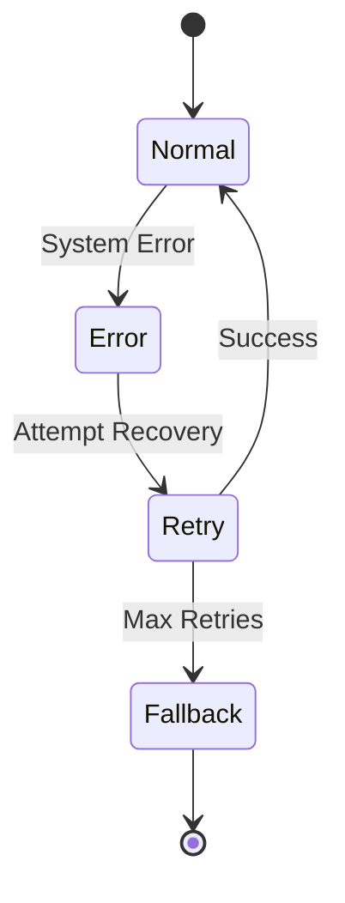

# Engineering Specifications

## System Requirements

### 1. Performance Targets



### 2. Technical Requirements

#### File Processing
```typescript
interface FileRequirements {
  maxFileSize: 5 * 1024 * 1024;  // 5MB
  allowedTypes: ['.csv'];
  maxRows: 1000;
  chunkSize: 1024 * 50;          // 50KB chunks
  workerThreads: 4;              // Parallel processing
}

interface ValidationRules {
  requiredFields: [
    'pickup_address',
    'delivery_address',
    'time_window',
    'priority'
  ];
  addressMaxLength: 200;
  timeWindowFormat: 'HH:mm-HH:mm';
  priorityRange: { min: 1, max: 5 };
}
```

#### Route Optimization
```typescript
interface OptimizationParams {
  maxOrdersPerGroup: 20;
  maxDistanceKm: 5;
  maxTotalDistance: 50;          // km per group
  maxTimeWindow: 4;              // hours
  restStopMinutes: 15;          // per 4 hours
  
  weights: {
    distance: 1.0;
    timeWindow: 2.0;
    priority: 1.5;
  };
  
  traffic: {
    peakHours: [8, 9, 17, 18];
    peakMultiplier: 1.5;
  };
}
```

#### User Interface
```typescript
interface UIRequirements {
  mapUpdateInterval: 500;        // ms
  progressUpdateInterval: 200;   // ms
  minimumInteractionDelay: 16;   // ms (60fps)
  
  responsive: {
    mobile: 320;                // px
    tablet: 768;
    desktop: 1024;
    widescreen: 1440;
  };
}
```

## System Architecture

### 1. Component Interaction



### 2. Data Flow



## Integration Points

### 1. External Services

#### Geocoding Service
```typescript
interface GeocodingConfig {
  provider: 'google' | 'mapbox';
  rateLimit: 50;                // requests per second
  cacheExpiry: 7 * 24 * 3600;  // 7 days in seconds
  timeout: 5000;               // ms
}
```

#### Map Services
```typescript
interface MapConfig {
  provider: 'google' | 'mapbox';
  updateInterval: 500;         // ms
  maxMarkers: 1000;
  clustering: true;
  styles: MapStyle[];
}
```

#### Distance Matrix
```typescript
interface DistanceConfig {
  provider: 'google' | 'mapbox';
  batchSize: 25;              // addresses per request
  cacheExpiry: 24 * 3600;    // 1 day in seconds
  timeout: 10000;            // ms
}
```

### 2. Internal Systems

#### State Management
```typescript
interface StateConfig {
  persistence: 'local' | 'session';
  syncInterval: 1000;         // ms
  maxHistorySize: 50;        // actions
  cleanupInterval: 300000;   // 5 minutes
}
```

#### Cache Management
```typescript
interface CacheConfig {
  strategy: 'lru' | 'fifo';
  maxSize: 1000;             // entries
  cleanupInterval: 3600000;  // 1 hour
  persistenceKey: string;
}
```

## Error Handling

### 1. Error Types
```typescript
type SystemError =
  | 'FILE_TOO_LARGE'
  | 'INVALID_FORMAT'
  | 'NETWORK_ERROR'
  | 'PROCESSING_ERROR'
  | 'OPTIMIZATION_ERROR';

interface ErrorConfig {
  retryAttempts: 3;
  retryDelay: 1000;          // ms
  fallbackStrategy: 'cache' | 'default';
  errorReporting: boolean;
}
```

### 2. Recovery Strategy



## Performance Optimization

### 1. Processing Strategy
```typescript
interface ProcessingConfig {
  chunkProcessing: true;
  parallelization: true;
  workerThreads: 4;
  batchSize: 100;            // items per batch
  
  optimization: {
    earlyTermination: true;
    approximation: 0.95;     // 95% optimal
    timeLimit: 30000;        // ms
  };
}
```

### 2. Memory Management
```typescript
interface MemoryConfig {
  maxHeapUsage: 512;         // MB
  garbageCollection: 'auto';
  cleanupThreshold: 0.8;     // 80% usage
  
  monitoring: {
    enabled: true;
    interval: 60000;         // ms
    alertThreshold: 0.9;     // 90% usage
  };
}
```

## Development Guidelines

### 1. Code Quality
- TypeScript for type safety
- ESLint for code style
- Jest for testing
- 80% test coverage minimum

### 2. Performance Metrics
- < 2s initial load time
- < 100ms interaction response
- < 5s processing time for 100 orders
- < 16ms frame time (60fps)

### 3. Security Requirements
- HTTPS only
- API key encryption
- XSS prevention
- CSRF protection

## Next Steps

1. Review [Implementation Guide](./index.md)
2. Study [CSV Upload](./csv-upload.md)
3. Explore [Route Optimization](./route-grouping.md)

*Last Updated: 2024-12-20T08:05:42+08:00*
