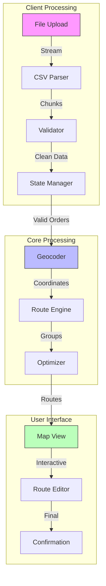
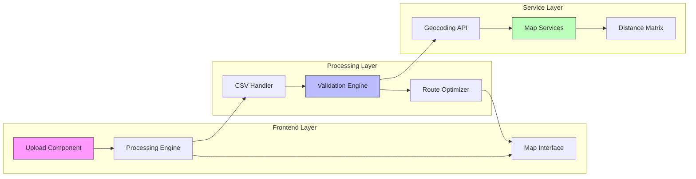
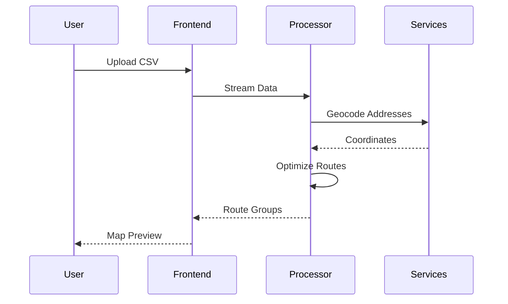
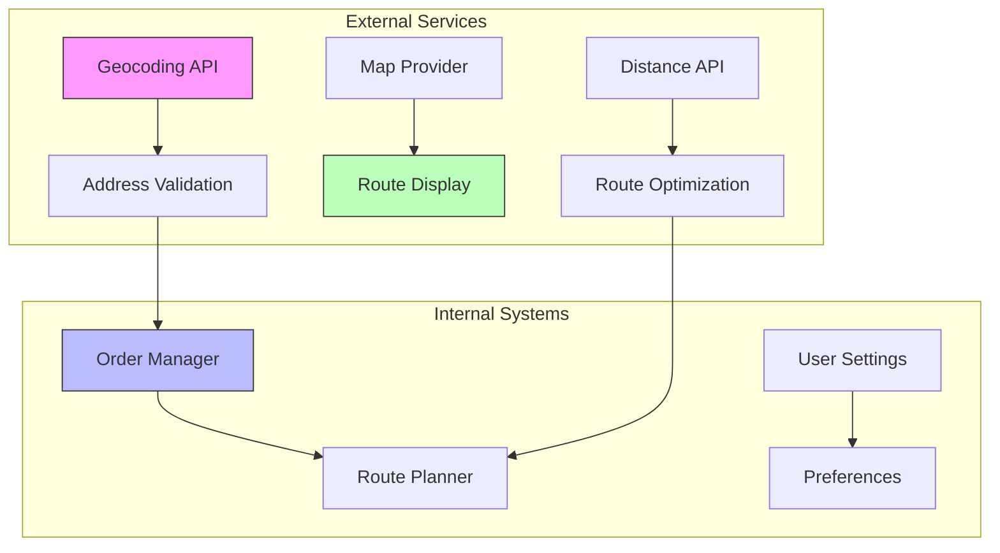

# Bulk Upload Implementation Guide

## System Overview

The bulk upload system transforms CSV order data into optimized delivery routes through a sophisticated processing pipeline.

## Feature Components

### 1. File Processing
- Client-side CSV parsing
- Streaming for large files
- Real-time validation
- Progress tracking

### 2. Data Processing
- Address geocoding
- Distance calculations
- Route optimization
- Group management

### 3. User Interface
- Interactive map
- Route visualization
- Group editing
- Progress indicators

## Technical Architecture

## Implementation Guides

### 1. Core Components
- [CSV Upload Implementation](./csv-upload.md)
  - File handling
  - Validation rules
  - Error management
  
- [Route Grouping System](./route-grouping.md)
  - Grouping algorithm
  - Optimization strategy
  - Performance tuning

### 2. Technical Specifications
- [Engineering Specifications](./engineering-specifications.md)
  - System requirements
  - Performance targets
  - Integration points

### 3. Frontend Integration
- [Frontend Components](./frontend/index.md)
  - UI components
  - State management
  - Map integration

## Development Flow

## Performance Considerations

### 1. File Processing
- Chunk-based parsing
- Worker thread processing
- Memory management
- Progress indicators

### 2. Route Optimization
- Efficient algorithms
- Caching strategy
- Background processing
- Real-time updates

### 3. User Interface
- Responsive design
- Progressive loading
- Error recovery
- Visual feedback

## Integration Points

## Development Resources

### 1. Code Examples
- [Implementation Examples](./examples/index.md)
  - Upload components
  - Validation rules
  - Route optimization

### 2. Technical Guides
- [Development Guides](./guides/index.md)
  - Setup instructions
  - Best practices
  - Performance tips

## Next Steps

1. Review the [Engineering Specifications](./engineering-specifications.md)
2. Explore the [CSV Upload Implementation](./csv-upload.md)
3. Study the [Route Grouping System](./route-grouping.md)

*Last Updated: 2024-12-20T08:05:42+08:00*
