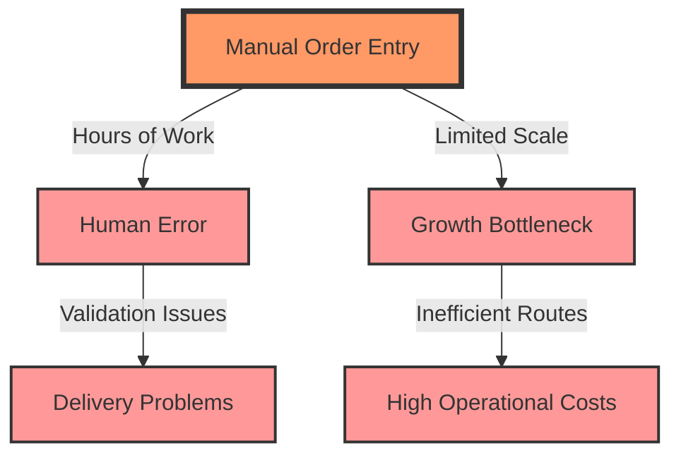
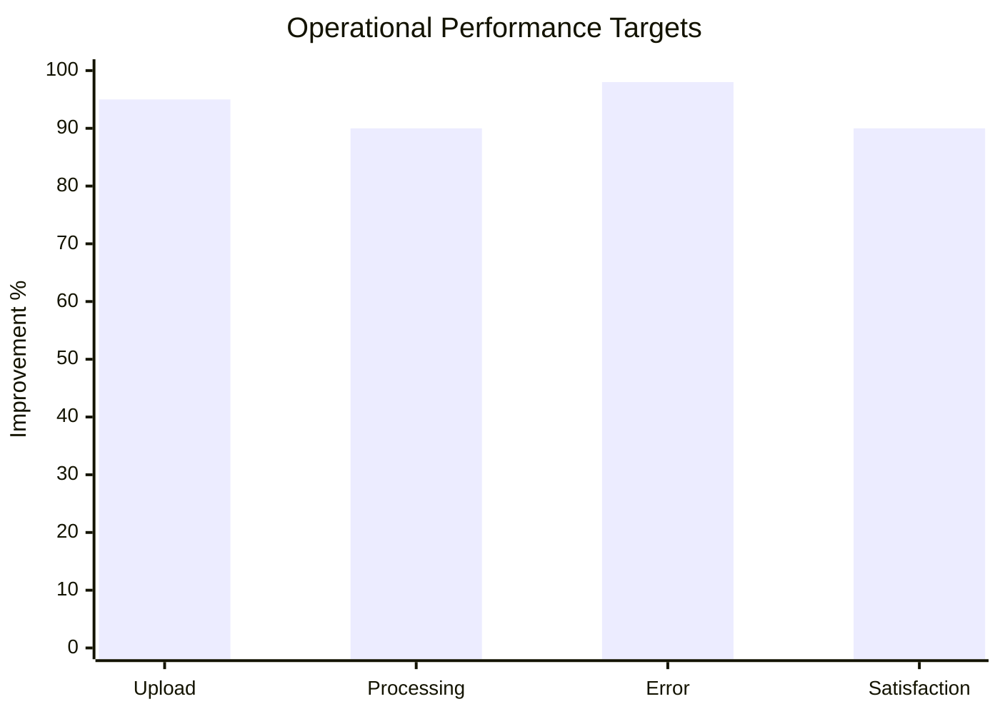

# Merchant Delivery Challenges: The Need for Bulk Upload

## Business Problem Landscape

Our bulk upload feature emerged from direct conversations with merchants like Aisyah, Lina, and Muthu, who face significant challenges in managing delivery operations. The core issues can be summarized in three critical dimensions:

### 1. Manual Order Processing Bottlenecks

Traditional order management creates substantial operational friction:

### 2. Scalability Constraints

Merchants are constrained by manual processes that limit their ability to grow:

- **Time Investment**: Hours spent on data entry
- **Error Rate**: High potential for mistakes
- **Processing Capacity**: Limited number of orders per day

### 3. Operational Inefficiencies

The manual approach creates multiple layers of inefficiency:

## Solution Design Principles

To address these challenges, we designed our bulk upload feature with three core objectives:

1. **Automation**: Reduce manual data entry
2. **Accuracy**: Minimize human error
3. **Scalability**: Enable rapid order processing

### Key Solution Capabilities

- Instant CSV upload
- Automatic address validation
- Intelligent route grouping
- Visual order confirmation
- Batch processing support

## Merchant Impact Metrics

Our solution aims to transform merchant operations:

### Expected Outcomes

- **Time Savings**: 60% reduction in order processing time
- **Error Reduction**: Less than 2% error rate
- **Scalability**: From 50 to 500 daily deliveries
- **Operational Efficiency**: Simplified logistics management

## Related Documentation

### Technical Resources
- [System Architecture](../technical/architecture.md)
- [Interface Guidelines](../ux/interface-guidelines.md)
- [Performance Metrics](../technical/performance.md)

*Last Updated: 2024-12-22*
