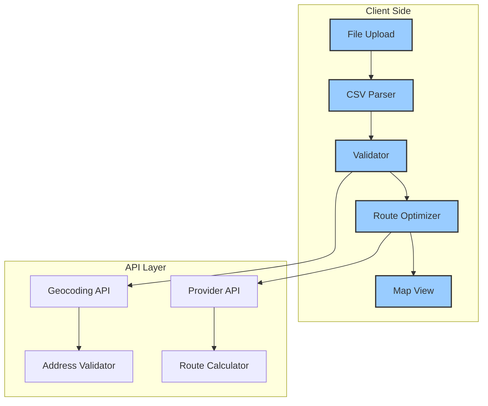

# Bulk Upload Technical Architecture

## System Overview

Our bulk upload system is a sophisticated, multi-layered architecture designed for performance, scalability, and user experience:



## Key Components

### 1. File Upload System
- **Technology**: TypeScript
- **Core Interface**:
```typescript
interface FileUploadProps {
  onUpload: (file: File) => Promise<void>;
  onValidate: (data: OrderData[]) => ValidationResult;
  maxFileSize: number;
}
```

### 2. Processing Pipeline


## Performance Optimization

### Strategies
- Chunked Processing
- Web Workers
- Distance Caching
- Progressive Loading

## Related Documentation
- [File Upload Component](./components/file-upload.md)
- [Route Grouping](./components/route-grouping.md)
- [Performance Optimization](./performance.md)

*Last Updated: 2024-12-22*
