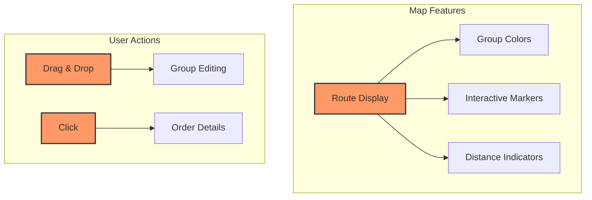

# Map Visualization: Interactive Route Display

## Component Design Philosophy

The map visualization transforms complex routing data into an intuitive, interactive user experience.



## TypeScript Interface

```typescript
interface MapVisualizationProps {
  groups: OrderGroup[];
  onGroupEdit: (groupId: string, orders: Order[]) => void;
  mapProvider: MapProvider;
  initialViewport: Viewport;
}
```

## Interaction Capabilities

### 1. Visual Grouping
- Color-coded route groups
- Dynamic marker clustering
- Adaptive zoom levels

### 2. User Interaction
- Drag-and-drop route reassignment
- Detailed order information popups
- Real-time route recalculation

### 3. Performance Optimization
- Lazy loading of map tiles
- Efficient marker rendering
- Minimal re-render strategies

## Rendering Techniques
- WebGL acceleration
- Efficient DOM manipulation
- Responsive design principles

## Accessibility Considerations
- High contrast modes
- Keyboard navigation
- Screen reader support

## Related Documentation
- [Technical Architecture](/technical/architecture.md)
- [Route Grouping](/technical/components/route-grouping.md)

*Last Updated: 2024-12-22*
