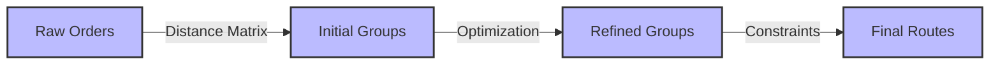

# Route Grouping Engine: Optimization Strategies

## Core Algorithm Design

The route grouping engine transforms raw delivery data into optimized, efficient routes through a sophisticated multi-stage process.



## TypeScript Interface

```typescript
interface RouteGroupProps {
  orders: Order[];
  groupingStrategy: GroupingStrategy;
  constraints: RouteConstraints;
  onGroupingComplete: (groups: OrderGroup[]) => void;
}
```

## Optimization Dimensions

### 1. Distance Minimization
- Euclidean distance calculations
- Nearest neighbor clustering
- Dynamic route recalculation

### 2. Time Window Constraints
- Delivery time preferences
- Vehicle capacity limits
- Priority order handling

### 3. Cost Efficiency
- Fuel consumption modeling
- Route length optimization
- Minimal vehicle switching

## Machine Learning Integration
- Predictive route suggestions
- Historical performance analysis
- Continuous algorithm improvement

## Performance Metrics
- Average route efficiency
- Grouping computation time
- Constraint satisfaction rate

## Related Documentation
- [Technical Architecture](/technical/architecture.md)
- [Performance Optimization](/technical/performance.md)

*Last Updated: 2024-12-22*
