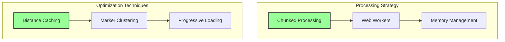
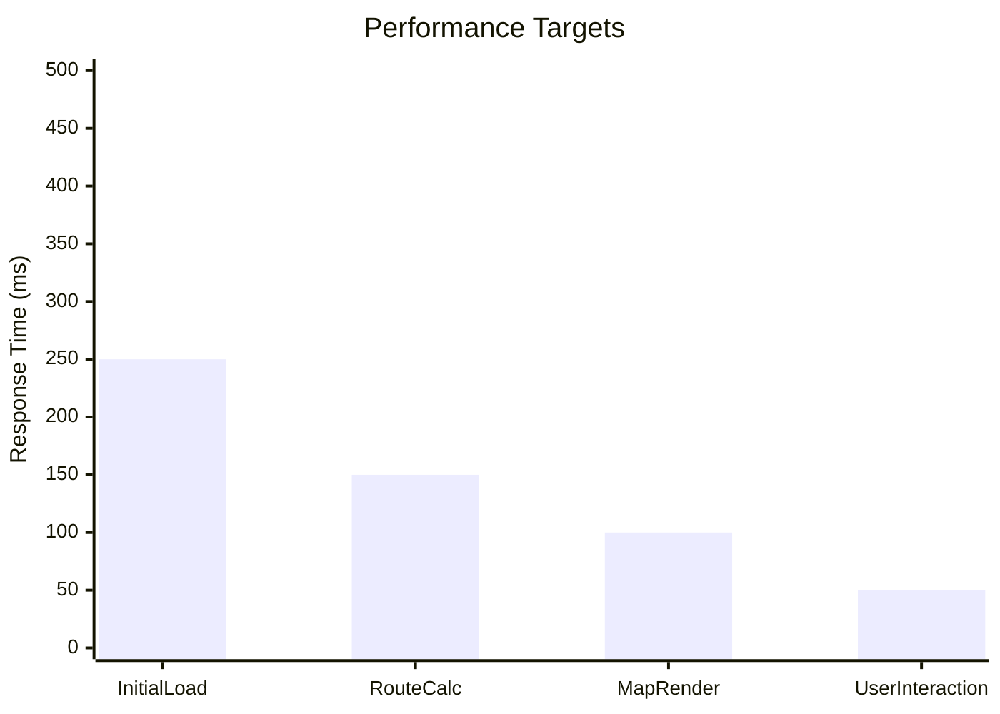

# Performance Optimization Strategies

## Comprehensive Performance Architecture

## Key Optimization Dimensions

### 1. Client-Side Processing
- Leverage browser's computational power
- Minimize server round trips
- Provide instant user feedback

### 2. Efficient Data Handling
- Implement lazy loading techniques
- Use memory-efficient data structures
- Optimize JavaScript execution

### 3. Rendering Performance
- Utilize WebGL for map rendering
- Implement virtual scrolling
- Minimize DOM manipulations

## Benchmarking Metrics

## Caching Strategies
- Geolocation result caching
- Route calculation memoization
- Browser storage utilization

## Related Documentation
- [Technical Architecture](./architecture.md)
- [Route Grouping](./components/route-grouping.md)

*Last Updated: 2024-12-22*
