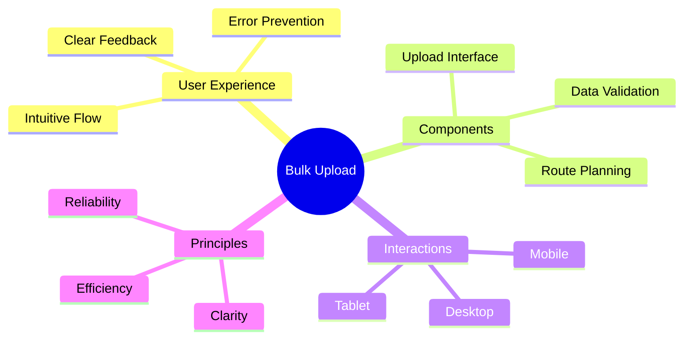
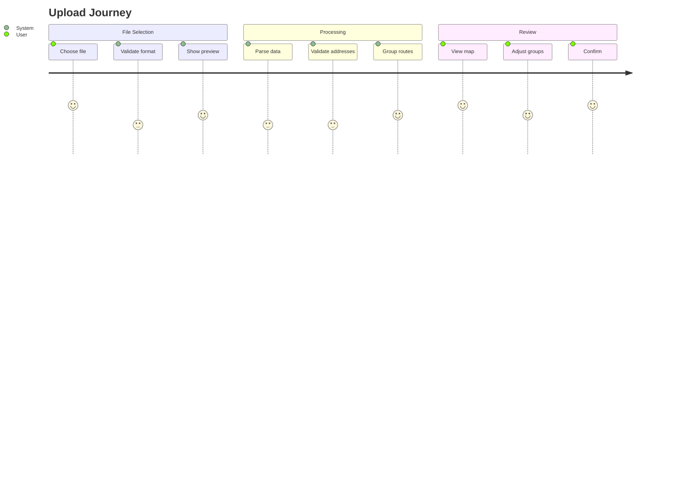
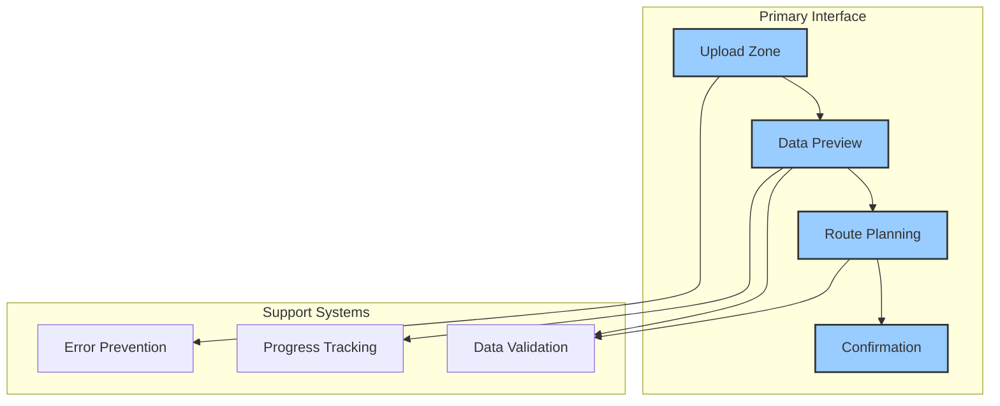
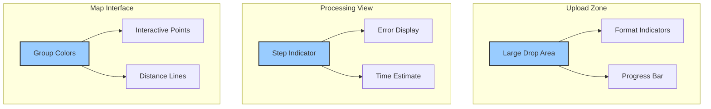
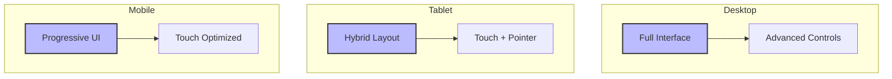
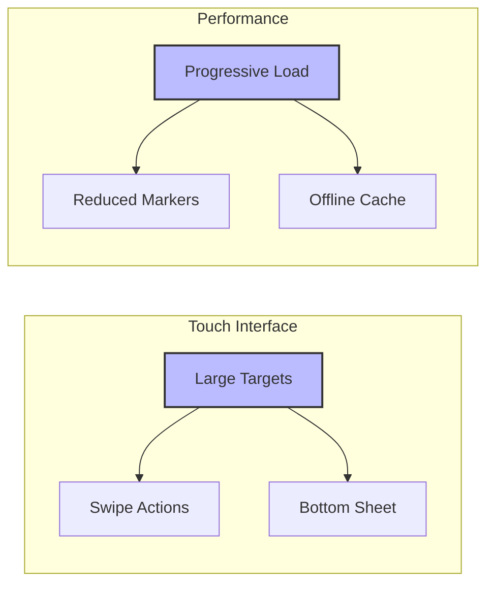
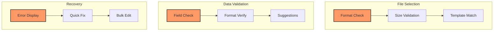
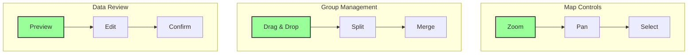
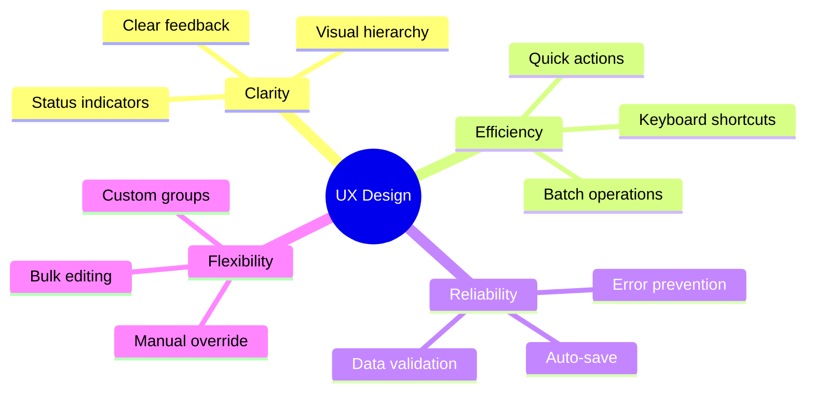
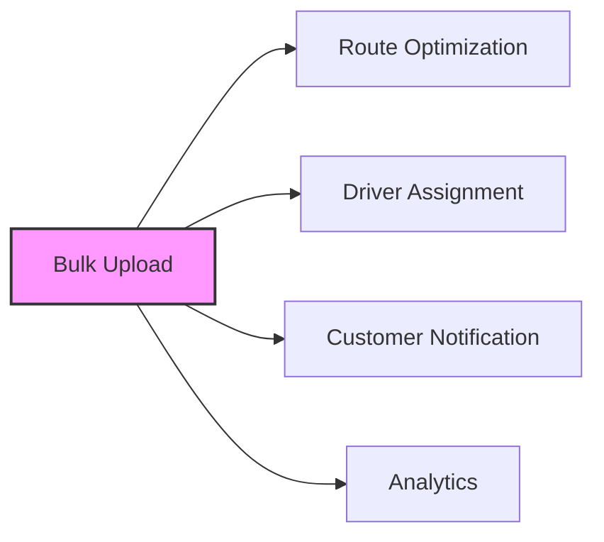

# Crafting the Bulk Upload Experience

The bulk upload feature combines powerful functionality with intuitive design, transforming complex delivery management operations into a streamlined, user-friendly process. This document outlines our comprehensive approach to user experience design, from high-level principles to specific implementation details.

## Experience Overview

## User Journey

Understanding how users interact with the system is crucial. We've mapped out a journey that guides them smoothly from file selection to final confirmation:

### Journey Analysis
- **High Satisfaction Points (5)**
  - File selection: Simple, familiar interaction
  - Map view: Visual confirmation of data
  - Final confirmation: Clear completion
- **System Processes (3-4)**
  - Format validation: Quick, automated
  - Address verification: Background process
  - Route grouping: Intelligent assistance

## Interface Architecture

Our interface is built on three foundational principles: clarity, feedback, and control. Each component is designed to work seamlessly with others while maintaining its distinct purpose.

### Component Integration

### Component Details

## Cross-Platform Experience

Our interface adapts seamlessly across devices while maintaining functionality and usability.

### Responsive Design Strategy

### Mobile Optimizations

## Error Prevention & Recovery

Our multi-layered approach to error handling ensures data quality while maintaining user confidence.

### Validation Layers

## Interactive Elements

Our interactive elements combine power with intuitive design, making complex operations feel natural.

### Interaction Flow

## Design Principles

Our core principles guide every aspect of the interface design:

### Principle Implementation
1. **Clarity**
   - Consistent visual language
   - Clear state indicators
   - Progressive disclosure
   - Contextual help

2. **Efficiency**
   - Optimized workflows
   - Keyboard shortcuts
   - Bulk operations
   - Smart defaults

3. **Reliability**
   - Robust validation
   - Auto-save
   - Error recovery
   - Data integrity

4. **Flexibility**
   - Customization options
   - Multiple workflows
   - Power user features
   - Accessibility support

## Integration Points

The bulk upload experience integrates with several other system components:

## Related Documentation
For more detailed information about specific aspects:
- [Component Specifications](./components.md) - Detailed component documentation
- [User Flow](./flow.md) - Complete user flow documentation
- [Interaction Design](./interactions.md) - Interaction patterns and behaviors
- [Technical Implementation](../technical.md) - Implementation details
- [Feature Context](../context.md) - Business context and decisions
- [Mobile Design](./mobile.md) - Mobile-specific considerations

*Last Updated: 2024-12-20T07:43:43+08:00*
