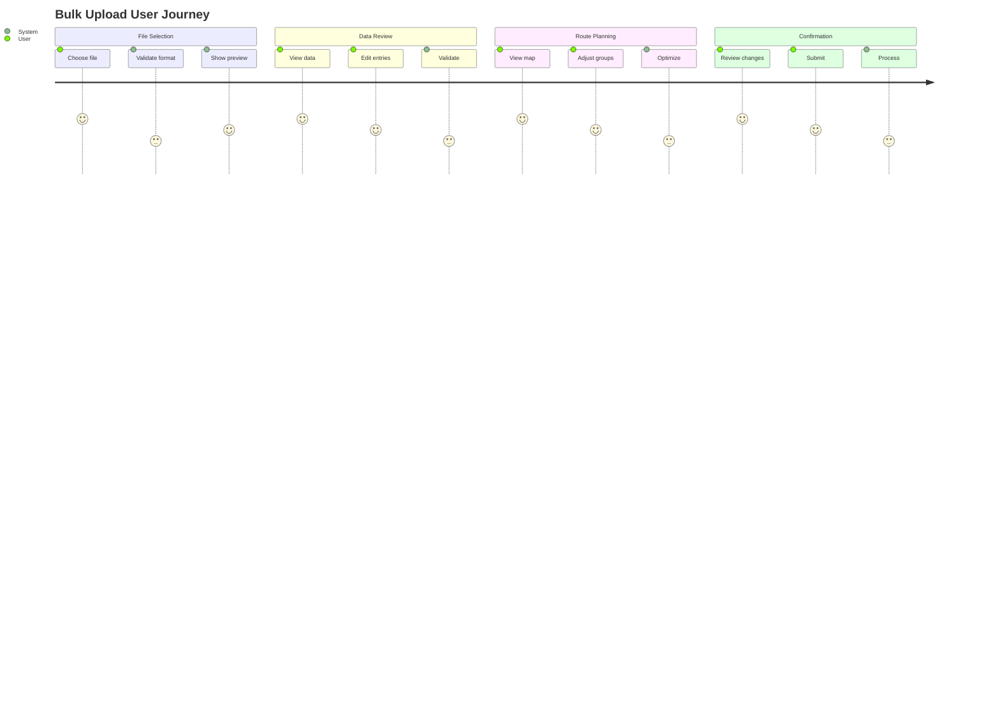
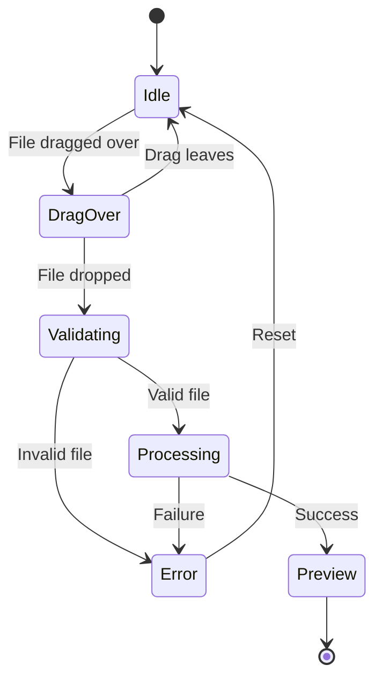
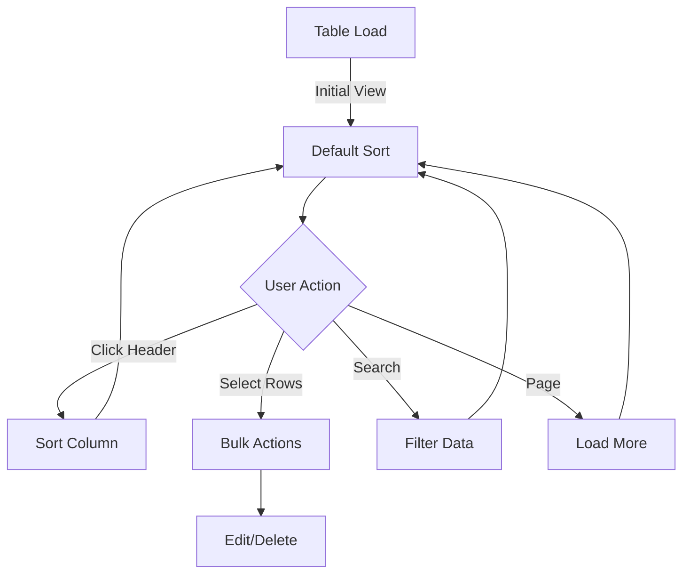
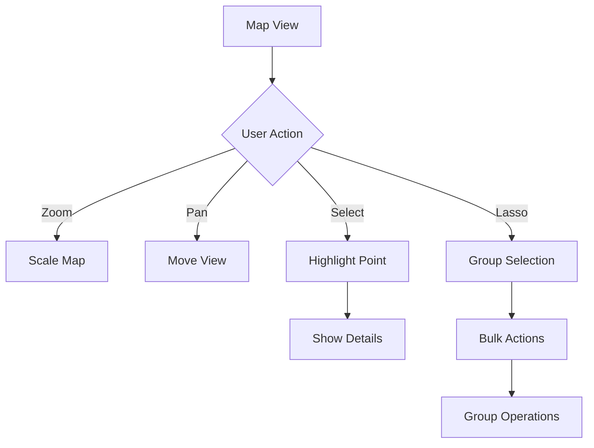
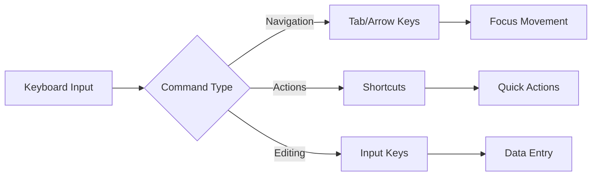
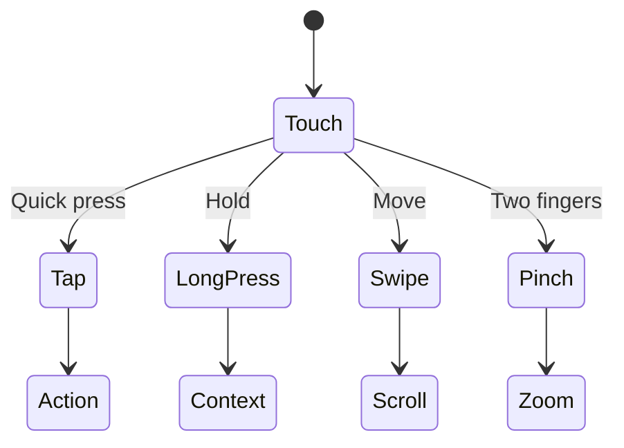

# User Interactions

Our bulk upload system is designed around natural, intuitive interactions that guide users through complex operations while maintaining efficiency and accessibility. Each interaction is carefully crafted to provide immediate feedback and clear progression through the upload process.

## User Journey Map

## File Upload Interactions

The file upload process is the user's first interaction with our system. It's crucial that this experience is smooth and confidence-inspiring.

### Drag and Drop Flow

1. User drags file over drop zone
   - Zone highlights with visual feedback
   - "Drop to upload" message appears
2. User drops file
   - Immediate file type validation
   - Progress indicator shows upload status
3. Upload completion
   - Success/error feedback
   - Transition to preview stage

### Manual File Selection
1. Click "Browse" button
   - Native file picker opens
   - File type filter applied (.csv)
2. File selection
   - Same validation and feedback as drag-drop
   - Consistent progress indication

## Data Preview Interactions

The data preview stage is where users verify and refine their upload. The interface must balance comprehensive data display with easy navigation and editing capabilities.

### Table Navigation Flow

### Table Navigation
- Column sorting by clicking headers
- Row selection with checkboxes
- Pagination controls
- Search/filter functionality

### Data Editing
1. Double-click cell to edit
2. Tab navigation between cells
3. Bulk edit selected rows
4. Undo/redo capabilities

## Route Group Management

Route management combines spatial and data interactions, requiring careful consideration of both map and list-based interfaces.

### Map Interaction Flow

### Map Interactions
- Zoom: scroll wheel/pinch
- Pan: click and drag
- Select: click on markers
- Group selection: lasso tool

### Group Adjustments
1. Drag deliveries between groups
2. Auto-rebalance option
3. Manual group creation
4. Group splitting/merging

## Keyboard Navigation

Keyboard support ensures efficiency for power users and accessibility for all users.

### Navigation
- `Tab`: Move between interactive elements
- `Enter`: Confirm/submit
- `Esc`: Cancel/close
- `Ctrl+Z`: Undo
- `Ctrl+Y`: Redo

### Data Manipulation
- `Ctrl+C`: Copy
- `Ctrl+V`: Paste
- `Delete`: Remove selected
- `Ctrl+A`: Select all

## Accessibility

Our accessibility support ensures the system is usable by everyone, regardless of their abilities or preferred interaction methods.

### Interaction Support Matrix

| Feature | Mouse | Keyboard | Touch | Screen Reader |
|---------|--------|-----------|--------|---------------|
| File Upload | ✓ | ✓ | ✓ | ✓ |
| Data Navigation | ✓ | ✓ | ✓ | ✓ |
| Editing | ✓ | ✓ | ✓ | ✓ |
| Map Control | ✓ | ✓ | ✓ | ✓ |
| Group Management | ✓ | ✓ | ✓ | ✓ |

### Keyboard Navigation
- Full keyboard accessibility
- Focus indicators
- Skip navigation links
- ARIA landmarks

### Screen Reader Support
- Meaningful labels
- Status announcements
- Error descriptions
- Progress updates

## Mobile Interactions

Mobile support focuses on touch-optimized interfaces while maintaining full functionality.

### Touch Interaction Flow

### Touch Gestures
- Swipe to scroll
- Pinch to zoom
- Long press for context menu
- Double tap to edit

### Responsive Adjustments
- Stack layouts on small screens
- Touch-friendly hit areas
- Simplified controls
- Optimized table view
