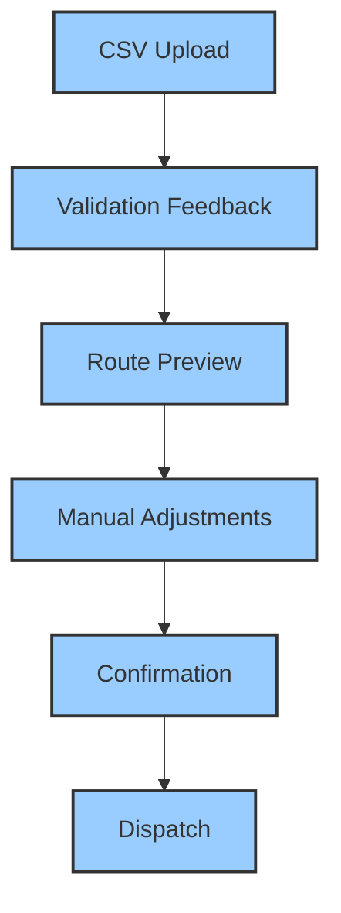

# User Experience Design Guidelines

## Design Principles

1. **Clarity**: Make complex processes simple
2. **Efficiency**: Minimize user effort
3. **Feedback**: Provide immediate, contextual information
4. **Flexibility**: Support diverse user workflows

## User Journey Mapping

## Interface Components

### 1. File Upload
- Drag-and-drop support
- Format validation
- Progress indicators
- Clear error messaging

### 2. Route Visualization
- Color-coded route groups
- Interactive map editing
- Distance and time estimates
- Responsive design

### 3. Confirmation Flow
- Summary of route groups
- Estimated delivery metrics
- One-click dispatch
- Undo/modify options

## Accessibility Considerations
- High contrast modes
- Keyboard navigation
- Screen reader compatibility
- Internationalization support

## Related Documentation
### Technical References
- [System Architecture](../technical/architecture.md)

### UX Guidelines
- [Error Handling](./error-handling.md)

*Last Updated: 2024-12-22*
