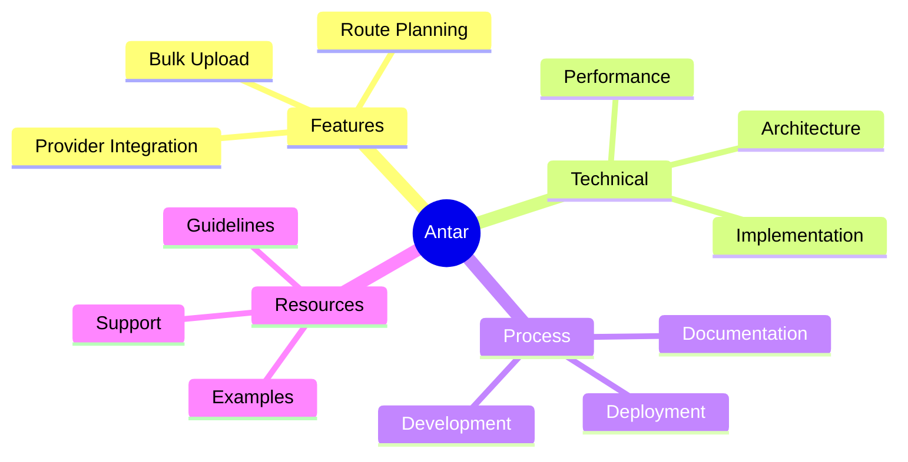
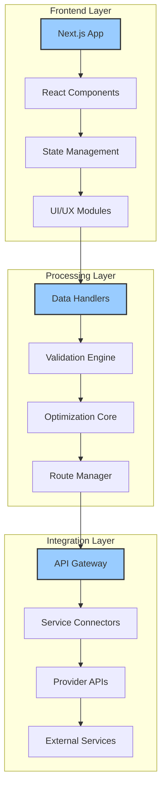
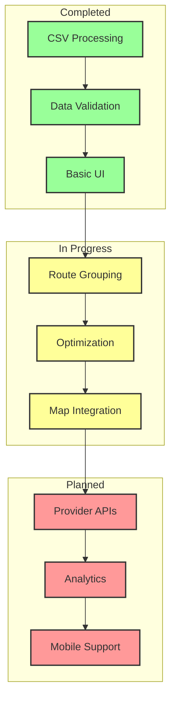
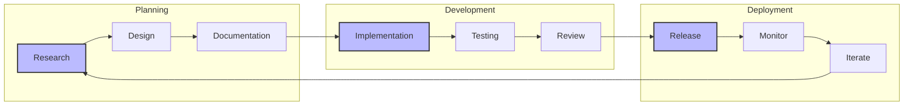
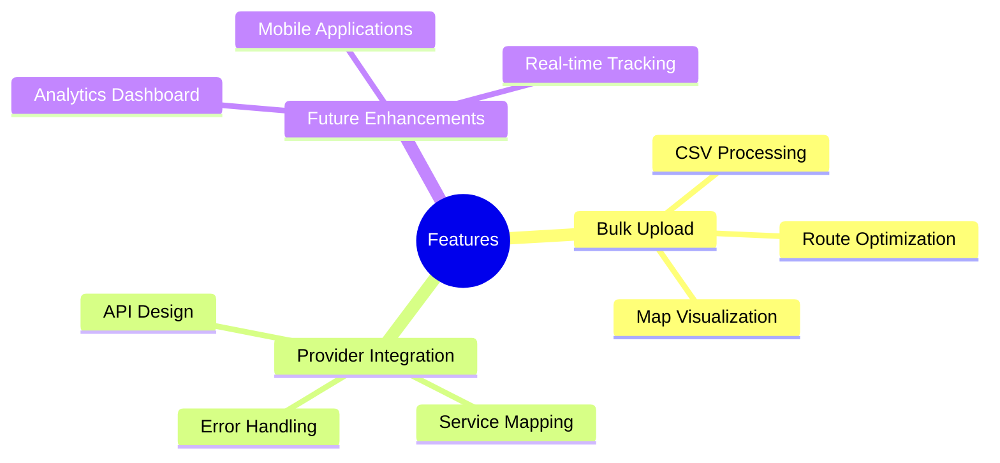
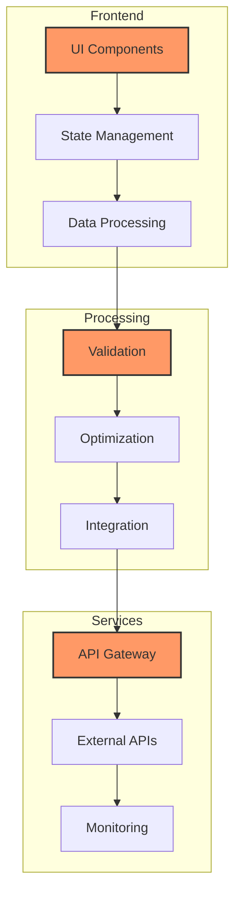
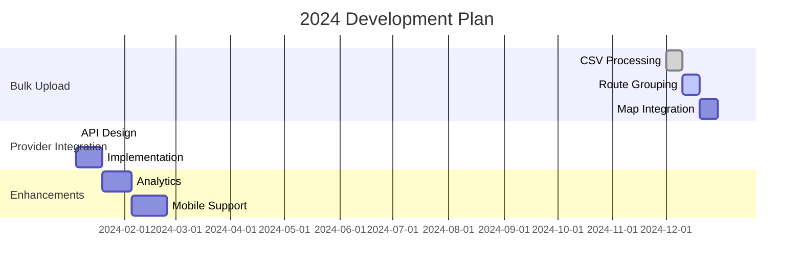

# Development Journey: Building Antar 🚀

## Quick Navigation

## Overview
Welcome to our development notebook! This is where we document our journey building Antar, a sophisticated delivery management system. Through careful architecture and user-centric design, we're creating tools that help merchants handle deliveries more efficiently and scale their operations effectively.

## System Architecture

Our architecture emphasizes modularity, performance, and user experience:

## Current Development Focus

### Bulk Upload MVP Status

## Development Process

Our iterative development approach ensures quality and maintainability:

## Feature Areas

Current and planned features addressing merchant needs:

## Technical Implementation

### Core Components

### Implementation Strategy
1. **Client-Side Processing**
   - Browser-based CSV parsing
   - Real-time validation
   - Memory optimization

2. **Route Optimization**
   - Advanced algorithms
   - Distance calculations
   - Time constraints

3. **User Interface**
   - Interactive maps
   - Group management
   - Error handling

## Development Timeline

## Documentation Structure

### Feature Documentation
- Bulk Upload Overview
  - Context & Requirements
  - Technical Implementation
  - User Experience
  - Development Guide

### Technical Documentation
- System Architecture
  - System Design
  - Data Flow
  - Integration Approach

### Process Documentation
- Development Process
  - Coding Standards
  - Review Workflow
  - Deployment Strategies

### Guidelines & Resources
- Best Practices
- Performance Guidelines
- Security Standards
- API Insights

## Contributing

To contribute to this documentation:
1. Follow the documentation standards
2. Update relevant sections
3. Keep diagrams and examples current
4. Maintain cross-references
5. Update timestamps

Remember: This notebook is a living document that evolves with our development. We continuously update it to reflect new learnings and decisions.

*Last Updated: 2024-12-20T07:43:43+08:00*
