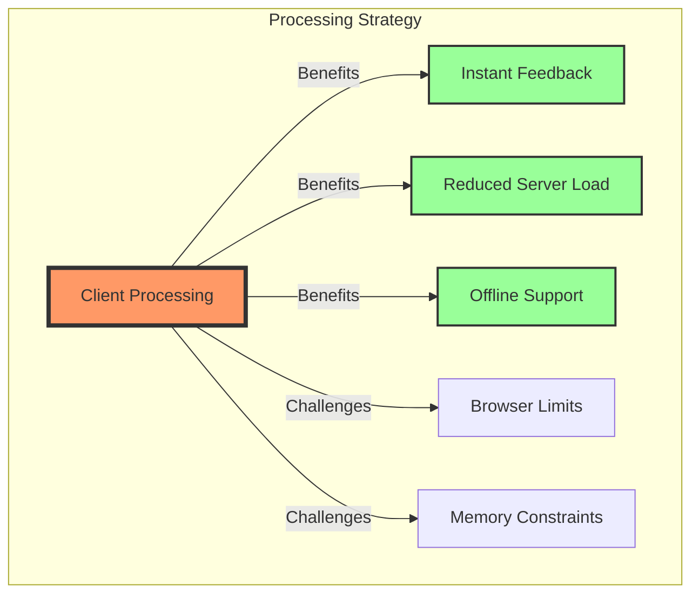
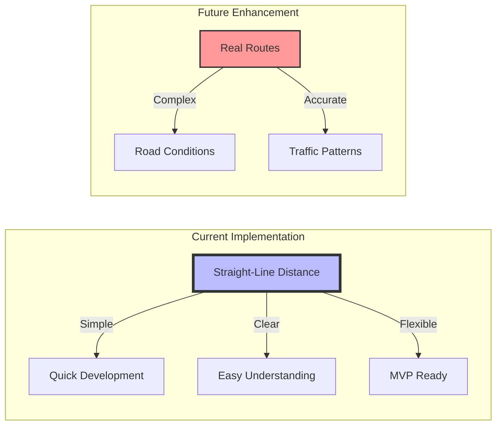
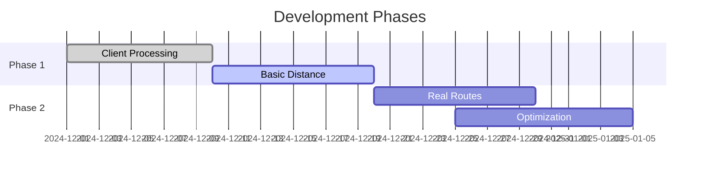
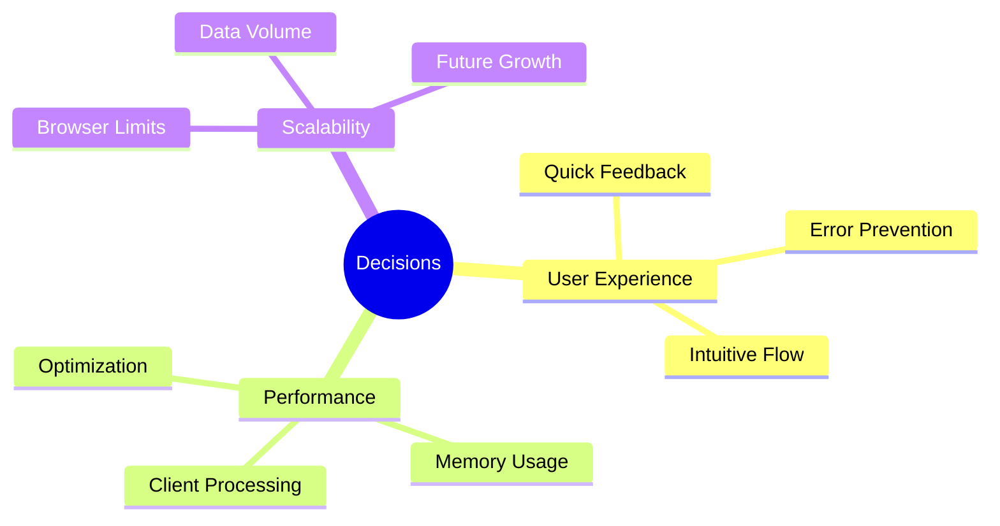
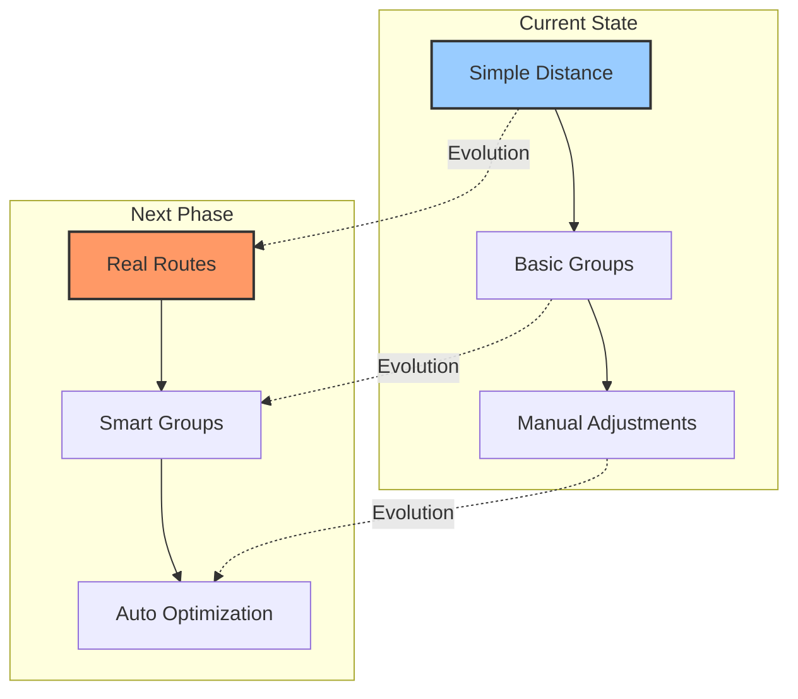

# Engineering Decisions & Rationale

Our development journey is shaped by careful consideration of technical choices and their impact. Here's how we're building Antar's foundation.

## Bulk Upload Architecture

## Route Optimization Approach

## Implementation Timeline

## Decision Impact Analysis

## Technical Evolution

Through these decisions, we're building a foundation that balances immediate needs with future scalability. Our choices prioritize user experience while maintaining technical excellence.

## Related Documentation
- [Technical Implementation](../features/bulk-upload/technical.md)
- [Architecture Overview](../tech/architecture/index.md)

*Last Updated: 2024-12-20T06:40:39+08:00*
