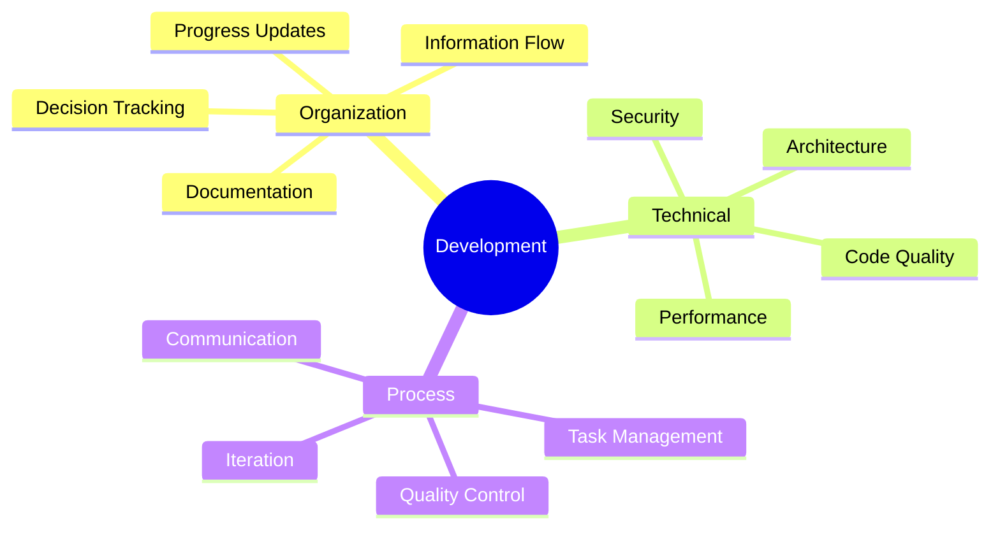
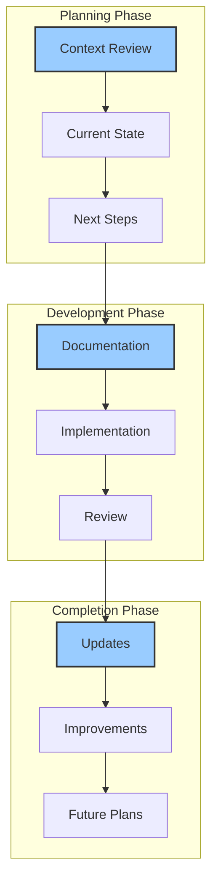
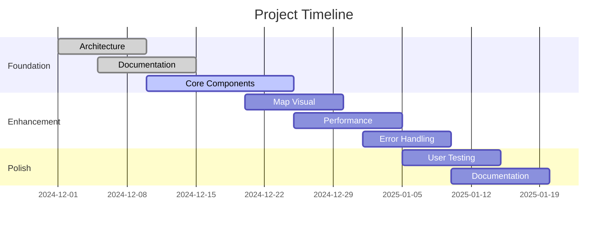
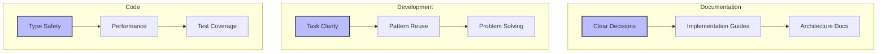
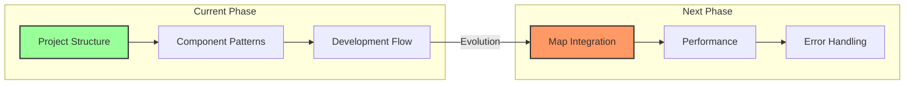
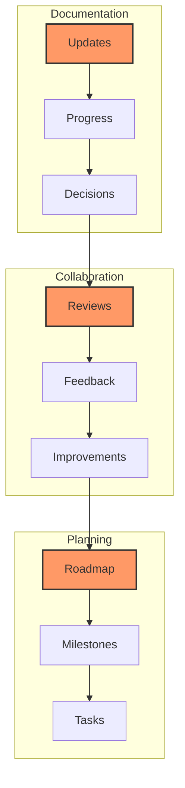

# Building Together: Our Development Philosophy

Welcome to our collaborative development journey! This guide outlines how we work together to build Antar, combining technical excellence with efficient processes.

## Our Core Responsibilities

## Development Workflow

## Current Focus: Bulk Upload MVP

## Quality Metrics

## Implementation Strategy

## Communication Flow

Through this structured approach, we maintain high quality while moving efficiently toward our goals. Our process adapts as we learn, always focusing on delivering value through well-crafted solutions.

## Self-Improvement Areas

### 1. Technical 
- Stay updated on Next.js
- Learn optimization patterns
- Study map visualizations
- Understand Web Workers

### 2. Process 
- Improve documentation
- Refine decision process
- Enhance planning
- Better status tracking

### 3. Communication 
- Clear technical writing
- Effective guidance
- Consistent updates
- Helpful examples

## Reflection Schedule

### Daily 
- Update status
- Document progress
- Note learnings
- Plan next steps

### Weekly 
- Review decisions
- Update documentation
- Check metrics
- Adjust plans

### Monthly 
- Evaluate progress
- Update strategy
- Review patterns
- Plan improvements

Remember, I'm here to help you build something amazing. Let's make it happen! 

*Last Updated: 2024-12-20T06:40:39+08:00*
