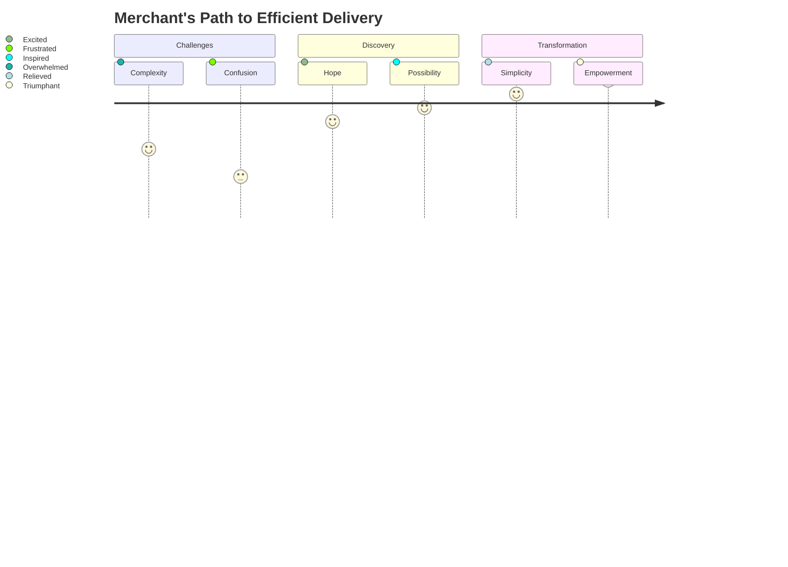
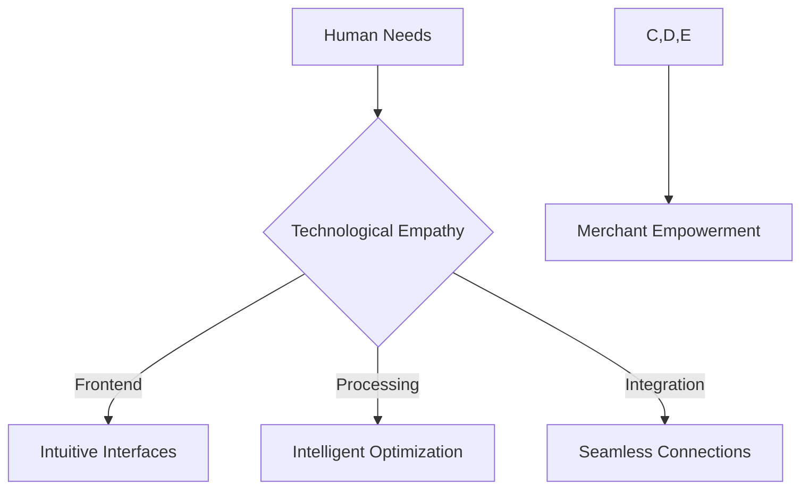
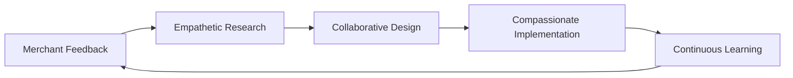

# The Antar Journey: Reimagining Delivery Management 🚀

## Our Human Story

Imagine a world where merchants can effortlessly manage deliveries, where complexity transforms into simplicity, and where technology becomes a compassionate partner in business growth.

### The Challenge
Merchants face overwhelming logistics challenges:
- Fragmented delivery processes
- Complex route planning
- Limited visibility
- Scalability struggles

### Our Vision
Antar isn't just a software—it's a collaborative solution that understands the human behind the business.

## The Emotional Architecture of Antar

### Why We Build
Our motivation goes beyond code:
- Empowering small businesses
- Reducing logistical stress
- Creating human-centric technology

### The Journey of Understanding

## Technical Compassion: Our Design Philosophy

### Modular Humanity
Our architecture isn't just technically sound—it's emotionally intelligent:

### Learning Paths
We recognize that every merchant's journey is unique:

1. **Beginner's Landscape**
   - Simplified onboarding
   - Guided feature exploration
   - Supportive learning environment

2. **Growing Business**
   - Advanced route optimization
   - Scalable integrations
   - Adaptive system design

3. **Enterprise Evolution**
   - Custom API solutions
   - Comprehensive analytics
   - Strategic growth support

## Development as a Collaborative Narrative

### Our Iterative Heartbeat
Development isn't a linear process—it's a living, breathing conversation:

## Reflection: Beyond Features

### What We're Really Building
- Trust, not just technology
- Simplicity, not complexity
- Partnership, not just a product

## Invitation to Our Journey
This documentation is an open invitation. It's not just about what we've built, but about the collective potential we're unlocking together.

### Pro Wisdom
- Technology serves humanity
- Complexity is the enemy of execution
- Every line of code tells a story

## Continuous Evolution Commitment
Our work is never finished—it's always becoming.

### Call to Collaborative Action
Join us in reimagining delivery management. Your insights, your challenges, your dreams are the true architecture of Antar.
