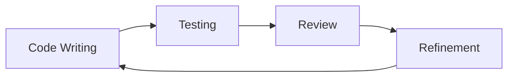

# The Frontend Development Journey: Crafting Digital Experiences with Intention 🚀

## Our Philosophical Approach

We don't just write code—we create experiences, solve problems, and build bridges of understanding.

### The Human Behind the Technology
Our frontend is more than pixels and interactions. It's a conversation between technology and human needs.

## Technology Landscape

For a comprehensive overview of our technology ecosystem, please refer to the [Frontend README](README.md).

## Development Workflow: A Collaborative Symphony

### Project Initialization
Our journey begins with intentional setup:

1. **Tool Selection**
   - Bun: Lightning-fast JavaScript runtime
   - Next.js: Intelligent React framework
   - TypeScript: Bringing clarity and safety to our code

2. **Configuration with Compassion**
   - Thoughtful dependency management
   - Performance-first approach
   - Flexibility for team creativity

### Testing: Our Quality Compass

For an in-depth look at our testing strategy, visit the [Testing Strategy](testing-strategy.md) documentation.

#### Testing Layers
- **Unit Tests**: Validate individual functions
- **Component Tests**: Ensure UI component integrity
- **E2E Tests**: Simulate real-world user journeys

### Continuous Improvement Ritual



## Technology Stack Deep Dive

For detailed version information and setup instructions, see the [Project Setup Guide](project-setup.md).

## Onboarding: Your First Steps

### Prerequisite Knowledge Checklist
✅ Basic JavaScript/TypeScript
✅ React fundamentals
✅ Modern web development concepts

### Detailed Setup Guide
```bash
# 1. Install development environment
curl -fsSL https://bun.sh/install | bash
bun --version  # Verify installation

# 2. Clone and prepare project
git clone https://github.com/your-org/antar.git
cd antar/frontend
bun install

# 3. Configuration Verification
bun run config:check  # Custom script to validate setup
```

### Troubleshooting Companion 🚨

#### Common Setup Challenges
1. **Bun Installation Issues**
   - Ensure you have latest Node.js
   - Check system PATH
   - Alternative: Use `npm` as fallback

2. **Dependency Conflicts**
   ```bash
   # Resolve potential conflicts
   bun install --force
   bun update
   ```

3. **Performance Optimization**
   - Use `bun install --cached` for faster installs
   - Regularly update dependencies
   - Monitor `bunfig.toml` configurations

## Learning Pathways 🌱

### Recommended Learning Track
1. **Foundations** (1-2 weeks)
   - TypeScript Deep Dive
   - React Hooks Mastery
   - State Management Principles

2. **Framework Expertise** (2-3 weeks)
   - Next.js Advanced Patterns
   - Server-Side Rendering
   - Static Site Generation

3. **Testing Mastery** (1-2 weeks)
   - Unit Testing Strategies
   - Component Testing
   - End-to-End Workflow Automation

### Community and Collaboration 🤝

#### Knowledge Sharing Rituals
- **Weekly Tech Talks**
  - Share insights
  - Discuss challenging implementations
  - Collaborative problem-solving

- **Pair Programming Sessions**
  - Cross-skill knowledge transfer
  - Mentorship opportunities
  - Real-time code review

#### Feedback Mechanisms
- Open GitHub Discussions
- Quarterly Documentation Hackathons
- Continuous Improvement Surveys

## Contribution Guidelines

For the most up-to-date contribution process and tasks, check the [Tasks Document](tasks.md).

## Emerging Technologies Watch 🔭
- WebAssembly Integration
- AI-Assisted Development
- Serverless Architectures
- Edge Computing Patterns

## Challenges and Growth

### Common Hurdles
- Tool compatibility
- Learning curve
- Performance optimization

### Our Approach
- Continuous learning
- Supportive documentation
- Embracing complexity with curiosity

## Reflection Prompt
How can we transform technical challenges into opportunities for growth and understanding?

## Pro Wisdom
- Code is communication
- Tests are conversations with future you
- Complexity is the enemy of reliability

## Commitment to Craft
This is not just documentation—it's an invitation to a shared journey of technological exploration and human-centered design.

*Last Updated*: 2024-02-20
*Crafted with ❤️ by the Antar Frontend Team*
