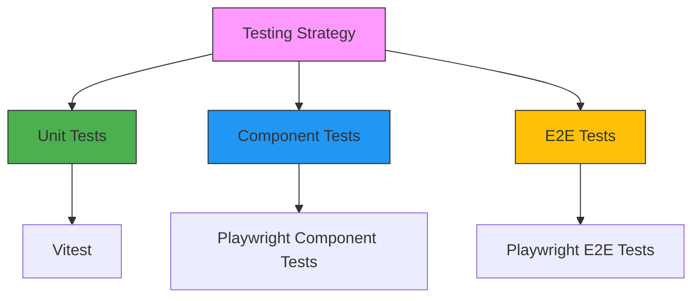

# Frontend Testing Strategy for Antar Delivery Management System

## Related Documentation
- [Project Setup Guide](/docs/notebook/tech/frontend/project-setup.md): Comprehensive project initialization instructions
- For a comprehensive overview of our technology ecosystem, please refer to the [Frontend README](README.md).

## Version Information
- **Version**: 1.1.0
- **Last Updated**: 2024-02-20
- **Compatibility**: 
  - Bun: 1.0.x+
  - Next.js: 14.x+
  - TypeScript: 5.x+

## Overview

Our testing strategy is designed to ensure robust, performant, and maintainable frontend code through a comprehensive multi-layered testing approach.

## Testing Pyramid



## Testing Tools

### 1. Unit Testing: Vitest
- **Framework**: Vitest
- **Purpose**: Fast, lightweight unit testing
- **Key Features**:
  - Native ESM support
  - Instant test feedback
  - Seamless Vite integration
  - TypeScript first-class support

### 2. Component Testing: Playwright
- **Framework**: Playwright Experimental Component Testing
- **Purpose**: Validate React components in isolation
- **Key Features**:
  - Real browser rendering
  - Cross-browser support
  - Interaction testing
  - Snapshot capabilities

### 3. End-to-End Testing: Playwright
- **Framework**: Playwright
- **Purpose**: Full application workflow testing
- **Key Features**:
  - Real browser automation
  - Network interception
  - Mobile device emulation
  - Visual regression testing

## Project Setup

### Dependencies
```bash
# Install testing dependencies
bun add -D vitest 
bun add -D @testing-library/react 
bun add -D @testing-library/user-event
bun add -D @types/vitest 
bun add -D jsdom 
bun add -D c8
bun add -D @playwright/test 
bun add -D @playwright/experimental-ct-react
bunx playwright install
```

## Project Structure

For detailed project setup instructions, visit the [Project Setup Guide](project-setup.md).

```plaintext
antar/
├── src/
│   └── ... (application code)
├── tests/
│   ├── unit/           # Vitest unit tests
│   │   └── lib/
│   │   └── hooks/
│   ├── components/     # Playwright component tests
│   │   └── ui/
│   │   └── features/
│   └── e2e/            # Playwright E2E tests
│       └── workflows/
├── vitest.config.ts    # Vitest configuration
└── playwright.config.ts
```

## Configuration Files

### Vitest Configuration (vitest.config.ts)
```typescript
import { defineConfig } from 'vitest/config';
import react from '@vitejs/plugin-react';

export default defineConfig({
  plugins: [react()],
  test: {
    globals: true,
    environment: 'jsdom',
    setupFiles: ['./test-setup.ts'],
    coverage: {
      provider: 'v8',
      reporter: ['text', 'json', 'html'],
      threshold: {
        branches: 80,
        functions: 80,
        lines: 80,
        statements: 80
      }
    }
  }
});
```

### Test Types and Examples

#### 1. Unit Test (Vitest)
```typescript
// Example: Utility function test
import { describe, it, expect } from 'vitest';
import { formatDeliveryStatus } from '@/lib/utils';

describe('Delivery Utility Functions', () => {
  it('formats delivery status correctly', () => {
    expect(formatDeliveryStatus('pending')).toBe('Pending');
    expect(formatDeliveryStatus('completed')).toBe('Completed');
  });
});
```

#### 2. Component Test (Playwright)
```typescript
// Example: Component interaction test
import { test, expect } from '@playwright/experimental-ct-react';
import DeliveryCard from '@/components/DeliveryCard';

test('renders delivery card with interaction', async ({ mount }) => {
  const onDetailClick = vi.fn();
  const component = await mount(
    <DeliveryCard 
      delivery={mockDelivery} 
      onDetailClick={onDetailClick} 
    />
  );
  
  await component.getByText('View Details').click();
  expect(onDetailClick).toHaveBeenCalledTimes(1);
});
```

#### 3. E2E Test (Playwright)
```typescript
// Example: Full delivery workflow test
import { test, expect } from '@playwright/test';

test('complete delivery creation workflow', async ({ page }) => {
  await page.goto('/dashboard');
  
  await page.click('button:has-text("New Delivery")');
  await page.fill('input[name="customer"]', 'Test Customer');
  await page.click('button[type="submit"]');
  
  await expect(page.locator('text=Test Customer')).toBeVisible();
  await expect(page.locator('text=Pending')).toBeVisible();
});

## CI/CD Integration

### GitHub Actions Workflow
```yaml
name: Frontend Testing
on: [push, pull_request]
jobs:
  test:
    runs-on: ubuntu-latest
    steps:
      - uses: actions/checkout@v4
      - uses: oven-sh/setup-bun@v1
      - run: bun install
      - run: bun test
      - run: bun run test:coverage
      - uses: actions/upload-artifact@v3
        with:
          name: test-coverage
          path: coverage
```

## Best Practices

For the latest tasks and improvements, check the [Tasks Document](tasks.md).

1. **Coverage Targets**
   - Aim for 80%+ test coverage
   - Prioritize critical path testing

2. **Test Organization**
   - Keep tests close to source code
   - Use descriptive test names
   - Test both happy and edge cases

3. **Performance**
   - Use Vitest's watch mode during development
   - Leverage parallel test execution
   - Minimize test setup and teardown overhead

## Continuous Improvement

- Regularly review and update test strategies
- Conduct periodic test suite performance audits
- Encourage team-wide testing culture

## Recommended Learning Resources

- [Vitest Documentation](https://vitest.dev/)
- [Playwright Testing Guide](https://playwright.dev/docs/intro)
- [React Testing Library](https://testing-library.com/docs/react-testing-library/intro/)

## Troubleshooting

- Ensure all team members have compatible environments
- Use consistent Node.js and Bun versions
- Keep testing dependencies up to date
