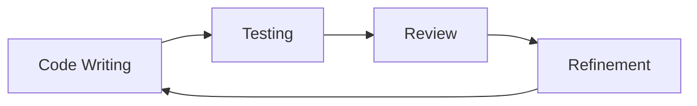

# Development Workflow: A Collaborative Symphony

## Project Initialization
Our journey begins with intentional setup:

1. **Tool Selection**
   - Bun: Lightning-fast JavaScript runtime
   - Next.js: Intelligent React framework
   - TypeScript: Bringing clarity and safety to our code

2. **Configuration with Compassion**
   - Thoughtful dependency management
   - Performance-first approach
   - Flexibility for team creativity

## Continuous Improvement Ritual

## Testing: Our Quality Compass

### Testing Layers
- **Unit Tests**: Validate individual functions
- **Component Tests**: Ensure UI component integrity
- **E2E Tests**: Simulate real-world user journeys

*Last Updated*: 2024-12-22
