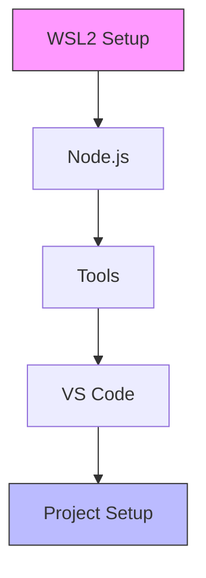

# Development Environment Setup

## Overview

This guide walks you through setting up a robust development environment for the Antar delivery management system.



## Prerequisites

Before you begin, ensure you have:
- Windows 10/11 with WSL2 support
- VS Code installed
- Git installed
- Basic command line knowledge

## Step-by-Step Setup

### 1. WSL2 Environment


```bash
# Enable WSL2
wsl --install

# Set Ubuntu as default
wsl --set-default Ubuntu
```

### 2. Development Tools

#### Core Tools
- Node.js via nvm (version 20.x)
- pnpm for package management
- Git for version control

```bash
# Install Node.js
curl -o- https://raw.githubusercontent.com/nvm-sh/nvm/v0.39.0/install.sh | bash
nvm install 20
nvm use 20

# Install pnpm
npm install -g pnpm

# Verify installations
node --version  # Should be 20.x.x
pnpm --version
```

#### VS Code Extensions
Essential extensions for development:
- ESLint: Code linting
- Prettier: Code formatting
- Tailwind CSS IntelliSense: CSS tooling
- GitLens: Git integration

### 3. Project Structure

```
~/projects/antar/
├── antar-web/        # Next.js frontend
│   ├── src/          # Source code
│   ├── public/       # Static assets
│   └── tests/        # Test files
├── docs/             # Documentation
└── scripts/          # Development scripts
```

### 4. VS Code Integration

1. Install "Remote - WSL" extension
2. Configure settings:
   ```json
   {
     "editor.formatOnSave": true,
     "editor.defaultFormatter": "esbenp.prettier-vscode",
     "editor.codeActionsOnSave": {
       "source.fixAll.eslint": true
     }
   }
   ```

## Development Workflow

### Starting Development
```bash
# Navigate to project
cd ~/projects/antar/antar-web

# Install dependencies
pnpm install

# Start development server
pnpm dev
```

### Code Quality Tools
```bash
# Linting
pnpm lint

# Testing
pnpm test

# Formatting
pnpm format
```

## Troubleshooting

Common issues and solutions:

1. **WSL2 Installation Issues**
   - Ensure virtualization is enabled in BIOS
   - Update Windows to latest version

2. **Node.js Version Conflicts**
   - Use `nvm` to switch versions
   - Clear npm cache if needed

3. **VS Code Connection Issues**
   - Reinstall Remote-WSL extension
   - Restart VS Code

## Next Steps

1. [Set up your project](./project-setup.md)
2. Review [coding standards](../architecture/index.md)
3. Start developing features!

## Environment Variables
```bash
# .env.local
NEXT_PUBLIC_MAPBOX_TOKEN=your_token
NEXT_PUBLIC_API_URL=http://localhost:3000
```

## Related Notes
- [Project Setup](./project-setup.md)
- [Frontend Framework](../decisions/frontend-framework.md)
- [Development Process](../../process/self-agency.md)

*Last Updated: 2024-12-20T06:19:11+08:00*
