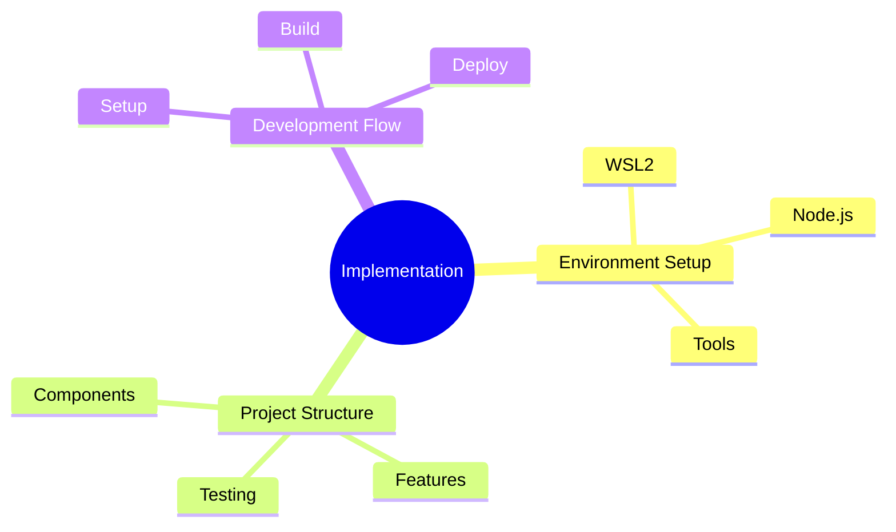
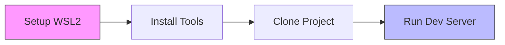
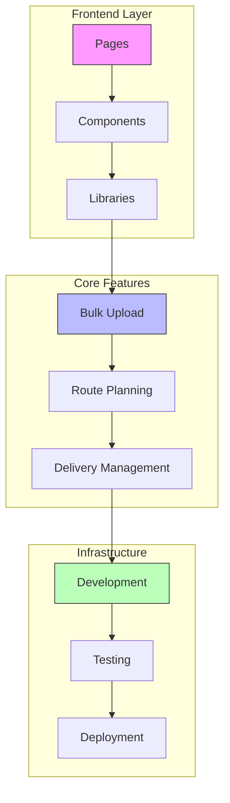
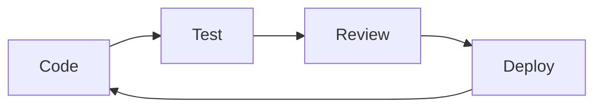

# Technical Implementation Guide

## Overview

## Getting Started

This guide will walk you through setting up and working with the Antar delivery management system. We'll cover everything from initial setup to development best practices.

### Quick Start

1. [Set up your development environment](./development-environment.md)
2. [Configure the project](./project-setup.md)
3. Start developing!

## Project Architecture

## Development Workflow

### 1. Environment Setup
- WSL2 Ubuntu configuration
- Node.js and package management
- Development tools and extensions

### 2. Project Structure
- Next.js application layout
- Component organization
- Feature implementation

### 3. Development Process

## Best Practices

### Code Organization
- Feature-based structure
- Shared components
- Utility libraries

### Testing Strategy
- Unit tests for components
- Integration tests for features
- End-to-end testing

### Performance Optimization
- Code splitting
- Image optimization
- Caching strategies

## Next Steps
1. [Set up your development environment](./development-environment.md)
2. [Configure your project](./project-setup.md)
3. Review our [coding standards](../architecture/index.md)
4. Start building features!
