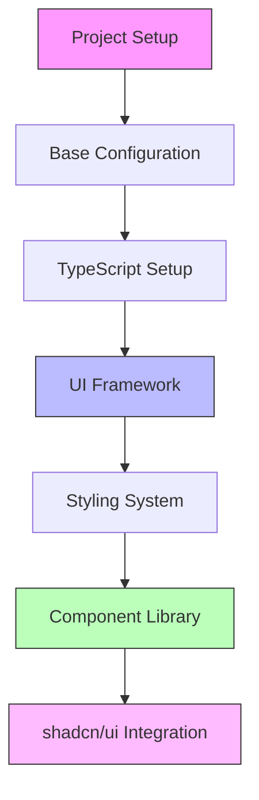

# Project Setup Guide

## Overview

This guide covers the complete setup of the Antar delivery management system, focusing on creating a robust, maintainable, and visually consistent application using shadcn/ui components.



## Initial Setup

### 1. Create Next.js Project
```bash
npx create-next-app@latest antar --typescript --tailwind --eslint
cd antar
```

### 2. Additional Dependencies
```bash
# Core dependencies
npm install @headlessui/react @heroicons/react
npm install @tanstack/react-query
npm install zustand immer

# Development dependencies
npm install -D @typescript-eslint/parser
npm install -D @typescript-eslint/eslint-plugin
npm install -D prettier prettier-plugin-tailwindcss

# shadcn/ui setup
npx shadcn-ui@latest init
```

### 3. shadcn/ui Configuration

When running the init command, use these options:
```plaintext
Would you like to use TypeScript (recommended)? yes
Which style would you like to use? › Default
Which color would you like to use as base color? › Indigo
Where is your global CSS file? › src/styles/globals.css
Do you want to use CSS variables for colors? › yes
Where is your tailwind.config.js located? › tailwind.config.js
Configure the import alias for components: › @/components
Configure the import alias for utils: › @/lib/utils
Are you using React Server Components? › yes
```

## Project Structure

```plaintext
antar/
├── src/
│   ├── app/
│   │   ├── layout.tsx
│   │   └── page.tsx
│   ├── components/
│   │   ├── ui/           # shadcn/ui components
│   │   ├── common/       # Shared components
│   │   ├── features/     # Feature-specific components
│   │   └── layout/       # Layout components
│   ├── hooks/
│   ├── lib/
│   │   └── utils.ts      # shadcn/ui utilities
│   ├── styles/
│   └── types/
├── public/
├── components.json       # shadcn/ui config
└── tests/
```

## TypeScript Configuration

### 1. tsconfig.json
```json
{
  "compilerOptions": {
    "target": "es5",
    "lib": ["dom", "dom.iterable", "esnext"],
    "allowJs": true,
    "skipLibCheck": true,
    "strict": true,
    "forceConsistentCasingInFileNames": true,
    "noEmit": true,
    "esModuleInterop": true,
    "module": "esnext",
    "moduleResolution": "node",
    "resolveJsonModule": true,
    "isolatedModules": true,
    "jsx": "preserve",
    "incremental": true,
    "baseUrl": ".",
    "paths": {
      "@/*": ["./src/*"]
    }
  },
  "include": ["next-env.d.ts", "**/*.ts", "**/*.tsx"],
  "exclude": ["node_modules"]
}
```

## Styling System

### 1. Design Tokens

Create `src/styles/tokens.css`:
```css
@layer base {
  :root {
    --background: 0 0% 100%;
    --foreground: 222.2 84% 4.9%;
 
    --card: 0 0% 100%;
    --card-foreground: 222.2 84% 4.9%;
 
    --popover: 0 0% 100%;
    --popover-foreground: 222.2 84% 4.9%;
 
    --primary: 221.2 83.2% 53.3%;
    --primary-foreground: 210 40% 98%;
 
    --secondary: 210 40% 96.1%;
    --secondary-foreground: 222.2 47.4% 11.2%;
 
    --muted: 210 40% 96.1%;
    --muted-foreground: 215.4 16.3% 46.9%;
 
    --accent: 210 40% 96.1%;
    --accent-foreground: 222.2 47.4% 11.2%;
 
    --destructive: 0 84.2% 60.2%;
    --destructive-foreground: 210 40% 98%;

    --border: 214.3 31.8% 91.4%;
    --input: 214.3 31.8% 91.4%;
    --ring: 221.2 83.2% 53.3%;
 
    --radius: 0.5rem;

    /* Upload Zone Colors */
    --upload-border: var(--border);
    --upload-primary: var(--primary);
    --dropzone-idle: var(--secondary);
    --dropzone-active: var(--accent);
    
    /* Spacing */
    --spacing-xs: 0.25rem;  /* 4px */
    --spacing-sm: 0.5rem;   /* 8px */
    --spacing-md: 1rem;     /* 16px */
    --spacing-lg: 1.5rem;   /* 24px */
    --spacing-xl: 2rem;     /* 32px */
    
    /* Transitions */
    --transition-fast: 150ms ease;
    --transition-base: 200ms ease;
    --transition-slow: 300ms ease;
    
    /* Breakpoints */
    --breakpoint-sm: 640px;
    --breakpoint-md: 768px;
    --breakpoint-lg: 1024px;
    --breakpoint-xl: 1280px;
  }
 
  .dark {
    --background: 222.2 84% 4.9%;
    --foreground: 210 40% 98%;
 
    --card: 222.2 84% 4.9%;
    --card-foreground: 210 40% 98%;
 
    --popover: 222.2 84% 4.9%;
    --popover-foreground: 210 40% 98%;
 
    --primary: 217.2 91.2% 59.8%;
    --primary-foreground: 222.2 47.4% 11.2%;
 
    --secondary: 217.2 32.6% 17.5%;
    --secondary-foreground: 210 40% 98%;
 
    --muted: 217.2 32.6% 17.5%;
    --muted-foreground: 215 20.2% 65.1%;
 
    --accent: 217.2 32.6% 17.5%;
    --accent-foreground: 210 40% 98%;
 
    --destructive: 0 62.8% 30.6%;
    --destructive-foreground: 210 40% 98%;
 
    --border: 217.2 32.6% 17.5%;
    --input: 217.2 32.6% 17.5%;
    --ring: 224.3 76.3% 48%;
  }
}
```

### 2. Tailwind Configuration

Update `tailwind.config.js`:
```javascript
const { fontFamily } = require("tailwindcss/defaultTheme")

/** @type {import('tailwindcss').Config} */
module.exports = {
  darkMode: ["class"],
  content: ["./src/**/*.{js,ts,jsx,tsx}"],
  theme: {
    container: {
      center: true,
      padding: "2rem",
      screens: {
        "2xl": "1400px",
      },
    },
    extend: {
      colors: {
        border: "hsl(var(--border))",
        input: "hsl(var(--input))",
        ring: "hsl(var(--ring))",
        background: "hsl(var(--background))",
        foreground: "hsl(var(--foreground))",
        primary: {
          DEFAULT: "hsl(var(--primary))",
          foreground: "hsl(var(--primary-foreground))",
        },
        secondary: {
          DEFAULT: "hsl(var(--secondary))",
          foreground: "hsl(var(--secondary-foreground))",
        },
        destructive: {
          DEFAULT: "hsl(var(--destructive))",
          foreground: "hsl(var(--destructive-foreground))",
        },
        muted: {
          DEFAULT: "hsl(var(--muted))",
          foreground: "hsl(var(--muted-foreground))",
        },
        accent: {
          DEFAULT: "hsl(var(--accent))",
          foreground: "hsl(var(--accent-foreground))",
        },
        popover: {
          DEFAULT: "hsl(var(--popover))",
          foreground: "hsl(var(--popover-foreground))",
        },
        card: {
          DEFAULT: "hsl(var(--card))",
          foreground: "hsl(var(--card-foreground))",
        },
        upload: {
          border: "var(--upload-border)",
          primary: "var(--upload-primary)",
        },
        dropzone: {
          idle: "var(--dropzone-idle)",
          active: "var(--dropzone-active)",
        },
      },
      borderRadius: {
        lg: "var(--radius)",
        md: "calc(var(--radius) - 2px)",
        sm: "calc(var(--radius) - 4px)",
      },
      fontFamily: {
        sans: ["var(--font-sans)", ...fontFamily.sans],
      },
      keyframes: {
        "accordion-down": {
          from: { height: 0 },
          to: { height: "var(--radix-accordion-content-height)" },
        },
        "accordion-up": {
          from: { height: "var(--radix-accordion-content-height)" },
          to: { height: 0 },
        },
      },
      animation: {
        "accordion-down": "accordion-down 0.2s ease-out",
        "accordion-up": "accordion-up 0.2s ease-out",
      },
    },
  },
  plugins: [require("tailwindcss-animate")],
}
```

### 3. Add shadcn/ui Components

Install commonly used components:
```bash
npx shadcn-ui@latest add button
npx shadcn-ui@latest add card
npx shadcn-ui@latest add dialog
npx shadcn-ui@latest add dropdown-menu
npx shadcn-ui@latest add input
npx shadcn-ui@latest add label
npx shadcn-ui@latest add progress
npx shadcn-ui@latest add table
npx shadcn-ui@latest add toast
```

## Feature Components

### 1. Enhanced UploadZone with shadcn/ui

Create `src/components/features/bulk-upload/UploadZone.tsx`:
```typescript
import { useCallback } from 'react'
import { useDropzone } from 'react-dropzone'
import { CloudArrowUpIcon } from '@heroicons/react/24/outline'
import { Button } from '@/components/ui/button'
import { Card } from '@/components/ui/card'
import { Progress } from '@/components/ui/progress'
import { useToast } from '@/components/ui/use-toast'

interface UploadZoneProps {
  onUpload: (file: File) => void
  progress?: number
}

export function UploadZone({ onUpload, progress }: UploadZoneProps) {
  const { toast } = useToast()

  const onDrop = useCallback((acceptedFiles: File[]) => {
    const file = acceptedFiles[0]
    if (file) {
      onUpload(file)
      toast({
        title: "File accepted",
        description: `Processing ${file.name}...`,
      })
    }
  }, [onUpload, toast])

  const { getRootProps, getInputProps, isDragActive } = useDropzone({
    onDrop,
    accept: {
      'text/csv': ['.csv'],
    },
    maxSize: 5 * 1024 * 1024, // 5MB
    multiple: false,
  })

  return (
    <Card
      {...getRootProps()}
      className={`relative p-6 text-center border-2 border-dashed 
        ${isDragActive 
          ? 'border-primary bg-accent' 
          : 'border-border bg-background'
        }`}
    >
      <input {...getInputProps()} />
      <CloudArrowUpIcon className="w-12 h-12 mx-auto text-primary mb-4" />
      <h3 className="text-lg font-medium mb-2">
        {isDragActive ? 'Drop your file here' : 'Drop your CSV file here'}
      </h3>
      <p className="text-muted-foreground mb-4">or</p>
      <Button>Browse Files</Button>
      <p className="text-sm text-muted-foreground mt-2">
        Supported format: CSV
      </p>
      {typeof progress === 'number' && (
        <div className="mt-4">
          <Progress value={progress} className="h-2" />
          <p className="text-sm text-muted-foreground mt-1">
            {progress}% uploaded
          </p>
        </div>
      )}
    </Card>
  )
}
```

## Next Steps

1. Review the [UI Components Guide](../../features/bulk-upload/ui/components.md)
2. Check the [Animations Guide](../../features/bulk-upload/ui/animations.md)
3. Study the [Responsive Design Guide](../../features/bulk-upload/ui/responsive.md)
4. Explore [shadcn/ui documentation](https://ui.shadcn.com/) for more components

*Last Updated: 2024-12-20T08:14:57+08:00*
