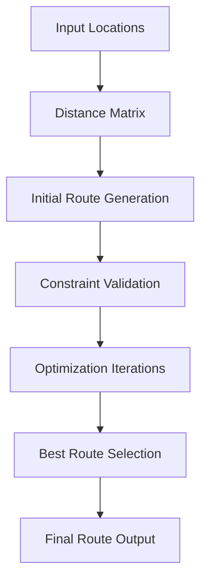

# Route Optimization Implementation

## Overview
Detailed implementation of our route optimization engine, focusing on efficient route planning and delivery logistics.

## Core Algorithms

### Route Calculation
- **Dijkstra's Algorithm** for base routing
- **A* Search** for advanced path finding
- **Genetic Algorithms** for complex multi-stop optimization

### Constraints Handling
- Time windows
- Vehicle capacity
- Driver working hours
- Traffic conditions

## Optimization Strategies

### Multi-Stop Route Planning


### Performance Optimization
- Caching intermediate results
- Parallel processing
- Incremental route refinement

## Code Snippet

```python
def optimize_route(locations, constraints):
    initial_route = generate_initial_route(locations)
    best_route = None
    min_cost = float('inf')
    
    for _ in range(MAX_ITERATIONS):
        candidate_route = refine_route(initial_route)
        route_cost = calculate_route_cost(candidate_route, constraints)
        
        if route_cost < min_cost:
            best_route = candidate_route
            min_cost = route_cost
    
    return best_route
```

## Complexity Analysis
- Time Complexity: O(n^2 * log(n))
- Space Complexity: O(n)
- n = number of delivery points

## Machine Learning Integration
- Predictive traffic modeling
- Dynamic constraint learning
- Route recommendation system

## Scalability Considerations
- Horizontal scaling
- Microservice architecture
- Distributed computing support

## Future Roadmap
- Real-time route adjustments
- Integration with external mapping services
- Advanced predictive routing
