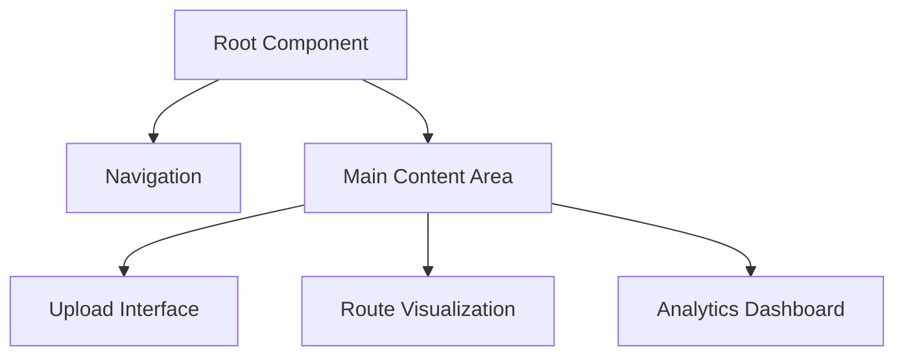

# User Interface Implementation

## Design Philosophy
- Intuitive user experience
- Performance-first approach
- Responsive and adaptive design

## Technology Stack
- **Framework**: Next.js
- **State Management**: React Context
- **Styling**: Tailwind CSS
- **Animations**: Framer Motion

## Component Architecture



## Key UI Components

### File Upload Interface
- Drag and drop support
- Progress indicators
- Error handling
- Preview functionality

### Route Visualization
- Interactive map integration
- Real-time route updates
- Zoom and pan controls
- Detailed route information

### State Management

```typescript
interface AppState {
  uploadedFiles: File[];
  routeData: RouteOptimizationResult;
  uiMode: 'upload' | 'route' | 'analytics';
}

function useAppReducer(state, action) {
  switch (action.type) {
    case 'ADD_FILES':
      return { ...state, uploadedFiles: action.payload };
    case 'OPTIMIZE_ROUTE':
      return { ...state, routeData: action.payload };
    // Other state transitions
  }
}
```

## Performance Optimization
- Code splitting
- Lazy loading of components
- Memoization of complex computations
- Efficient re-rendering strategies

## Accessibility Considerations
- WCAG 2.1 compliance
- Keyboard navigation
- Screen reader support
- High contrast modes

## Responsive Design
- Mobile-first approach
- Flexbox and CSS Grid
- Adaptive layouts
- Touch-friendly interactions

## Error Handling
- Graceful error messages
- Fallback UI components
- Detailed error logging

## Future Enhancements
- Dark/Light mode toggle
- Internationalization
- Advanced customization options
- Machine learning-driven UI personalization
