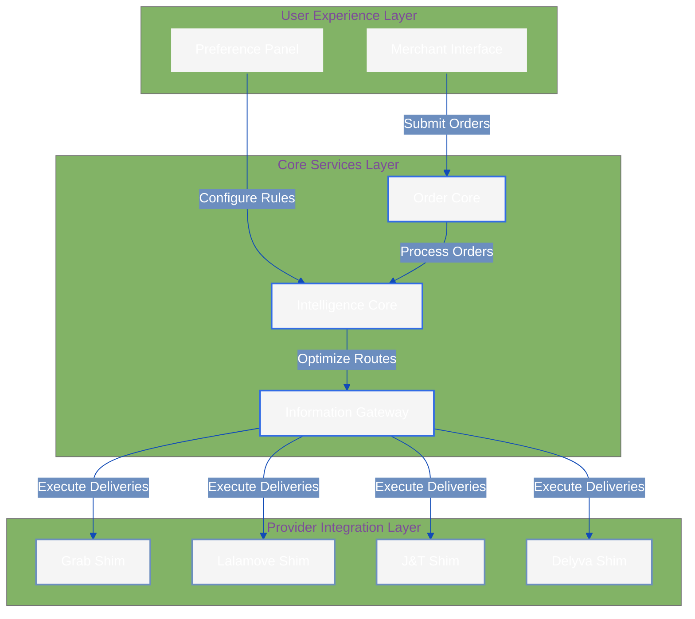
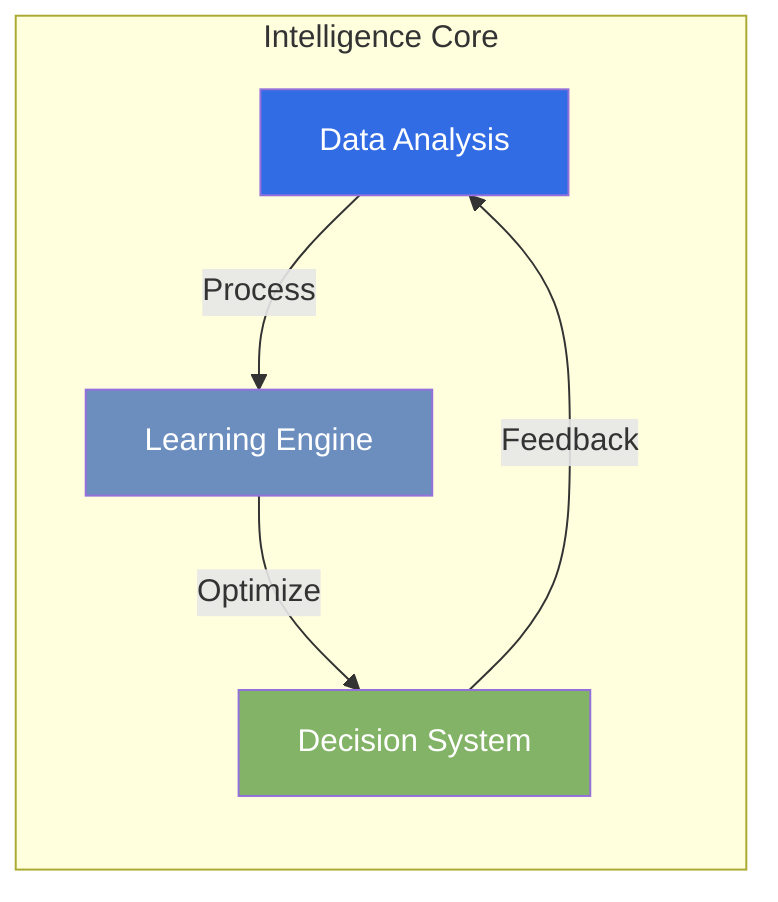
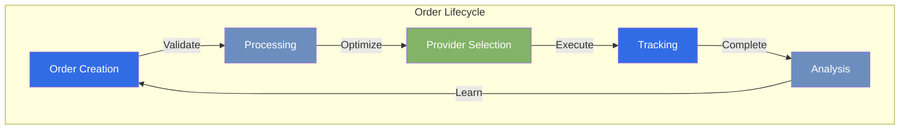
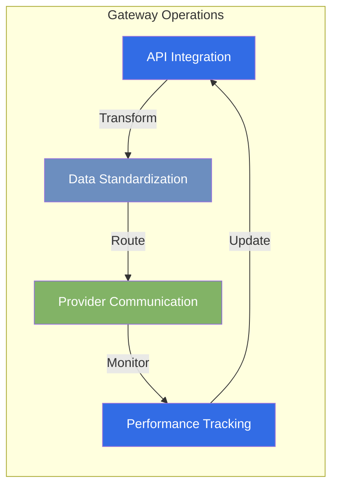
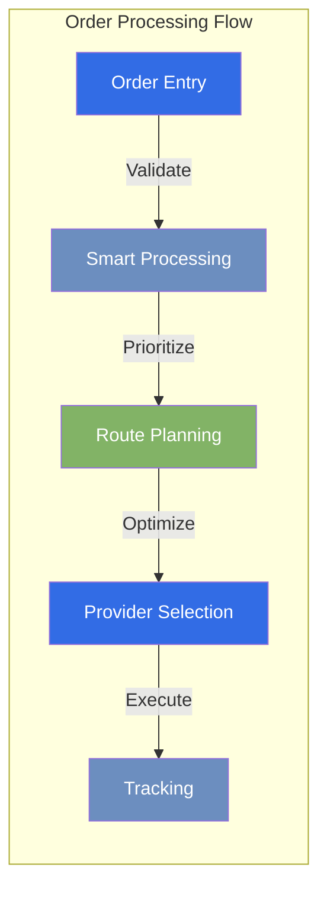
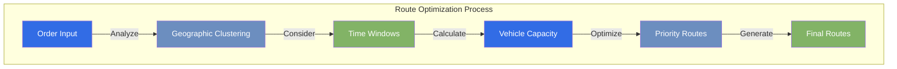
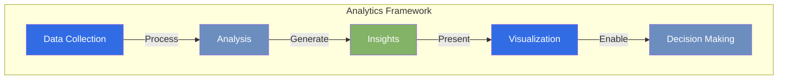

# Intelligent Delivery Service Aggregator Platform

## Overview
!!! abstract "Quick Summary"
    Antar is an AI-powered delivery aggregation platform revolutionizing how Malaysian merchants handle their logistics needs. By intelligently integrating multiple delivery services (Grab, Lalamove, J&T, Delyva), we transform complex delivery decisions into simple, data-driven choices tailored to each merchant's unique requirements.

## The Challenge: Why Malaysian Merchants Need Antar
Malaysian merchants face increasingly complex delivery challenges in today's fast-paced e-commerce landscape:

!!! danger "Critical Pain Points"
    - **Decision Paralysis**: With multiple delivery providers offering different pricing models and service levels, merchants waste valuable time comparing options
    - **Operational Inefficiency**: Managing deliveries across multiple platforms leads to increased administrative overhead and potential errors
    - **Suboptimal Choices**: Without data-driven insights, merchants often make decisions that aren't cost-effective or time-efficient
    - **Fragmented Management**: No unified system to track and manage deliveries across different providers
    - **Complex Integration**: Difficulty in maintaining relationships with multiple delivery providers

## Our Solution: The Antar Platform Architecture
We've built an intelligent platform that combines three powerful components to solve these challenges:



### 1. Intelligence Core: The Brain of Our Platform 🧠
Our AI-powered decision engine that transforms complex delivery choices into optimal solutions:



- **Smart Analysis**: Processes historical data and current conditions
- **Adaptive Learning**: Continuously improves based on delivery outcomes
- **Preference Integration**: Considers merchant-specific requirements
- **Predictive Optimization**: Anticipates and prevents delivery issues

### 2. Order Core: Unified Delivery Management 📦
A comprehensive system that streamlines the entire delivery lifecycle:



- **Centralized Management**: Single interface for all delivery operations
- **Real-time Tracking**: Live updates across all providers
- **Smart Validation**: Prevents errors before they occur
- **Performance Analytics**: Insights for continuous improvement

### 3. Information Gateway: Seamless Provider Integration 🔄
Our robust integration layer that ensures reliable communication with delivery providers:



- **Universal Integration**: Standardized interface across providers
- **Real-time Monitoring**: Continuous service availability checks
- **Performance Metrics**: Detailed provider performance tracking
- **Data Consistency**: Unified data format across all providers

## Key Features: Transforming Delivery Management

### 1. Smart Order Management System

!!! tip "Operational Excellence"
    Transform complex delivery operations into streamlined, automated workflows that save time and reduce errors.



- **Intelligent Bulk Processing**: Handle multiple orders efficiently
- **Advanced Validation**: Prevent errors before they occur
- **Priority Management**: Smart handling of urgent deliveries
- **Real-time Updates**: Live tracking and notifications
- **Automated Workflows**: Reduce manual intervention

### 2. AI-Powered Route Optimization

!!! tip "Maximum Efficiency"
    Our advanced algorithms consider multiple factors to create optimal delivery routes that save time and cost.



- **Smart Clustering**: Group nearby deliveries efficiently
- **Time-Aware Planning**: Consider delivery windows
- **Capacity Optimization**: Maximize vehicle utilization
- **Dynamic Updates**: Real-time route adjustments
- **Cost Optimization**: Balance speed and cost

### 3. Comprehensive Analytics Dashboard

!!! tip "Data-Driven Decisions"
    Transform delivery data into actionable insights for better business decisions.



- **Performance Metrics**: Track key delivery indicators
- **Cost Analysis**: Understand and optimize spending
- **Provider Insights**: Compare provider performance
- **Trend Analysis**: Identify patterns and opportunities
- **Custom Reports**: Tailored to business needs

## Advanced Features

### Intelligent Automation
- **Rule-Based Routing**: Automated decision-making
- **Smart Retries**: Intelligent failure handling
- **Load Balancing**: Optimal provider utilization
- **Queue Management**: Priority-based processing
- **Error Recovery**: Automated issue resolution

### Enterprise Integration
- **RESTful API**: Easy system integration
- **Webhook Support**: Real-time notifications
- **Bulk Operations**: High-volume processing
- **Custom Workflows**: Flexible process adaptation
- **Security Features**: Enterprise-grade protection

## Real-World Impact

!!! example "Success Stories"
    Our platform transforms how merchants handle deliveries:

    ```mermaid
    graph TD
        subgraph "Merchant Benefits"
            A[Time Savings] -->|"Up to 70%"| B[Reduced Admin]
            C[Cost Reduction] -->|"15-30%"| D[Better Margins]
            E[Customer Satisfaction] -->|"Improved"| F[Business Growth]
        end
        
        style A fill:#326CE5,color:#fff
        style B fill:#6C8EBF,color:#fff
        style C fill:#82B366,color:#fff
        style D fill:#326CE5,color:#fff
        style E fill:#6C8EBF,color:#fff
        style F fill:#82B366,color:#fff
    ```

    - **Time Management**: "Reduced delivery planning from hours to minutes"
    - **Cost Efficiency**: "Saved 25% on delivery costs through smart routing"
    - **Growth Support**: "Scaled operations without adding admin staff"
    - **Customer Success**: "Improved delivery reliability by 40%"

## Future Roadmap 🚀

### Geographic Expansion
- **Market Coverage**: Expansion across Southeast Asia
- **Provider Network**: Integration with local services
- **Regional Support**: Localized features and support

### Platform Evolution
- **Advanced AI**: Enhanced prediction models
- **Mobile Solutions**: Native mobile applications
- **Custom Analytics**: Advanced reporting tools
- **Integration Options**: Expanded API capabilities

## Success Metrics 📊

### Platform Performance
- **User Growth**: Active merchant adoption
- **Volume Handling**: Order processing capacity
- **Integration Success**: Provider network reliability

### Business Impact
- **Cost Efficiency**: Merchant savings achieved
- **Time Savings**: Operational efficiency gains
- **Satisfaction**: User happiness metrics
- **Reliability**: Platform uptime and performance

### Future Development
- **AI Enhancement**: Improved prediction accuracy
- **Route Optimization**: Advanced algorithms
- **Provider Network**: Expanded integrations
- **Mobile Platform**: Enhanced accessibility
- **Analytics**: Custom reporting capabilities

[Explore Our Detailed Roadmap →](roadmap/index.md)

*Last Updated: 2024-12-20T07:00:28+08:00*
