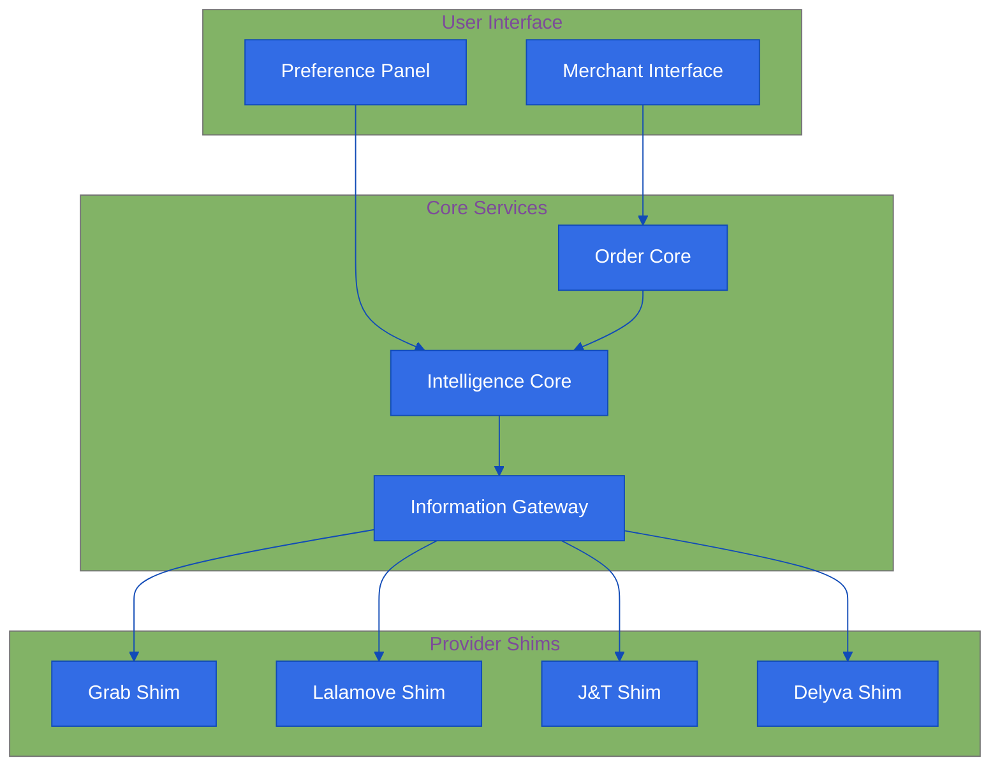
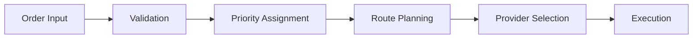
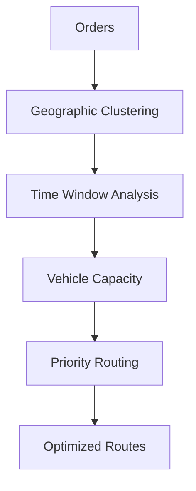

# Intelligent Delivery Service Aggregator Platform

!!! abstract "Quick Summary"
    An AI-powered platform that helps Malaysian merchants easily manage and choose between multiple delivery services (Grab, Lalamove, J&T, Delyva) based on their specific needs.

## The Challenge
Malaysian merchants struggle with delivery services because:

!!! danger "Pain Points"
    - Too Many Choices: Multiple delivery providers with different pricing
    - Time Waste: Hours spent comparing different options
    - Hard Decisions: Balancing speed, cost, and reliability
    - Management Headache: No single place to handle all deliveries
    - Complex Process: Difficult to pick the best option for each delivery

## Our Solution
We're building a smart platform with three main parts:

### 1. Intelligence Core 🧠
Makes smart decisions about your deliveries:
- Analyzes and categorizes options
- Learns your preferences
- Helps you make trade-offs
- Uses AI to predict and optimize

### 2. Order Core 📦
Handles all your delivery tasks:
- Manages and tracks orders
- Keeps status updated across providers
- Shows all orders in one place
- Analyzes past orders to help you improve

### 3. Information Gateway 🔄
Connects with delivery providers:
- Real-time integration with provider APIs
- Monitors service availability
- Tracks provider performance
- Makes all data consistent and usable

## Key Features

!!! abstract "Platform Overview"
    Antar's intelligent platform combines AI-powered optimization with seamless integration to revolutionize delivery management for Southeast Asian businesses.

## Core Features

### 1. Smart Order Management

!!! tip "Streamlined Operations"
    Transform complex delivery operations into simple, automated workflows.

- Bulk order processing
- Smart validation rules
- Priority handling
- Real-time tracking
- Status notifications

### 2. Intelligent Route Optimization

!!! tip "Maximum Efficiency"
    AI-powered route planning that considers multiple factors for optimal delivery paths.

- Multi-stop optimization
- Time window consideration
- Load balancing
- Dynamic rerouting
- Cost optimization

### 3. Provider Network

!!! tip "Unified Access"
    Connect with multiple delivery providers through a single, intelligent interface.

- Real-time availability
- Automated selection
- Performance tracking
- Cost comparison
- Service matching

### 4. Analytics Dashboard

!!! tip "Data-Driven Insights"
    Make informed decisions with comprehensive delivery analytics.

- Cost analysis
- Performance metrics
- Delivery patterns
- Provider insights
- Optimization suggestions

## Advanced Capabilities

### Smart Automation
- Rule-based routing
- Auto-retry logic
- Failure handling
- Priority queuing
- Load balancing

### Integration Options
- RESTful API
- Webhook support
- Bulk operations
- Real-time events
- Custom workflows

### Security Features
- Role-based access
- Audit logging
- Data encryption
- API authentication
- Secure file handling

## Technology Stack

### Frontend
- Modern web interface
- Mobile responsive
- Real-time updates
- Interactive maps
- Rich analytics

### Backend
- Scalable architecture
- High availability
- Fast processing
- Secure storage
- API-first design

## How It Helps Merchants

!!! example "Real Use Cases"
    - "I want to see all delivery options when I enter pickup and delivery locations"
    - "Show me the best option based on what I care about (speed/cost/security)"
    - "Let me easily change my preferences and see what changes"
    - "Help me understand what I'm gaining or losing with each option"
    - "Let me track all my deliveries in one place"

## Future Growth 🚀

### Geographic Expansion
- More Southeast Asian markets
- Additional local providers

### New Features
- Bulk order handling
- Scheduled deliveries
- Advanced analytics
- Smart routing

### Smarter System
- Price predictions
- Smart provider selection
- Better delivery time estimates
- Merchant-specific optimizations

## Coming Soon

!!! note "Future Features"
    - Machine learning predictions
    - Advanced route optimization
    - Enhanced provider integrations
    - Mobile application
    - Custom reporting

[Explore Our Roadmap →](roadmap/index.md)

## Measuring Success 📊

### 1. Platform Growth
- Active merchant count
- Order volume
- Provider integration success

### 2. User Happiness
- Merchant satisfaction
- Time saved
- Good recommendations

### 3. Performance
- Cost savings
- Successful deliveries
- Platform reliability

*Last Updated: 2024-12-11T13:22:12+08:00*
