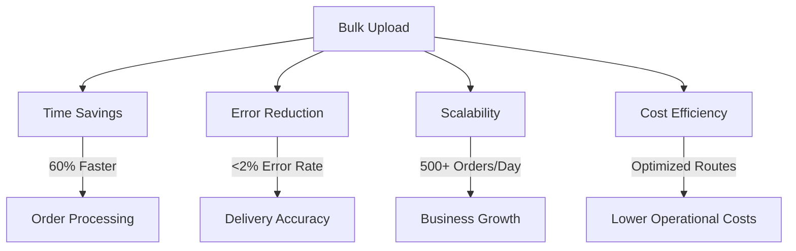

# Bulk Upload Feature: Transforming Delivery Operations 

## Quick Overview

Our Bulk Upload feature is a powerful solution designed to revolutionize how merchants manage and process large volumes of delivery orders. By combining intelligent automation, precise routing, and user-friendly interfaces, we solve critical challenges in logistics management.

## Core Capabilities

- **Instant CSV Upload**
- **Smart Route Optimization**
- **Automatic Address Validation**
- **Batch Processing**

## Key Benefits

## Bulk Upload Feature Documentation

### Key Resources
- Business Context Overview
- Technical Architecture Summary
- User Experience Guidelines

## Quick Start

1. Prepare your CSV with delivery orders
2. Upload through our intuitive interface
3. Review auto-generated route optimizations
4. Confirm and dispatch

*Last Updated: 2024-12-22*
