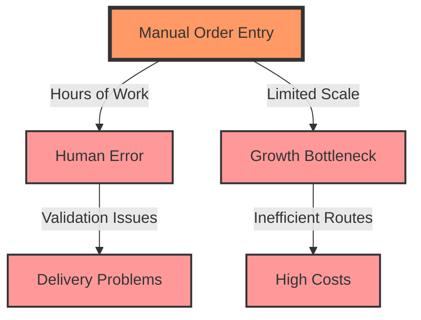
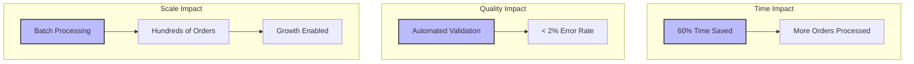
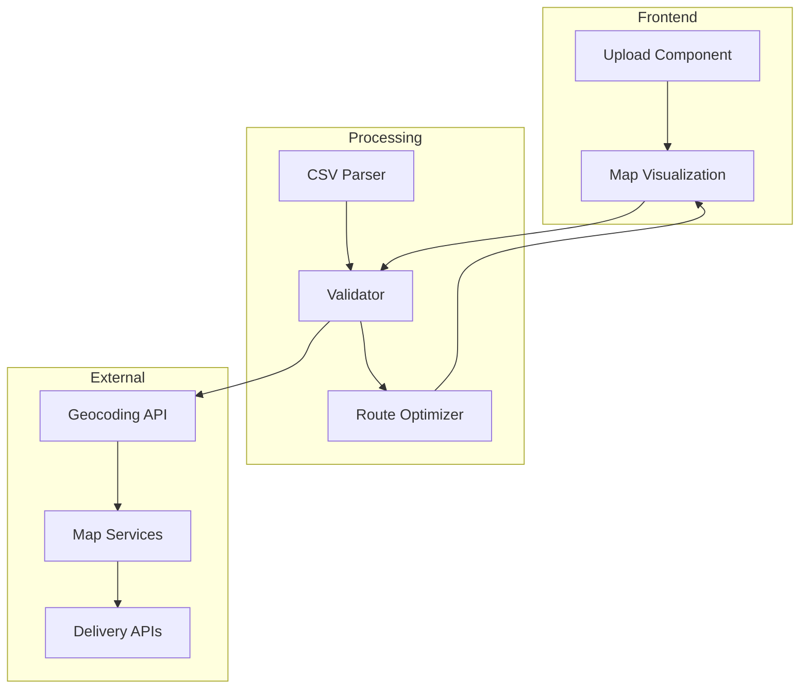
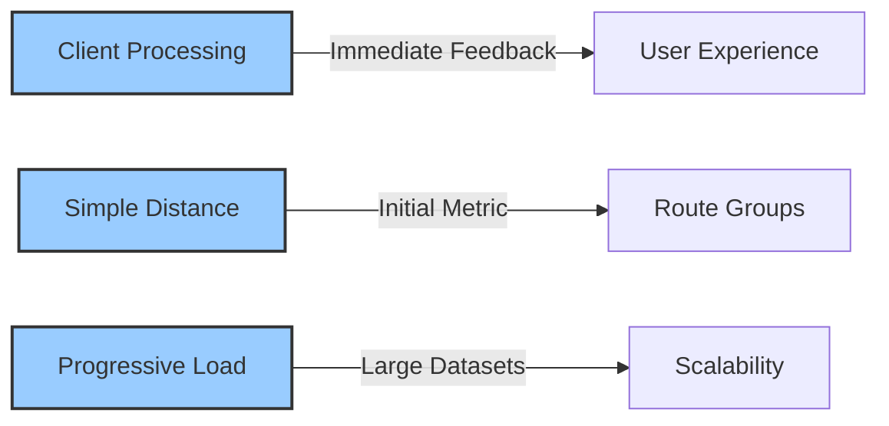

# Understanding Bulk Upload: The Why and How

Our bulk upload feature transforms how merchants handle their delivery operations. Through conversations with merchants like Aisyah, Lina, and Muthu, we've uncovered the challenges they face and designed solutions that make their work easier and more efficient.

## The Challenge

At the heart of our merchants' struggles lies a time-consuming, error-prone process. Manual order entry isn't just tedious – it's a significant barrier to growth. Let's look at how these challenges interconnect:



As shown above, manual order entry creates a cascade of challenges. When merchants spend hours inputting orders by hand, they're not just losing time – they're introducing errors that can lead to failed deliveries. Meanwhile, the inability to process orders quickly creates a bottleneck that prevents business growth and leads to higher operational costs.

## Our Solution

To address these challenges, we've designed a streamlined process that transforms hours of manual work into minutes of automated efficiency:


This workflow transforms a complex task into four simple steps. Merchants upload their orders in a familiar CSV format, and our system takes care of the rest – validating addresses, processing the data, and intelligently grouping deliveries. The visual confirmation step ensures merchants always maintain control and understanding of their delivery operations.

## Impact on Merchants

The real power of our solution becomes clear when we look at its impact across different aspects of the business:



These improvements work together to create a multiplier effect. The time saved through automation allows merchants to handle more orders. Meanwhile, automated validation dramatically reduces errors, and batch processing capabilities remove the ceiling on growth. For merchants like Aisyah, this means being able to expand from 50 to 500 deliveries per day without adding operational complexity.

## Technical Integration

Behind the scenes, we've built a robust system that seamlessly connects various components:



This architecture ensures reliable operation at every step. The frontend components provide an intuitive interface, while our processing engine handles the heavy lifting of parsing, validation, and optimization. External services are integrated thoughtfully to provide accurate geocoding and mapping capabilities without creating dependencies that could affect performance.

## Success Metrics

We've established clear, measurable targets to ensure our solution delivers real value:

```mermaid
xychart-beta
    title "Performance Targets"
    x-axis [Upload, Processing, Error, Satisfaction]
    y-axis "Target %" 0 --> 100
    bar [95, 90, 98, 90]
    style [success, success, success, success]
```

These metrics tell an important story: we're aiming for excellence across all aspects of the system. A 95% upload success rate ensures reliability, while 90% processing efficiency keeps operations smooth. Our ambitious 98% accuracy target virtually eliminates delivery errors, and we're committed to maintaining 90% user satisfaction through continuous improvement.

## Implementation Approach

Our development strategy balances immediate needs with long-term scalability:



This approach reflects our commitment to both user experience and system performance. By processing data on the client side, we provide instant feedback that helps users catch and correct issues immediately. Our initial use of simple distance calculations for route grouping allows us to deliver value quickly while laying the groundwork for more sophisticated optimization in the future. Progressive loading ensures the system remains responsive even as merchants scale up their operations.

Through this feature, we're not just automating a process - we're transforming how merchants manage their deliveries, enabling them to grow their businesses efficiently and confidently. Each component has been carefully designed to solve real problems while maintaining the flexibility to evolve with our merchants' needs.

*Last Updated: 2024-12-20T06:45:46+08:00*
