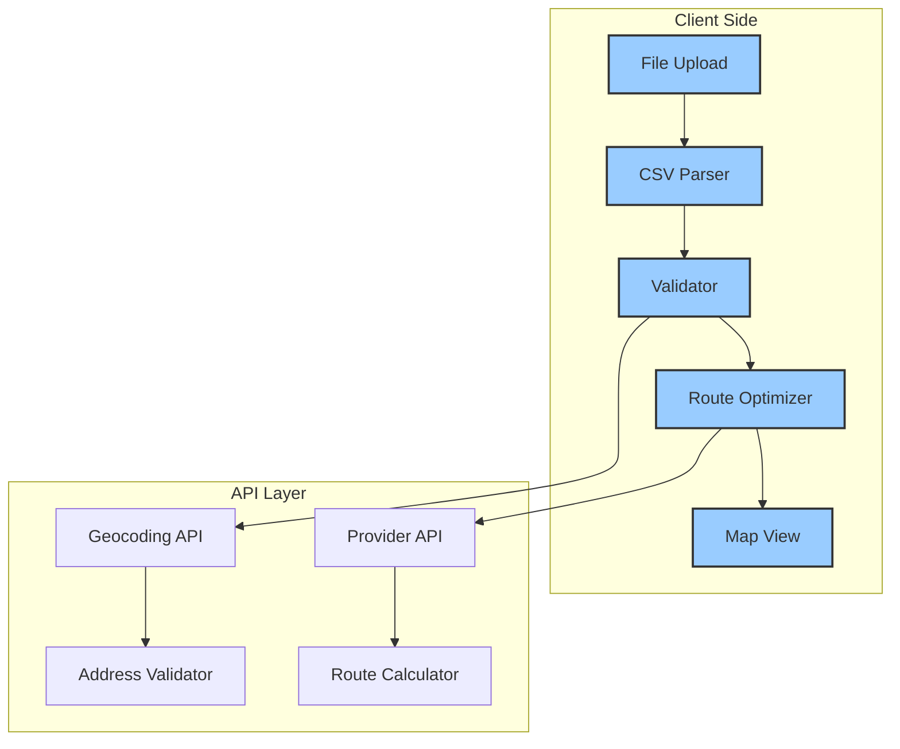
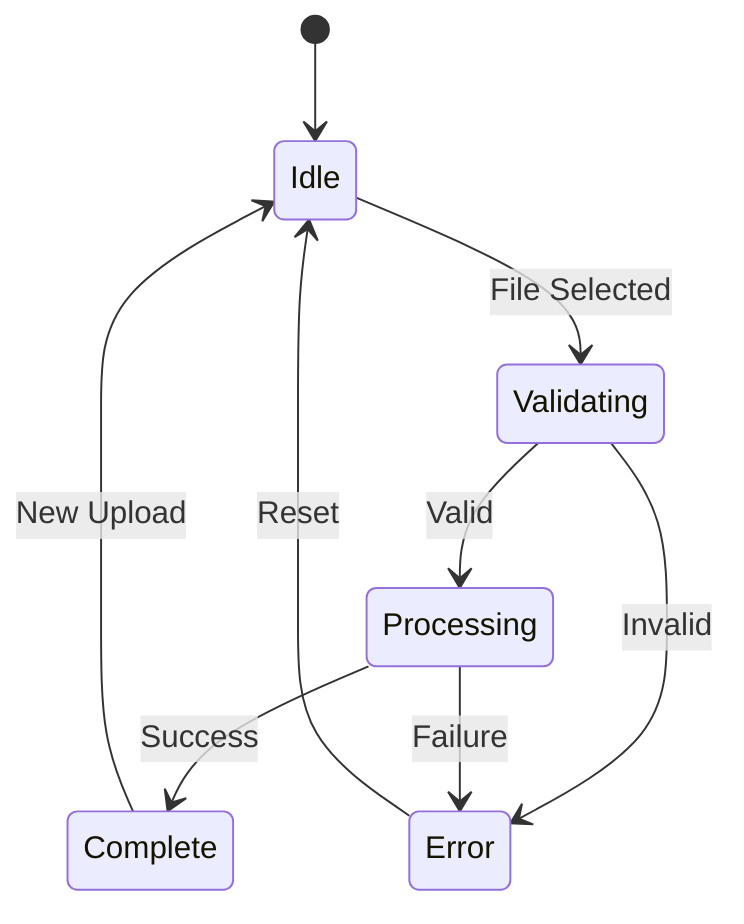
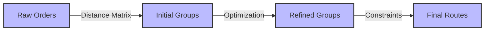
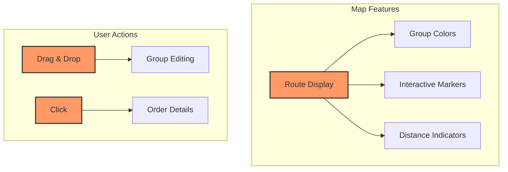
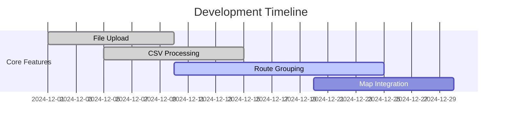
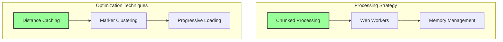
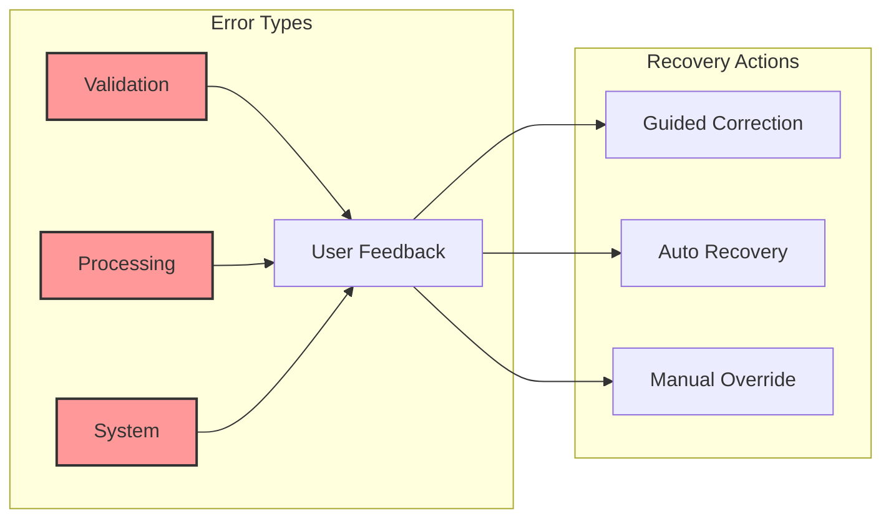

# Building the Bulk Upload System

Our bulk upload system combines efficient client-side processing with intuitive user interaction. Here's how we've architected the solution to handle large-scale delivery processing effectively, ensuring both performance and reliability.

## System Architecture

The heart of our system lies in its carefully orchestrated components, each playing a crucial role in the delivery management process:



This architecture reflects our commitment to responsive user experience. Notice how the client-side components handle immediate user interactions, while the API layer provides essential services without blocking the interface. The flow from file upload through to map view creates a seamless experience, with each step building on the validation and processing of the previous one.

## Core Components

### File Upload System
```typescript
interface FileUploadProps {
  onUpload: (file: File) => Promise<void>;
  onValidate: (data: OrderData[]) => ValidationResult;
  maxFileSize: number;
}
```

The file upload component is the user's first point of interaction. We've designed it to provide immediate feedback and validation, following a clear state progression:



This state machine ensures users always know where they are in the process. Notice how we handle both success and error paths gracefully, providing clear routes back to the initial state. This design prevents users from getting stuck in error states and maintains a smooth upload flow.

### Route Grouping Engine
```typescript
interface RouteGroupProps {
  orders: Order[];
  groupingStrategy: GroupingStrategy;
  onGroupingComplete: (groups: OrderGroup[]) => void;
}
```

Our routing system transforms raw delivery data into optimized routes through a sophisticated process:



The progression from raw orders to final routes involves multiple optimization steps. We start with basic distance calculations to form initial groups, then refine these based on various constraints such as time windows and vehicle capacity. The final routes represent the optimal balance between efficiency and practical constraints.

### Map Visualization
```typescript
interface MapVisualizationProps {
  groups: OrderGroup[];
  onGroupEdit: (groupId: string, orders: Order[]) => void;
}
```

The map component brings our route groups to life with interactive visualization:



This visualization system combines clear visual feedback with powerful interaction capabilities. Color-coded groups help users quickly understand route assignments, while drag-and-drop functionality enables easy manual adjustments when needed. The distance indicators provide immediate feedback about the impact of any changes.

## Implementation Progress

Our development timeline shows how we're methodically building out these features:



Notice how we've prioritized the foundational features first. The file upload and CSV processing systems are complete, providing the essential base for our route grouping work. Map integration will follow, building on the stable foundation we've established.

## Performance Optimization

To handle large datasets efficiently, we've implemented a comprehensive optimization strategy:



This dual approach to performance combines smart processing strategies with efficient data handling. Chunked processing and web workers keep the interface responsive even during heavy calculations, while our optimization techniques ensure smooth visualization of large datasets. The memory management system prevents performance degradation over time.

## Error Handling

Our error management system ensures reliability through comprehensive error detection and recovery:



This system categorizes errors into three main types and provides appropriate recovery paths for each. Validation errors receive immediate feedback with correction guidance, processing errors trigger automatic recovery attempts, and system errors offer manual override options when necessary. This layered approach ensures users can always progress with their tasks.

## Implementation Details

### CSV Upload
Detailed information about CSV processing and validation.

### Route Grouping
Overview of route optimization strategies.

### User Experience
Brief notes on UX considerations.

*Last Updated: 2024-12-20T06:45:46+08:00*
