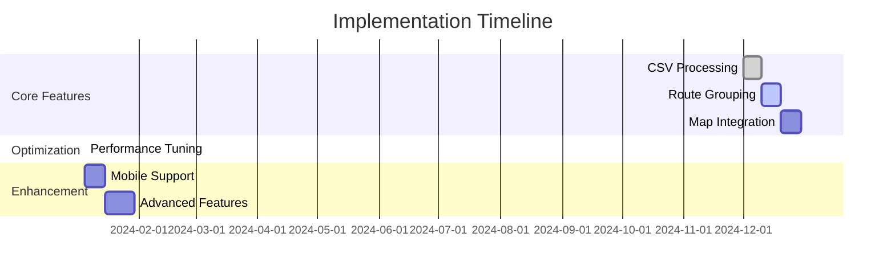
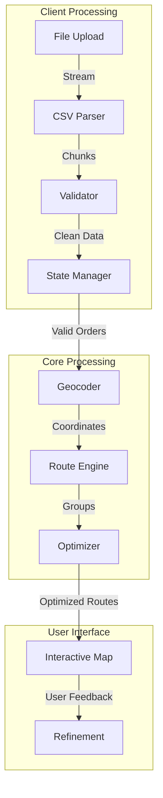
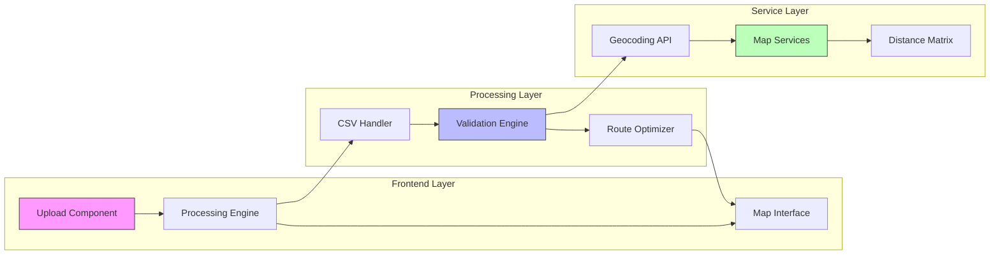
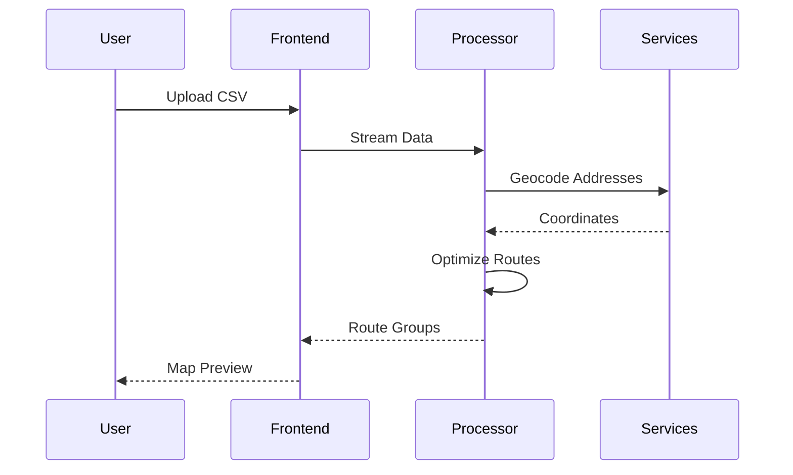
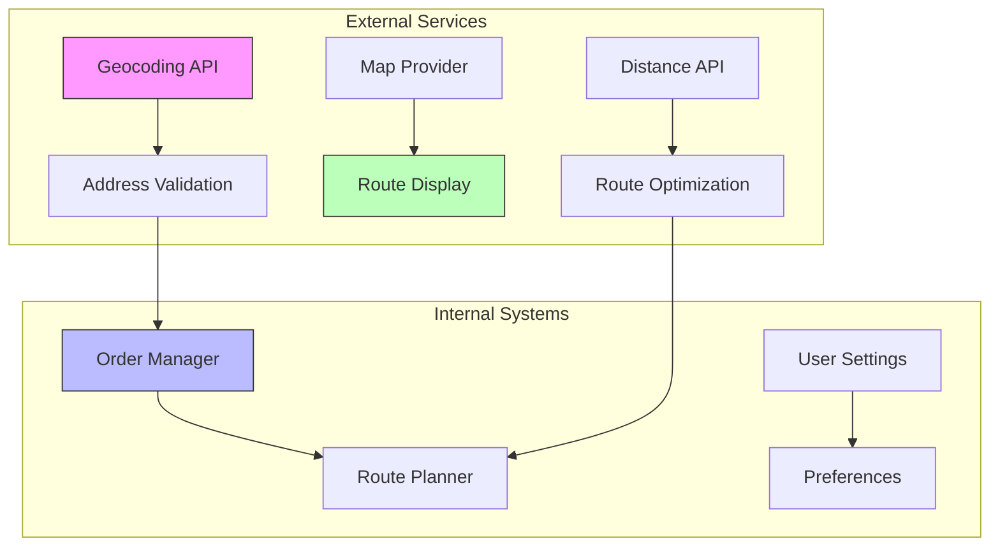

# Bulk Upload Implementation Guide

## Development Milestones

## System Overview

The bulk upload system transforms CSV order data into optimized delivery routes through a sophisticated processing pipeline.

## Feature Components

### 1. File Processing
- Client-side CSV parsing
- Streaming for large files
- Real-time validation
- Progress tracking

### 2. Data Processing
- Address geocoding
- Distance calculations
- Route optimization
- Group management

### 3. User Interface
- Interactive map
- Route visualization
- Group editing
- Progress indicators

## Technical Architecture

## Implementation Guides

### 1. Core Components
- CSV Upload Implementation
  - File handling
  - Validation rules
  - Error management
  
- Route Grouping System
  - Grouping algorithm
  - Optimization strategy
  - Performance tuning

### 2. Technical Specifications
- Engineering Specifications
  - System requirements
  - Performance targets
  - Integration points

### 3. Frontend Integration
- Frontend Components
  - UI components
  - State management
  - Map integration

## Development Flow

## Performance Considerations

### 1. File Processing
- Chunk-based parsing
- Worker thread processing
- Memory management
- Progress indicators

### 2. Route Optimization
- Efficient algorithms
- Caching strategy
- Background processing
- Real-time updates

### 3. User Interface
- Responsive design
- Progressive loading
- Error recovery
- Visual feedback

## Integration Points

## Development Resources

### 1. Code Examples
- Implementation Examples
  - Upload components
  - Validation rules
  - Route optimization

### 2. Technical Guides
- Development Guides
  - Setup instructions
  - Best practices
  - Performance tips

## Technology Stack
- Frontend: TypeScript, React
- Mapping: Mapbox GL JS
- State Management: Redux
- Testing: Jest, React Testing Library

## Related Documentation
- Technical Architecture Overview
- Performance Optimization Strategies
- User Experience Guidelines

## Current Development Focus

### Implemented Features
- CSV file parsing
- Basic route grouping
- Initial map visualization

### Active Development
- Performance optimization
- Advanced routing algorithms
- Enhanced error handling

## Next Steps

1. Review the Engineering Specifications
2. Explore the CSV Upload Implementation
3. Study the Route Grouping System

*Last Updated: 2024-12-22*
