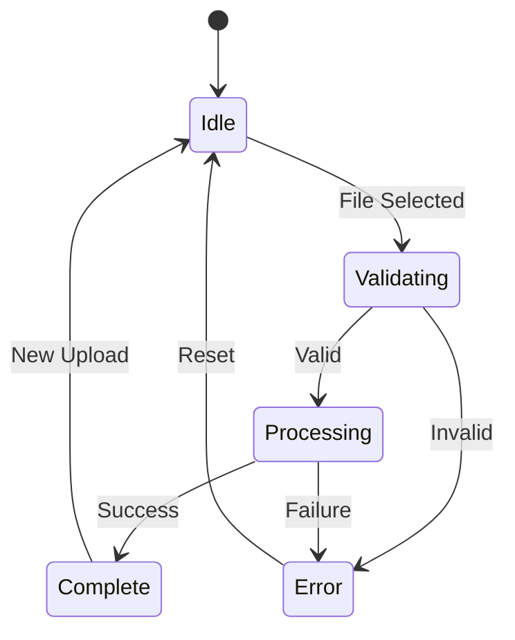

# File Upload Component: Technical Deep Dive

## System Design

The file upload component is a critical first touchpoint in our bulk upload workflow, designed for maximum reliability and user experience.



## TypeScript Interface

```typescript
interface FileUploadProps {
  onUpload: (file: File) => Promise<void>;
  onValidate: (data: OrderData[]) => ValidationResult;
  maxFileSize: number;
  supportedFormats: string[];
}
```

## Validation Strategies

### 1. File Validation
- Size check
- Format verification
- Encoding support

### 2. Content Validation
- CSV structure integrity
- Required field checks
- Data type consistency

## Performance Considerations
- Client-side processing
- Minimal server load
- Instant feedback mechanism

## Error Handling
- Granular error messages
- Guided user correction
- Fallback mechanisms

## Related Technical Documentation

### Architecture References
- [System Architecture](../architecture.md)
- [Route Grouping Component](./route-grouping.md)

*Last Updated: 2024-12-22*
