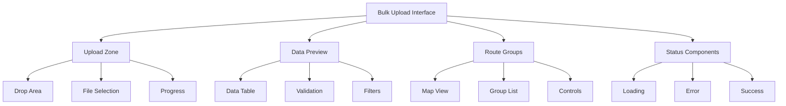
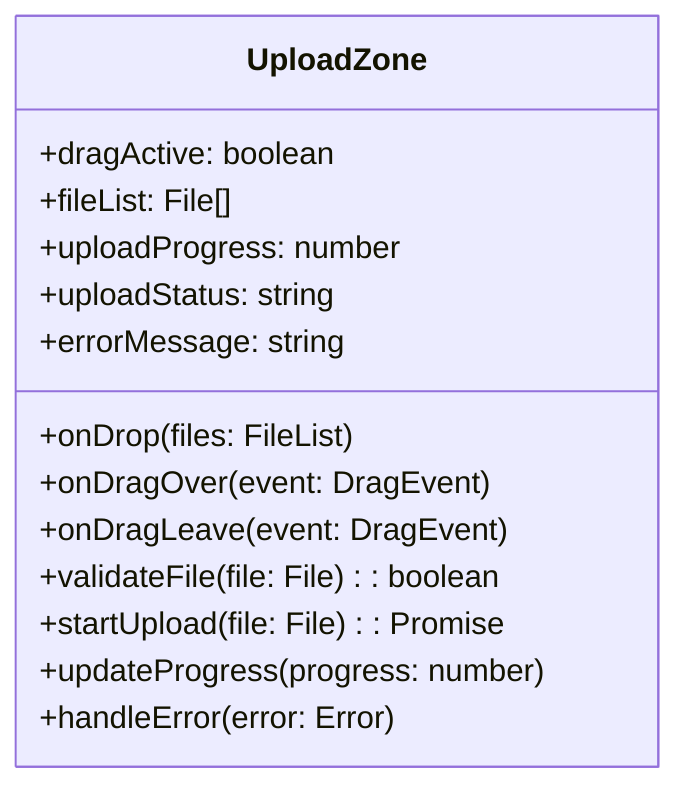
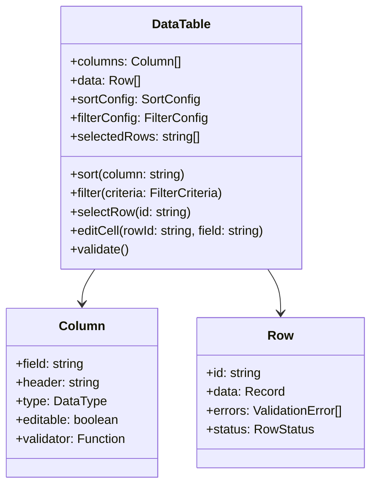
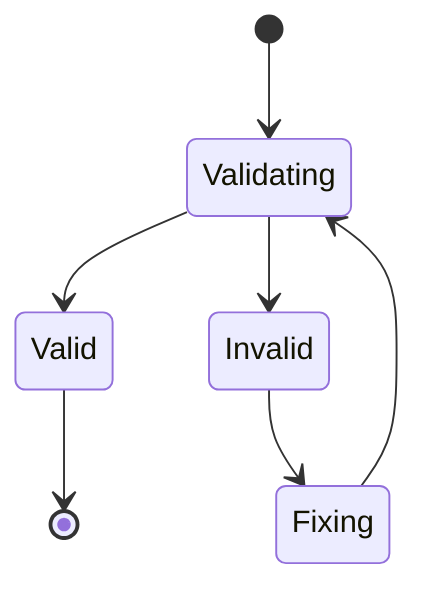
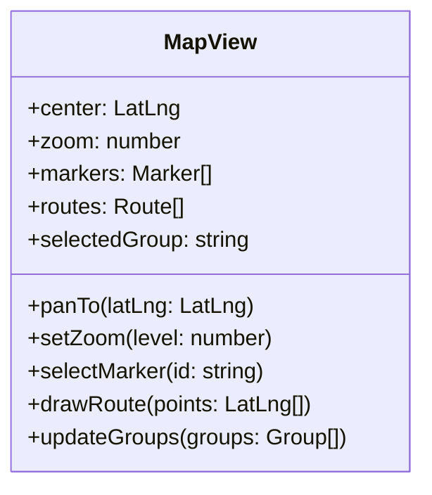
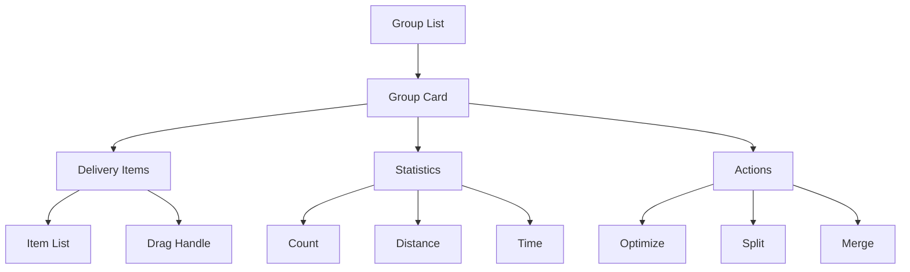
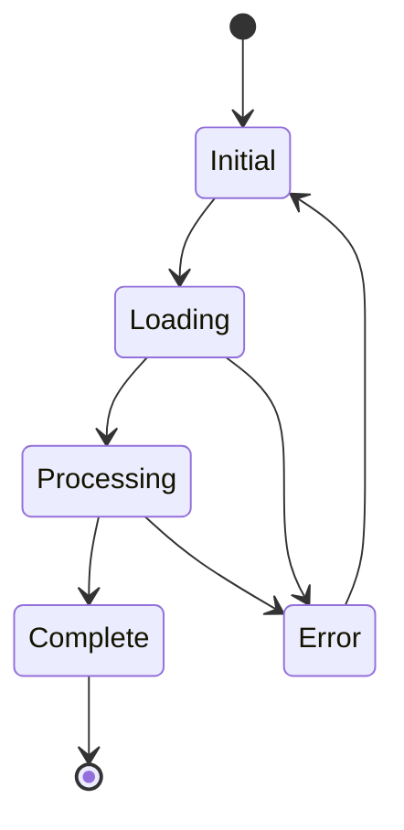
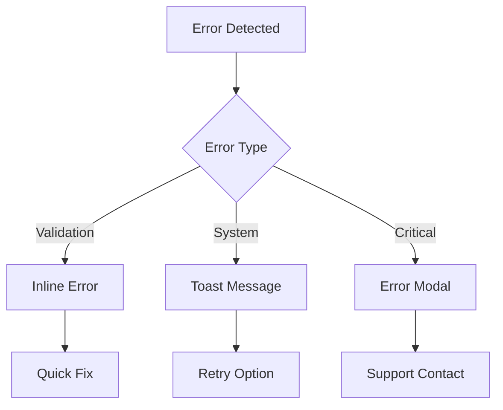
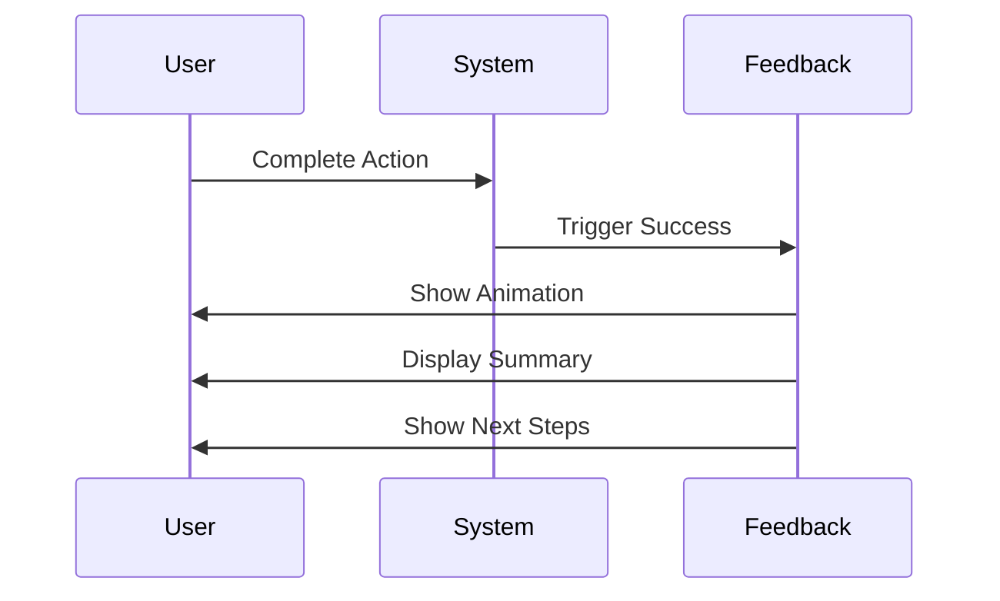

# UX Components

Our bulk upload interface is composed of carefully designed components that work together to create a seamless user experience. Each component is crafted to be both intuitive and powerful, supporting users from novice to expert.

## Component Hierarchy

## Upload Zone

The upload zone is the user's first point of interaction with our system. It must inspire confidence and provide clear feedback throughout the upload process.

### File Drop Area

**Specifications:**
- Dimensions: 400x200px (minimum)
- Padding: 24px
- Border: 2px dashed (default state)
- Border radius: 8px
- Background: Light gray (idle) / Light blue (drag over)

**States:**
1. Idle
   - Default border
   - Upload icon centered
   - "Drop files here" text
2. Drag Over
   - Highlighted border
   - Background color change
   - "Release to upload" text
3. Uploading
   - Progress bar visible
   - Cancel button available
   - File name display
4. Error
   - Error message display
   - Reset button
   - Error icon

### File Selection Button
- Primary button style
- Icon: upload cloud (24x24px)
- Text: "Choose File" or "Browse"
- Position: Center of upload zone
- Hover/Focus states defined

## Data Preview

The data preview section provides a comprehensive view of uploaded data with powerful editing capabilities.

### Preview Table Architecture

### Preview Table Specifications
- Header height: 48px
- Row height: 40px
- Cell padding: 12px
- Border: 1px solid (light gray)
- Sticky header with shadow
- Alternating row colors
- Error highlighting (left border red)
- Inline editing with double-click
- Column sorting with indicators
- Search/filter functionality

### Validation Status Component

**Status Indicators:**
- Color-coded status (green/yellow/red)
- Error count with severity levels
- Quick-fix suggestions tooltip
- Bulk edit action buttons

## Route Groups

The route group interface combines spatial and list-based views for effective delivery management.

### Map View Component

**Map Features:**
- Interactive map component (Leaflet/Google Maps)
- Custom marker clustering
- Route visualization with colors
- Group color coding (distinct colors)
- Zoom and pan controls
- Address markers with tooltips

### Group Management Interface

**Features:**
- Drag-and-drop interface
- Real-time group statistics
- Optimization controls
- Manual adjustment tools
- Group performance metrics

## Status Components

### Loading States

**Progress Indicators:**
- Upload progress bar (linear)
- Processing spinner (circular)
- Step completion checklist
- Time estimates (dynamic)
- Cancel option

### Error Handling

**Error Components:**
- Toast notifications (auto-dismiss)
- Inline validation markers
- Error summary panel
- Recovery suggestion buttons
- Support contact information

### Success Feedback

**Success Elements:**
- Success animation (checkmark)
- Order summary card
- Next steps guidance
- Download options
- Action buttons
