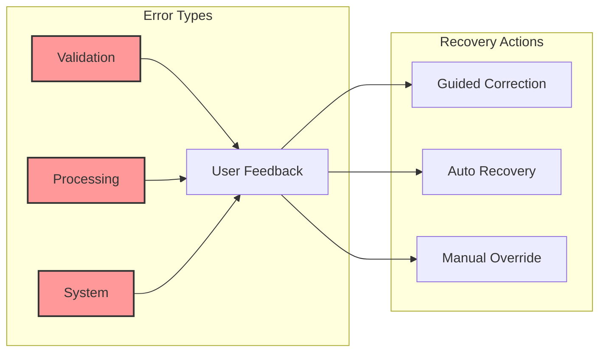

# Error Handling and Recovery Strategies

## Error Management Philosophy



## Error Classification

### 1. Validation Errors
- Incorrect file format
- Missing required fields
- Data type mismatches

### 2. Processing Errors
- Geocoding failures
- Route optimization constraints
- Capacity limit exceedance

### 3. System Errors
- API connection issues
- Resource allocation problems
- Unexpected runtime exceptions

## Recovery Strategies

#### Validation Error Handling
- Immediate, clear feedback
- Specific error location
- Suggested corrections
- Optional manual override

#### Processing Error Management
- Partial processing support
- Fallback optimization methods
- Transparent error reporting
- User-guided resolution

#### System Error Mitigation
- Graceful degradation
- Automatic retry mechanisms
- Comprehensive logging
- Minimal user disruption

## Error Reporting Interface

```typescript
interface ErrorReportProps {
  type: 'validation' | 'processing' | 'system';
  severity: 'warning' | 'error' | 'critical';
  message: string;
  suggestedAction?: string;
  recoveryOptions: RecoveryOption[];
}
```

## Related Documentation
### UX Guidelines
- [Interface Guidelines](./interface-guidelines.md)

### Technical References
- [System Architecture](../technical/architecture.md)

*Last Updated: 2024-12-22*
