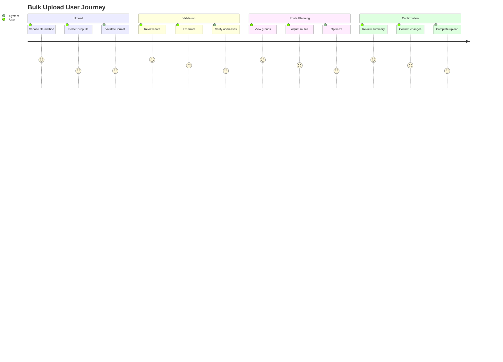
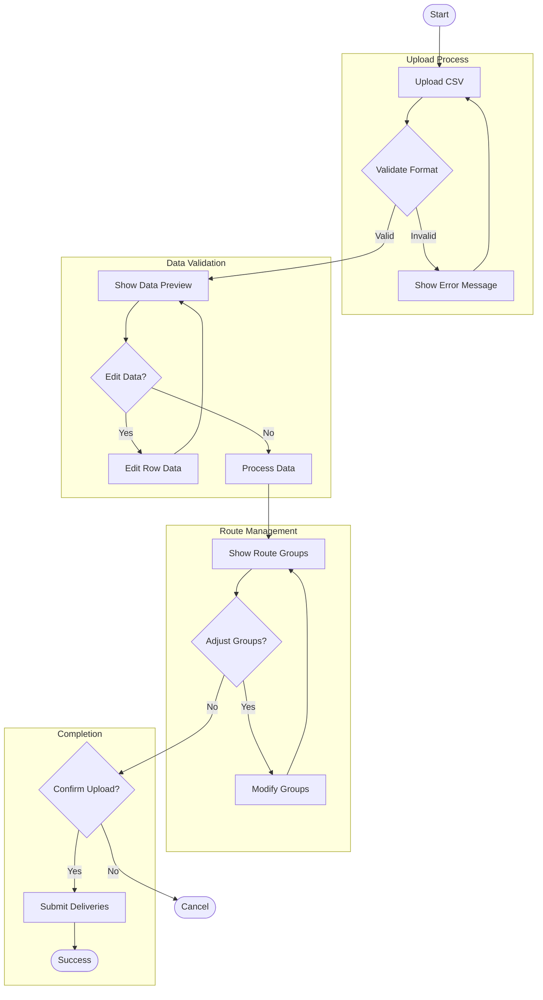
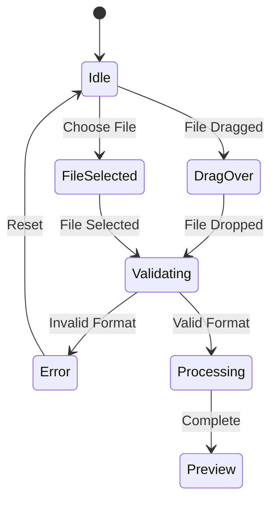
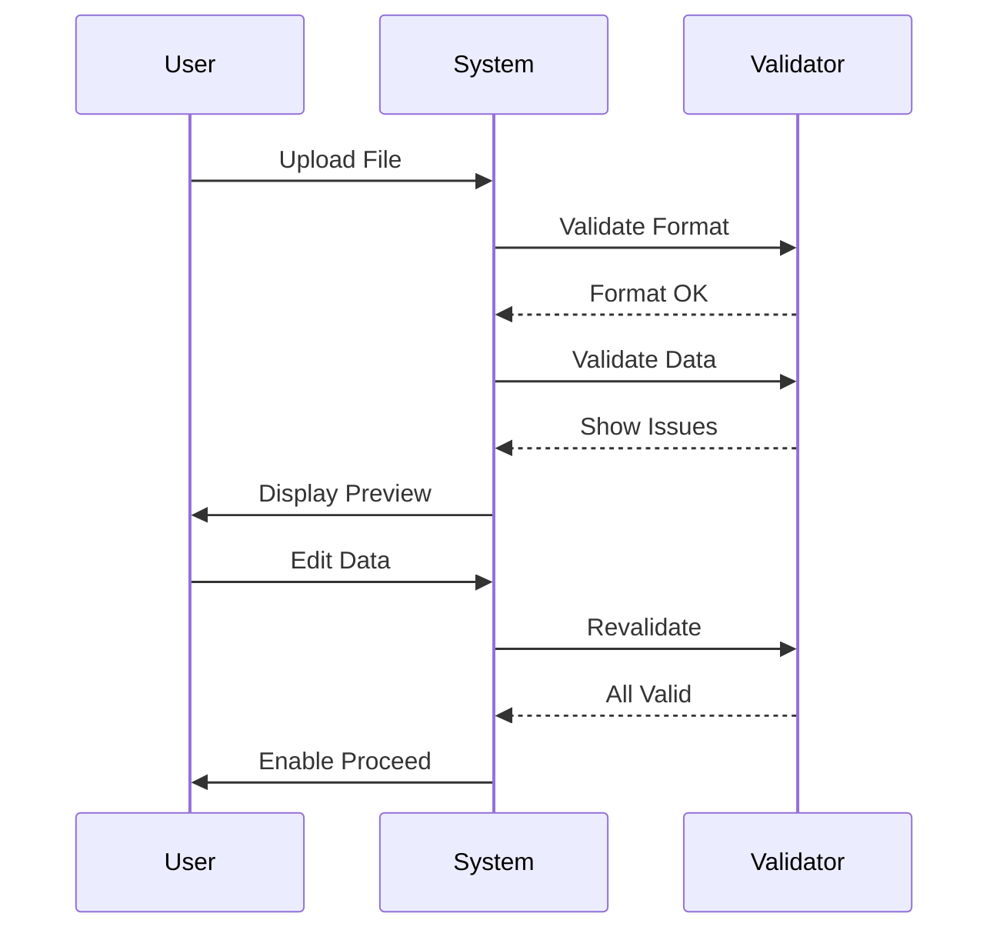
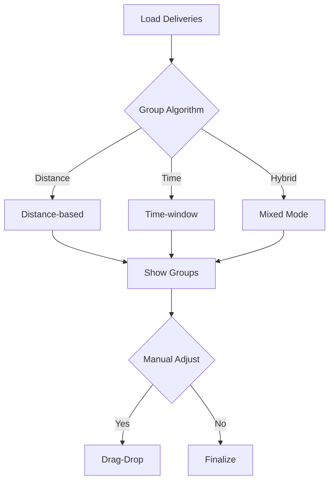
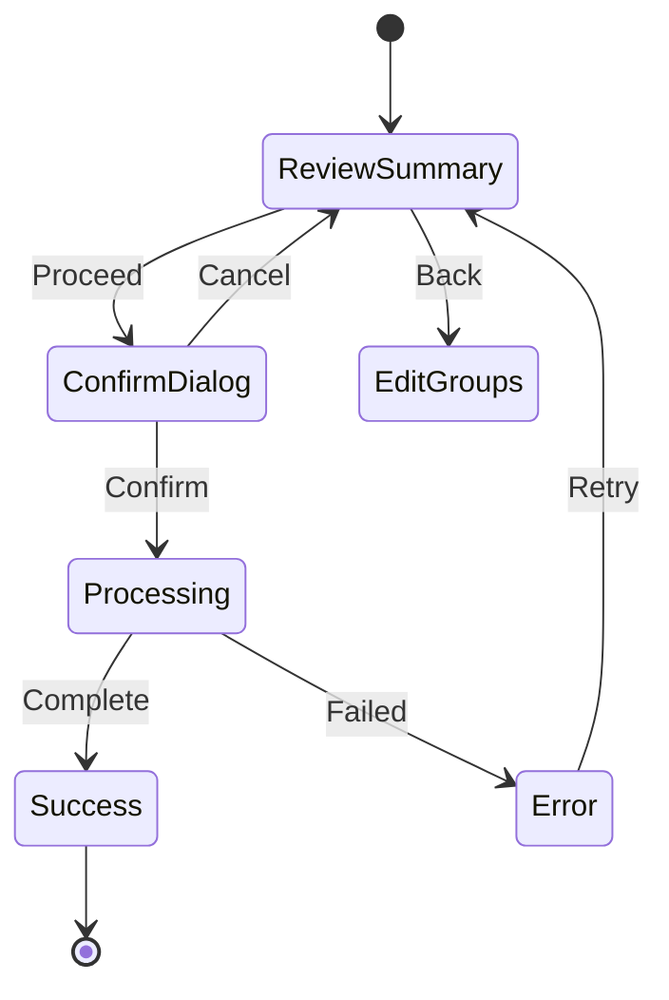
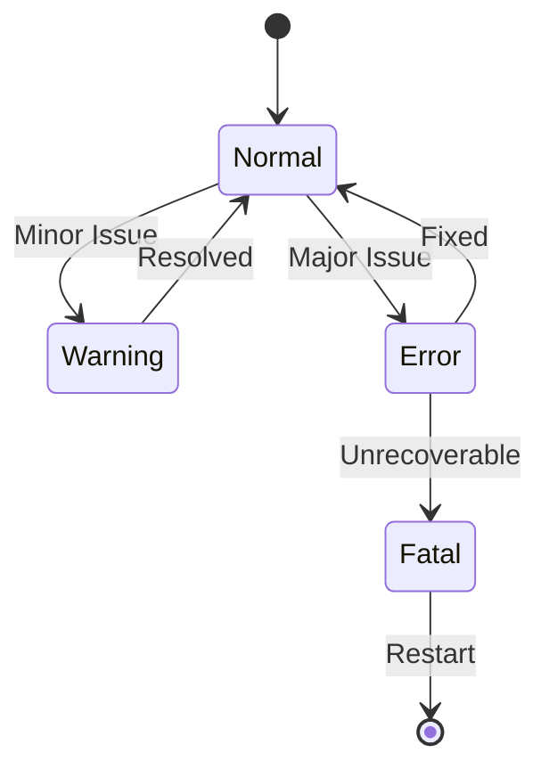
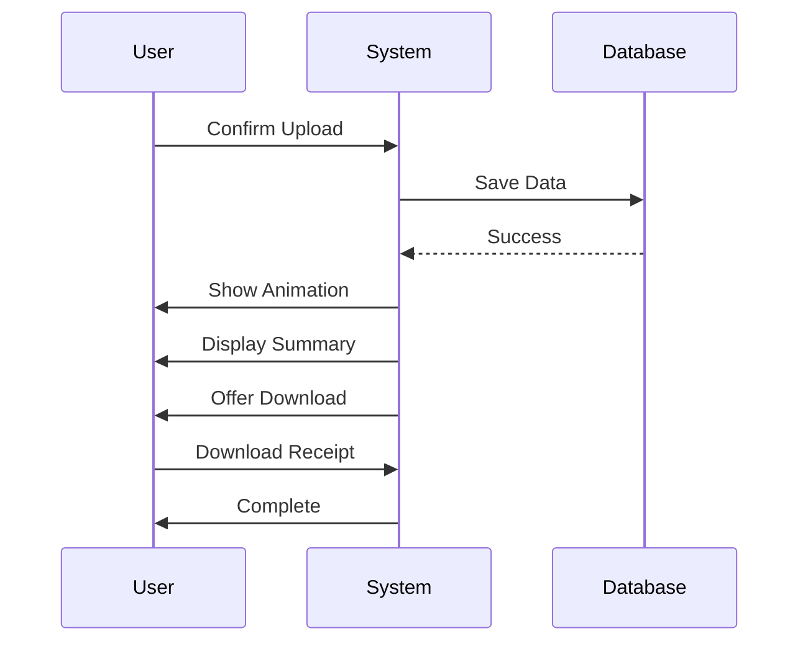

# Bulk Upload Flow

## Overview

The bulk upload flow is designed to help users efficiently upload and process multiple deliveries at once. The system guides users through a series of well-defined stages, each with clear objectives and feedback mechanisms.

## User Journey Map

## Detailed Flow Diagram

## Stage Details

### 1. Upload Stage

#### File Selection
- **Drag-and-Drop Zone**
  - Active area: 400x200px minimum
  - Visual feedback on hover/drag
  - Supported file types: CSV
  - Max file size: 10MB

- **Manual Selection**
  - Browse button placement: Center
  - File picker: Native OS
  - Multiple file support: No

#### Format Validation
- **Required Columns**
  - Delivery ID (unique)
  - Customer Name
  - Delivery Address
  - Contact Number
  - Time Window
  - Package Details

- **Template Support**
  - Download template button
  - Sample data row
  - Column descriptions
  - Format guidelines

### 2. Validation Stage

#### Data Preview
- **Table View**
  - Pagination: 50 rows/page
  - Column sorting
  - Quick filters
  - Search functionality
  - Row selection

- **Validation Rules**
  | Field | Validation | Error Message |
  |-------|------------|---------------|
  | ID | Unique | Duplicate delivery ID |
  | Name | Required | Customer name required |
  | Address | Geocodable | Invalid address format |
  | Contact | Format check | Invalid phone number |
  | Time | Range check | Outside operation hours |

#### Error Management
- **Visual Indicators**
  - Row level: Left border (red)
  - Cell level: Background (light red)
  - Field level: Icon with tooltip

- **Bulk Operations**
  - Select all with errors
  - Bulk edit similar errors
  - Copy/paste from Excel
  - Undo/redo support

### 3. Route Planning Stage

#### Route Groups
- **Map View**
  - Zoom levels: 10-18
  - Marker clustering
  - Route lines with direction
  - Group color coding
  - Interactive markers

- **Group Management**
  - Drag-drop between groups
  - Auto-rebalance option
  - Split/merge groups
  - Optimize button

#### Optimization
- **Algorithms**
  - Distance-based grouping
  - Time-window clustering
  - Vehicle capacity check
  - Route efficiency score

### 4. Confirmation Stage

#### Final Review
- **Summary View**
  - Total deliveries
  - Group distribution
  - Cost estimation
  - Time projections

- **Confirmation Dialog**
  - Clear action buttons
  - Review checklist
  - Terms acceptance
  - Cancel option

## Error Handling

### System States

### Error Types
1. **Validation Errors**
   - Field-level validation
   - Business rule violations
   - Format inconsistencies
   - Missing required data

2. **System Errors**
   - Network timeout
   - Server errors
   - File corruption
   - Memory limits

### Recovery Mechanisms
- Auto-save every 30 seconds
- Local storage backup
- Session recovery
- Error retry logic

## Success Scenarios

### Completion States

### Success Actions
1. **Visual Feedback**
   - Success animation
   - Confetti effect
   - Status update
   - Summary card

2. **Next Steps**
   - Download receipt
   - View deliveries
   - Start tracking
   - Share results

3. **Follow-up**
   - Email confirmation
   - Track link
   - Support contact
   - Feedback request
