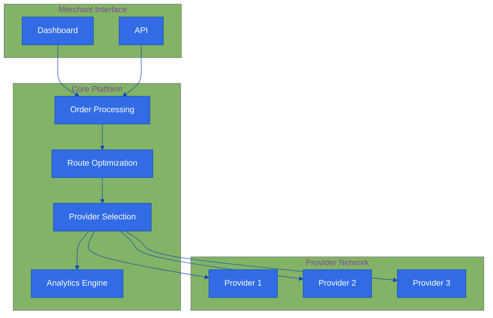

# Platform Overview

!!! tip "Quick Summary"
    Antar is an AI-powered delivery platform that seamlessly connects Southeast Asian merchants with multiple delivery services through a single, intelligent interface.

## The Challenge

!!! danger "Pain Points"
    - __Multiple Platforms__: Merchants juggle multiple delivery apps
    - __Time Consuming__: Hours spent comparing delivery options
    - __Complex Decisions__: Difficult to balance speed, cost, and reliability
    - __Management Overhead__: No unified view of delivery operations
    - __Inefficient Processes__: Manual provider selection and order management

## Our Solution

## Key Components

### 1. Smart Order Management
- Bulk order processing
- Automated validation
- Priority handling
- Real-time status updates

### 2. Intelligent Route Optimization
- AI-powered route planning
- Geographic clustering
- Time window optimization
- Multi-stop efficiency

### 3. Provider Network
- Multiple provider integration
- Real-time availability
- Dynamic pricing
- Performance tracking

### 4. Analytics & Insights
- Cost analysis
- Performance metrics
- Delivery patterns
- Optimization suggestions

## Benefits

### For Merchants
- Reduced operational costs
- Improved delivery efficiency
- Better customer satisfaction
- Data-driven decisions
- Simplified management

### For Customers
- Faster deliveries
- Reliable service
- Real-time tracking
- Better communication
- Consistent experience

## Getting Started

1. Sign up for an Antar account
2. Connect your delivery providers
3. Upload your orders
4. Let our AI optimize your deliveries
5. Track and analyze performance

[Get Started Now →](roadmap/phase-1-foundation.md)
