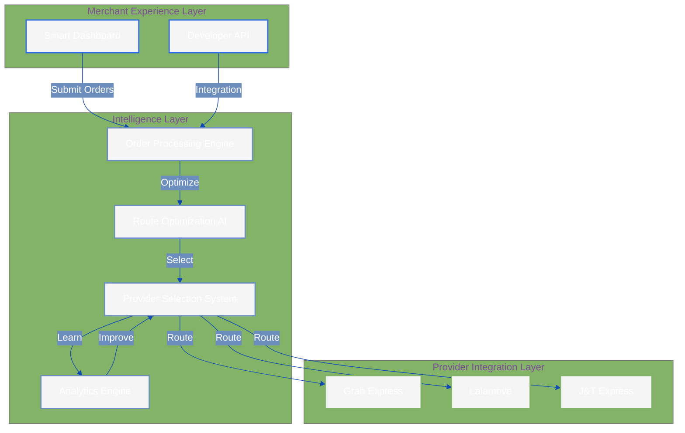
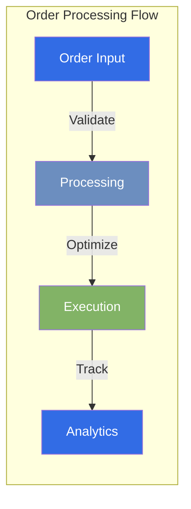
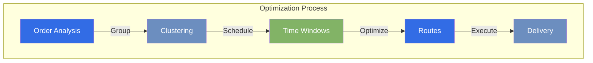
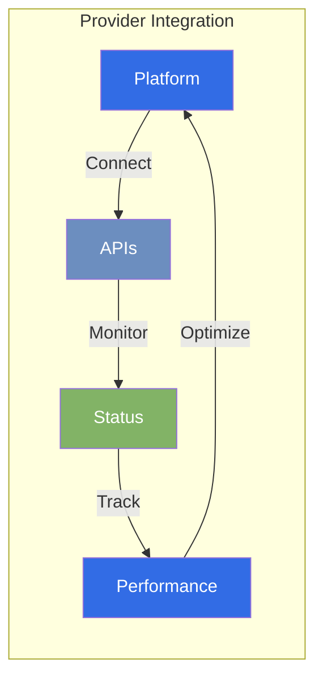
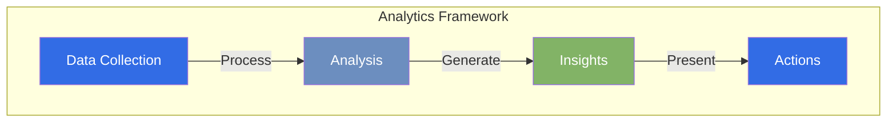
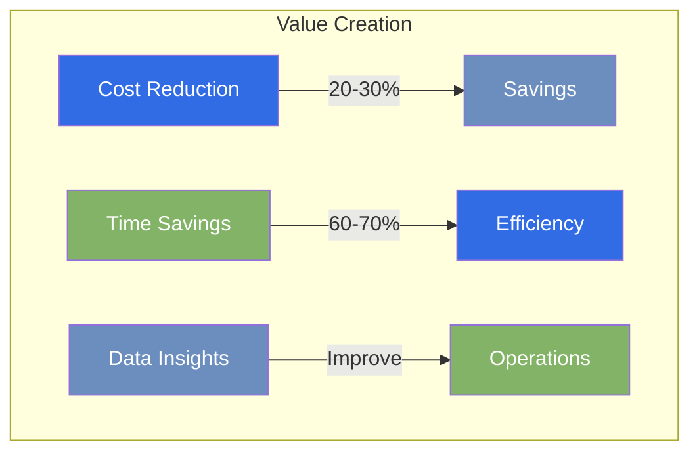
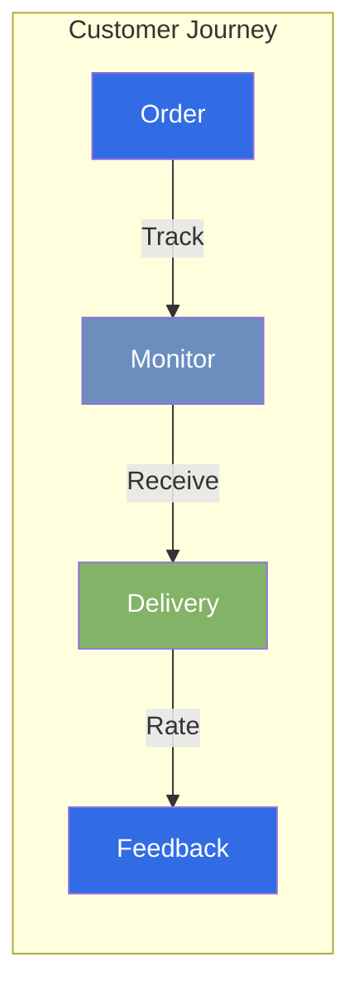

# Platform Overview

## Vision
!!! tip "Quick Summary"
    Antar revolutionizes delivery management in Southeast Asia by unifying multiple delivery services under a single, AI-powered platform. We transform complex logistics decisions into simple, data-driven choices that save time, reduce costs, and improve customer satisfaction.

## The Market Challenge

!!! danger "Critical Pain Points"
    ```mermaid
    graph TD
        subgraph "Current Challenges"
            A[Multiple Platforms] -->|Leads to| B[Time Waste]
            B -->|Results in| C[Poor Decisions]
            C -->|Causes| D[Customer Issues]
            D -->|Creates| E[Business Impact]
            E -->|Forces Return to| A
        end
        
        style A fill:#326CE5,color:#fff
        style B fill:#6C8EBF,color:#fff
        style C fill:#82B366,color:#fff
        style D fill:#326CE5,color:#fff
        style E fill:#6C8EBF,color:#fff
    ```

    - __Platform Fragmentation__: Merchants struggle with multiple delivery apps, each with its own interface and workflow
    - __Operational Inefficiency__: Hours lost daily comparing options and managing deliveries across platforms
    - __Decision Complexity__: Difficult to optimize for speed, cost, and reliability simultaneously
    - __Management Overhead__: No unified view leads to scattered data and inefficient operations
    - __Process Inefficiency__: Manual provider selection and order management increase errors and costs

## Our Solution: The Antar Platform



## Key Platform Components

### 1. Intelligent Order Management


- **Smart Bulk Processing**: Handle multiple orders efficiently
- **Automated Validation**: Prevent errors before they occur
- **Priority Management**: Intelligent handling of urgent deliveries
- **Real-time Updates**: Live tracking and notifications

### 2. AI-Powered Route Optimization


- **Smart Geographic Clustering**: Group nearby deliveries
- **Time Window Optimization**: Consider delivery constraints
- **Multi-stop Efficiency**: Optimize multiple deliveries
- **Dynamic Updates**: Real-time route adjustments

### 3. Unified Provider Network


- **Seamless Integration**: Connect with multiple providers
- **Real-time Availability**: Live service status
- **Dynamic Pricing**: Up-to-date cost information
- **Performance Monitoring**: Track provider metrics

### 4. Advanced Analytics Engine


- **Comprehensive Analysis**: Deep cost insights
- **Performance Tracking**: Key metrics monitoring
- **Pattern Recognition**: Delivery trend analysis
- **Smart Suggestions**: Data-driven recommendations

## Platform Benefits

### Merchant Advantages


- **Operational Excellence**: Streamlined delivery management
- **Cost Optimization**: Reduced delivery expenses
- **Customer Satisfaction**: Improved delivery experience
- **Data Intelligence**: Informed business decisions
- **Simple Management**: Unified control center

### Customer Experience


- **Enhanced Speed**: Optimized delivery times
- **Reliable Service**: Consistent performance
- **Live Tracking**: Real-time order visibility
- **Better Communication**: Clear delivery updates
- **Consistent Experience**: Standardized service

## Getting Started

### Quick Start Guide
1. **Platform Access**
   - Sign up for Antar account
   - Complete business verification
   - Access dashboard

2. **Provider Setup**
   - Connect delivery services
   - Set preferences
   - Configure rules

3. **Operations Launch**
   - Upload initial orders
   - Monitor AI optimization
   - Track performance

4. **Optimization**
   - Review analytics
   - Adjust settings
   - Scale operations

[Begin Your Journey →](roadmap/phase-1-foundation.md)

*Last Updated: 2024-12-20T07:00:28+08:00*
