# Documentation System Initiative

## Vision
> "Building a living documentation system that evolves with our platform"

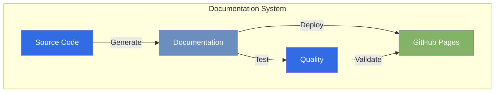

## Objective
Establish a robust, automated documentation system that ensures our platform's documentation is always up-to-date, accessible, and maintainable through continuous integration and deployment.

## Impact

### User Benefits
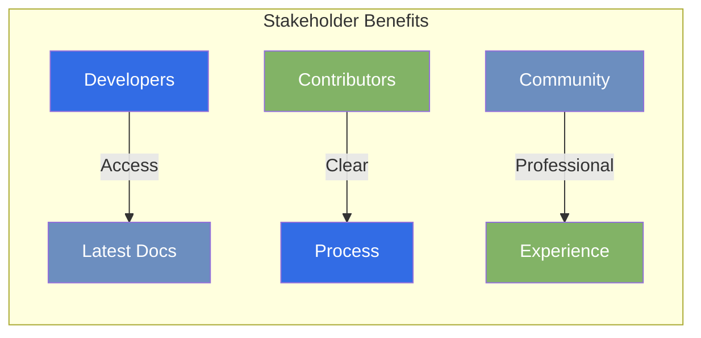

- **Developers**: Easy access to latest documentation
- **Contributors**: Clear process for documentation updates
- **Stakeholders**: Always-current project status
- **Community**: Professional, accessible documentation

### System Improvements
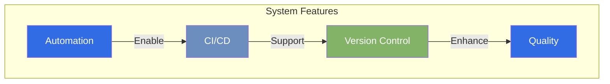

- Automated build and deployment
- Version control integration
- Visual regression testing
- Mermaid diagram support

## Implementation

### Technical Architecture
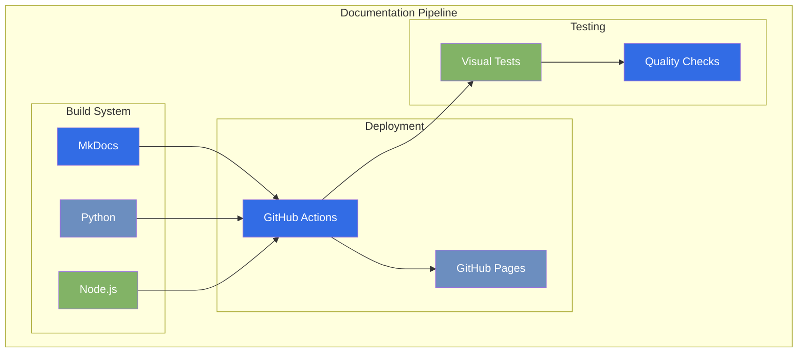

### Technical Changes
1. **GitHub Actions Workflow**
   ```yaml
   name: Deploy Documentation
   on:
     push:
       branches: [main]
     pull_request:
       branches: [main]
   ```

2. **Build System**
   - MkDocs with Material theme
   - Python-based build process
   - Node.js for Mermaid support

3. **Deployment**
   - GitHub Pages integration
   - Automatic versioning
   - Preview environments

### Process Flow
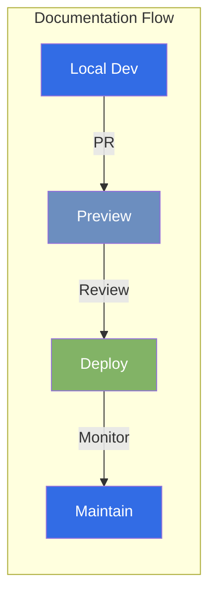

### Process Updates
1. **Documentation Workflow**
   - Local development setup
   - Preview builds for PRs
   - Automated deployment
   - Quality checks

2. **Maintenance Procedures**
   - Regular visual testing
   - Dependency updates
   - Performance monitoring
   - Content reviews

### Documentation Structure
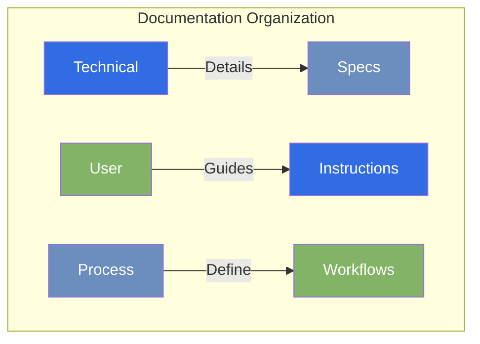

### Documentation Requirements
1. **Technical Specifications**
   - CI/CD pipeline details
   - Configuration guides
   - Troubleshooting steps

2. **User Guides**
   - Setup instructions
   - Contribution guidelines
   - Best practices

## Success Metrics

### Performance Dashboard
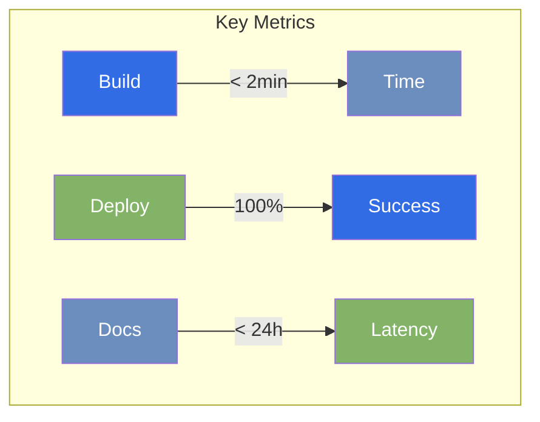

### Quantitative Metrics
- Build time < 2 minutes
- Zero failed deployments
- 100% build success rate
- < 24h documentation latency

### Qualitative Metrics
- Positive developer feedback
- Clear documentation structure
- Easy contribution process
- Professional appearance

## Project Timeline

### Development Roadmap
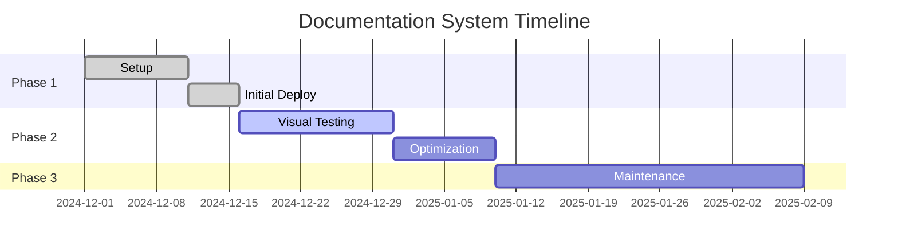

### Phase 1: Setup (Completed)
- [x] GitHub Actions workflow
- [x] Basic documentation structure
- [x] Initial deployment

### Phase 2: Enhancement
- [ ] Visual regression testing
- [ ] Performance optimization
- [ ] Search enhancement
- [ ] Analytics integration

### Phase 3: Maintenance
- [ ] Regular reviews
- [ ] Dependency updates
- [ ] Process refinement
- [ ] User feedback collection

## Status Updates

### Project Progress
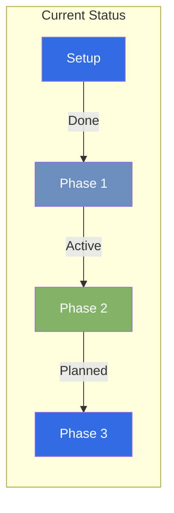

### 2024-12-11
- Initial setup completed
- GitHub Actions workflow deployed
- Documentation structure established
- CI/CD pipeline operational

## Integration Areas

### System Integration
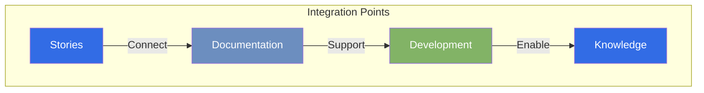

### Story Idea
- Connects to user need for reliable documentation
- Supports development efficiency
- Enables knowledge sharing

### Technical Roadmap
- Aligns with automation goals
- Supports quality standards
- Enables scalable processes

### Task Management
- Regular maintenance tasks
- Update procedures
- Quality checks

## Resources

### Technology Stack
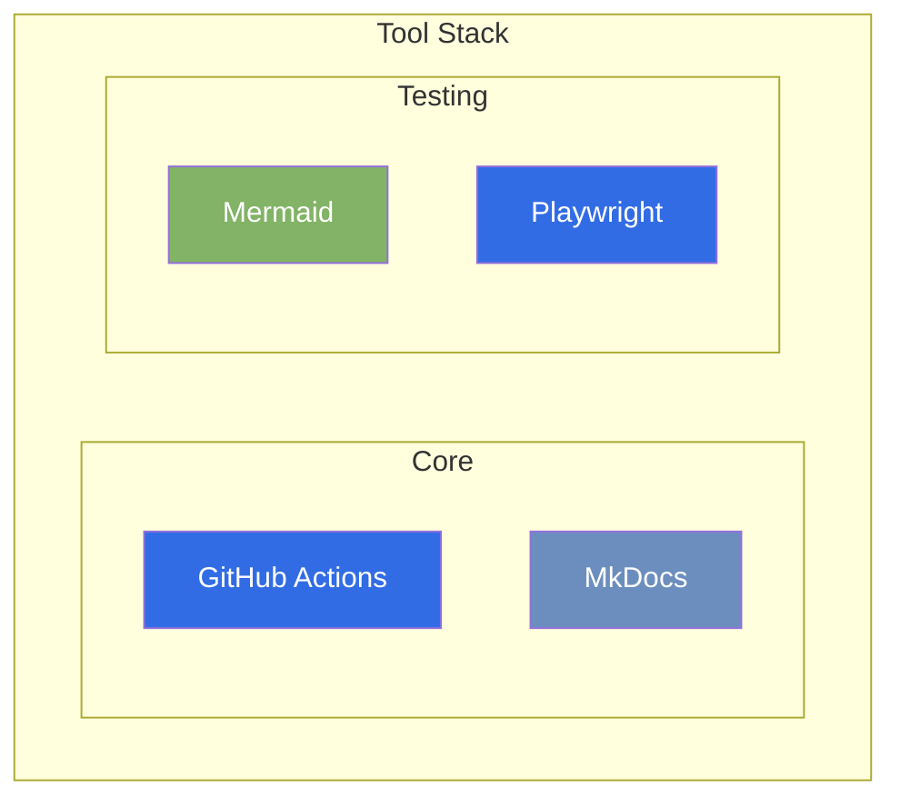

### Tools
- GitHub Actions
- MkDocs Material
- Mermaid CLI
- Playwright

### Documentation
- [Technical Specification](../technical-specifications/ci-cd.md)
- [GitHub Actions Workflow](../../.github/workflows/docs.yml)
- [Setup Guide](../README.md)

*Last Updated: 2024-12-20T07:06:09+08:00*
