# Visual Testing Toolkit

## Vision
> "A picture is worth a thousand words, but a visual test is worth a thousand manual checks."

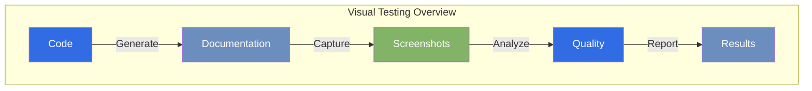

## Overview

The Visual Testing Toolkit is a powerful addition to our documentation system that helps ensure consistent and high-quality visual presentation across our documentation. It provides automated tools for capturing and analyzing visual elements, making it easier to catch layout issues early.

### System Architecture
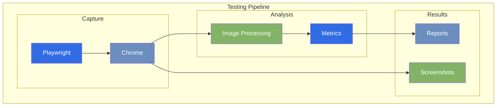

## Key Features

### Component Testing Flow
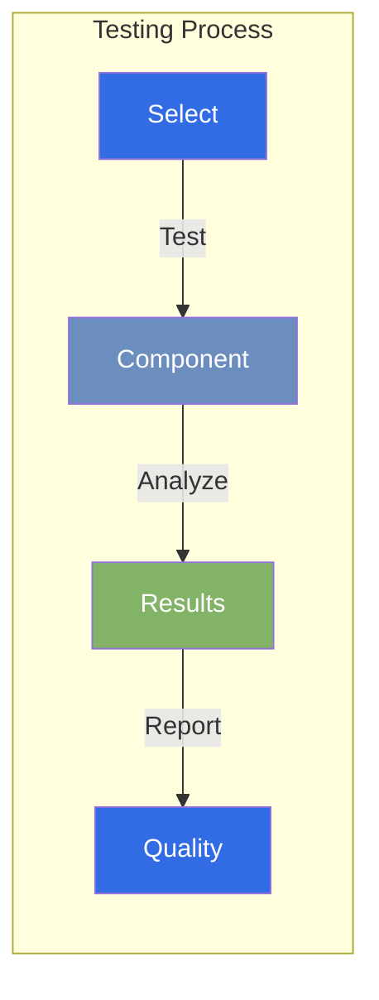

### 🎯 Component-specific Testing

Test specific components or entire pages with simple commands:

```bash
# Test navigation menu only
python 00.py docs visual nav

# Test full page captures
python 00.py docs visual pages

# Run all visual tests
python 00.py docs visual
```

### Analytics Dashboard
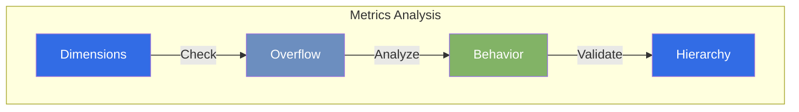

### 📊 Detailed Analytics

Get comprehensive insights about your UI components:
- Container dimensions
- Content overflow detection
- Scrolling behavior analysis
- Visual hierarchy checks

### Screenshot Management
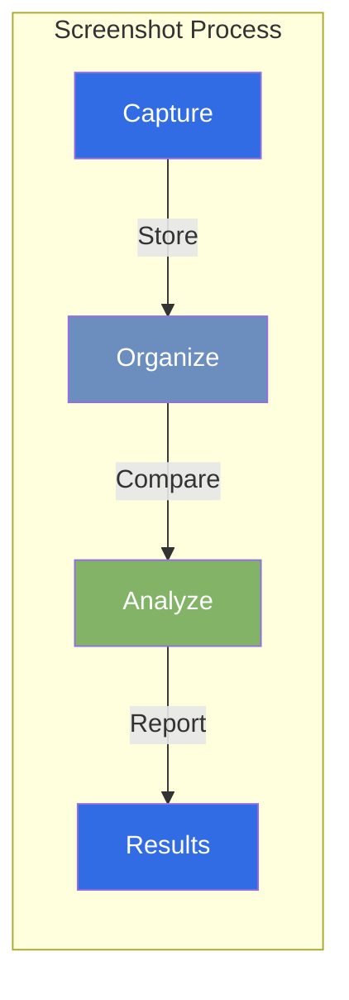

### 📸 Automated Screenshots

- Full page captures for documentation review
- Component-specific snapshots for detailed inspection
- Organized output in `.cascade/visual-test/` directory

## Quick Start

### Setup Process
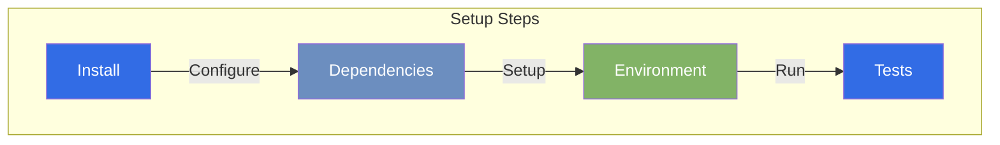

1. **Setup**
   ```bash
   # Install dependencies
   pip install playwright
   python -m playwright install chromium
   ```

2. **Run Tests**
   ```bash
   # Start the docs server
   python 00.py docs serve

   # In another terminal, run visual tests
   python 00.py docs visual
   ```

3. **Check Results**
   - Open `.cascade/visual-test/` directory
   - Review screenshots and test reports
   - Check console output for measurements and warnings

## Use Cases

### Testing Workflow
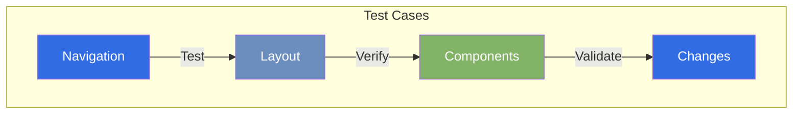

### 1. Navigation Menu Development
```bash
python 00.py docs visual nav
```
Perfect for:
- Testing scrolling behavior
- Checking container overflow
- Verifying visual hierarchy

### 2. Page Layout Verification
```bash
python 00.py docs visual pages
```
Useful for:
- Ensuring consistent styling
- Checking responsive design
- Validating content layout

### 3. Pre-commit Validation
Run all tests before committing changes:
```bash
python 00.py docs visual
```

## Implementation Details

### System Components
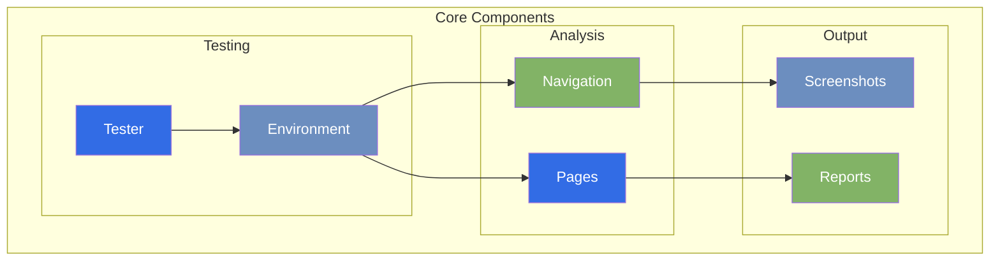

### Core Components

1. **VisualTester Class**
   - Manages test environment
   - Handles server lifecycle
   - Organizes test outputs

2. **Navigation Testing**
   - Measures container dimensions
   - Analyzes scrolling behavior
   - Captures component screenshots

3. **Page Testing**
   - Full page captures
   - Cross-page consistency checks
   - Layout verification

### Output Structure
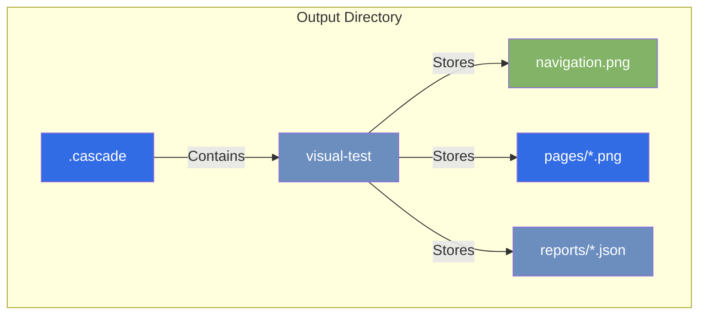

```
.cascade/visual-test/
├── navigation.png       # Navigation menu snapshot
├── home.png            # Homepage capture
├── story.png           # Story page capture
├── features.png        # Features page capture
└── personas.png        # Personas page capture
```

## Best Practices

### Testing Process
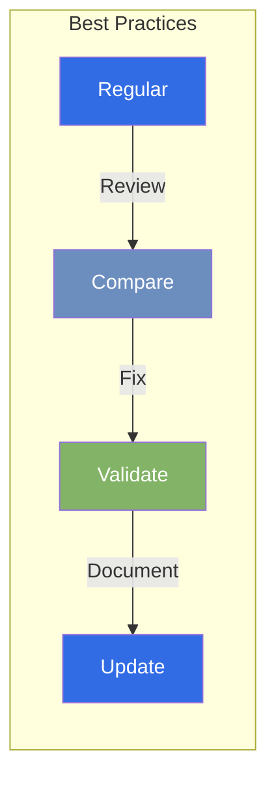

1. **Regular Testing**
   - Run visual tests after CSS changes
   - Check navigation behavior updates
   - Verify page layout modifications

2. **Review Process**
   - Compare before/after screenshots
   - Check console output for warnings
   - Verify component measurements

3. **Issue Resolution**
   - Use measurements to guide fixes
   - Test specific components first
   - Validate fixes with full suite

## Future Enhancements

### Roadmap
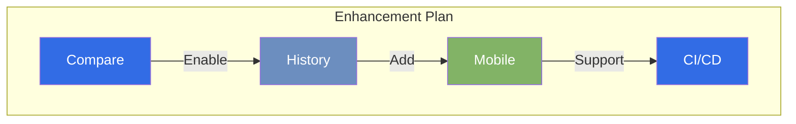

1. **Automated Comparison**
   - Screenshot diff generation
   - Historical comparison
   - Regression detection

2. **Extended Coverage**
   - Mobile viewport testing
   - Dark mode validation
   - Animation verification

3. **Integration Features**
   - CI/CD pipeline integration
   - Automated PR checks
   - Performance metrics

## Contributing

### Development Flow
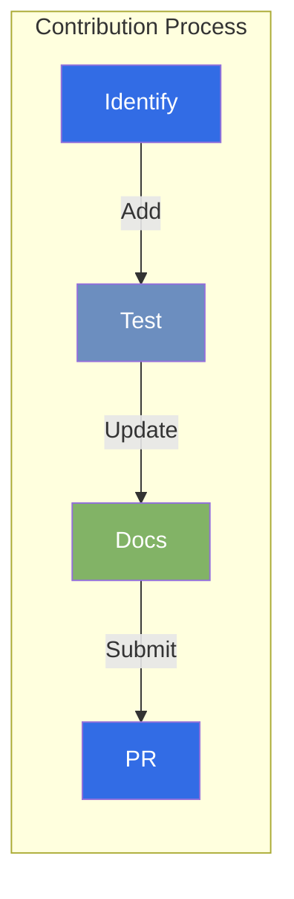

To add new visual tests:

1. Identify the component to test
2. Add test logic to `visual.py`
3. Update documentation
4. Submit PR with test results

## Related Resources

### Integration Points
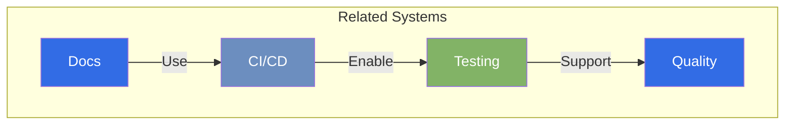

- [Documentation System](../documentation-system.md)
- [CI/CD Pipeline](../../technical-specifications/ci-cd.md)
- [Testing Strategy](../../technical-specifications/testing.md)

---

> "Visual testing isn't just about catching bugs; it's about maintaining the quality and consistency of our user experience."

*Last Updated: 2024-12-20T07:06:09+08:00*
