# Phase 1: Foundation Initiative

## Vision and Strategy
In the vibrant landscape of Southeast Asian commerce, where thousands of deliveries pulse through city streets daily, businesses face mounting pressure to manage bulk orders efficiently. Phase 1 of Antar marks our strategic entry into this dynamic market, focusing on building a robust foundation that will revolutionize delivery management.

> "Building an Intelligent Multi-Route Optimization Platform for Bulk Deliveries: Where AI Meets Real-World Logistics"

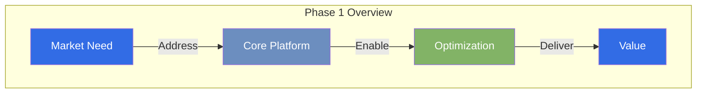

Our initial implementation will serve a strategic retail partner in Malaysia, validating both our technology and business model while setting the stage for broader market adoption.

[View Technical Vision →](/tech/story/vision)

## Technical Architecture Vision

### System Architecture Overview
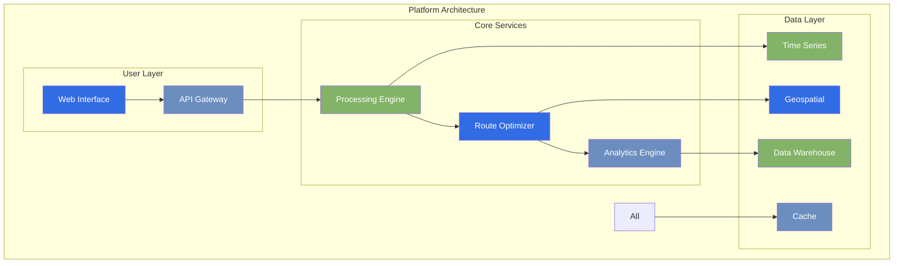

### Core Components
- **Processing Engine**
    - Event-driven microservices
    - Real-time processing pipeline
    - Scalable queue management
    - Fault-tolerant design

- **Data Architecture**
    - Time-series optimization
    - Geospatial indexing
    - Multi-layer caching
    - Analytics warehouse

- **Integration Layer**
    - Smart API gateway
    - Provider adaptors
    - Auth services
    - Rate management

[View Technical Architecture →](/tech/roadmap/phase-1/architecture)

## Core Platform Capabilities

### Bulk Order Management System
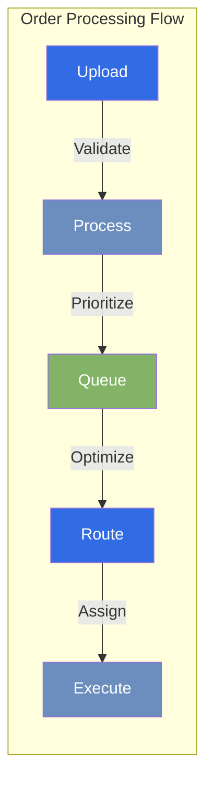

#### Features
- **Smart Upload Interface**
    - Bulk CSV/JSON processing
    - Real-time validation
    - Priority assignment
    - Time window handling
    - Special requirements

[View API Specifications →](/tech/specs/api)

### Route Optimization Engine
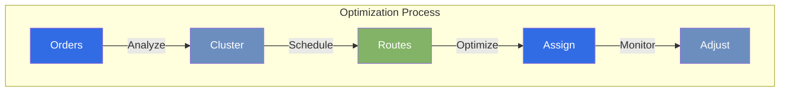

#### Capabilities
- **Intelligent Routing**
    - Geographic clustering
    - Time-window optimization
    - Capacity planning
    - Priority routing
    - Multi-stop optimization

[View Data Models →](/tech/specs/data)

### Dynamic Pricing System
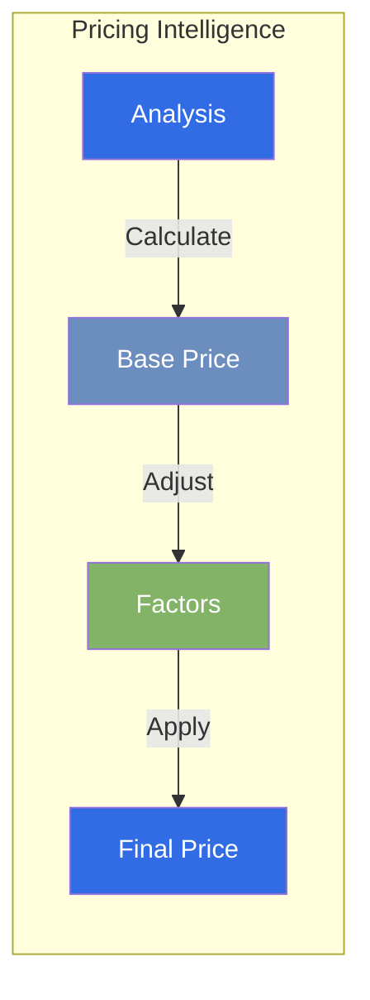

#### Features
- **Smart Pricing Model**
    - Priority-based tiers
    - Volume discounts
    - Time sensitivity
    - Special handling
    - Peak pricing

[View Integration Details →](/tech/roadmap/phase-1/integration)

## Implementation Strategy

### Development Timeline
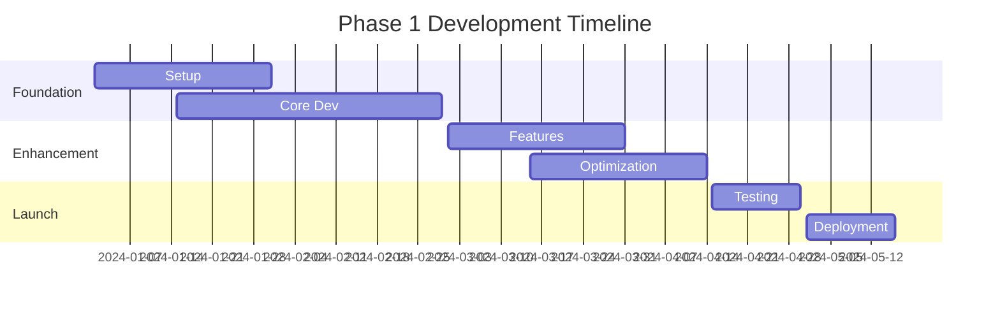

### Technical Stack Evolution
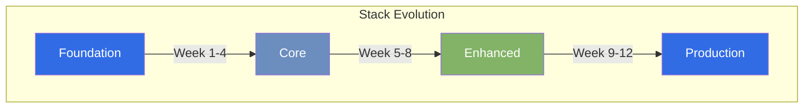

#### Phase 1A: Core Platform (Weeks 1-6)
- **Foundation Building**
    - Order processing system
    - Data validation
    - Basic routing
    - Initial clustering

#### Phase 1B: Advanced Features (Weeks 7-12)
- **Intelligence Layer**
    - ML-based clustering
    - Dynamic routing
    - Traffic integration
    - Performance optimization

## Technical Implementation

### Technology Stack
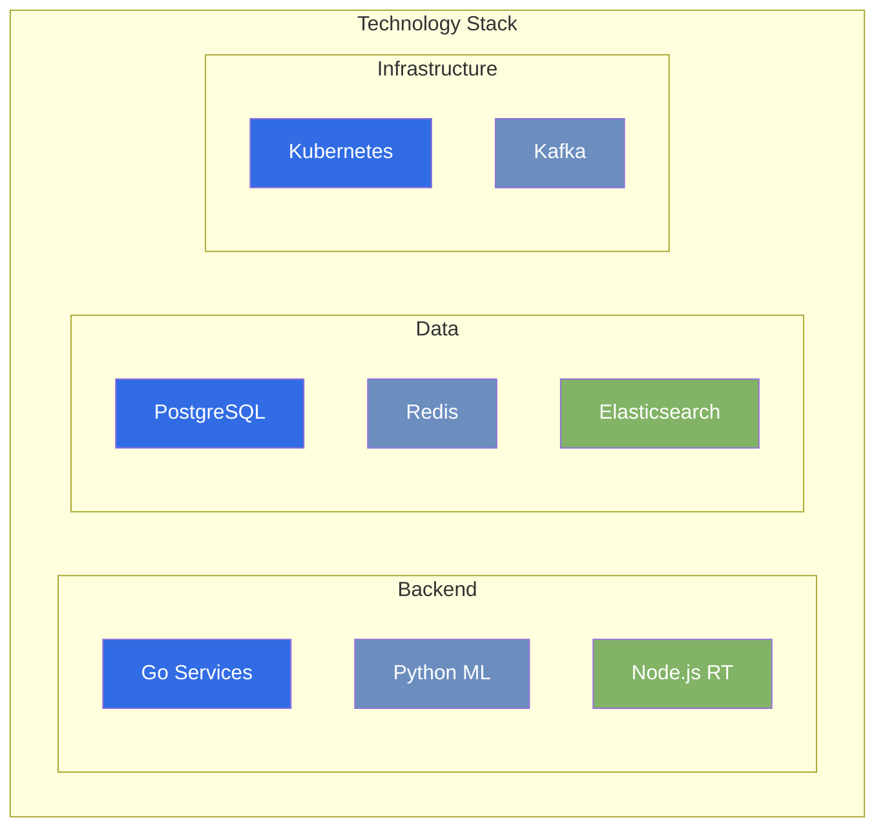

## Success Metrics

### Performance Targets
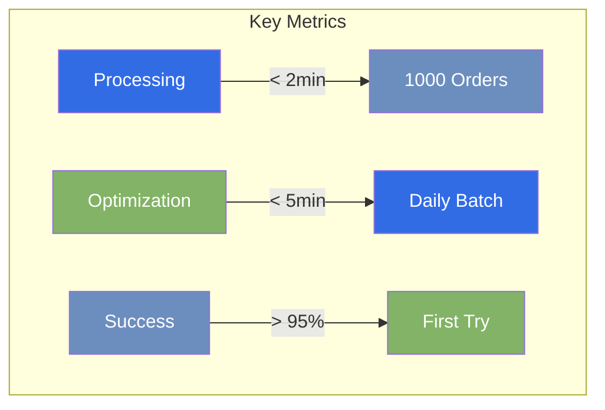

### Business Impact
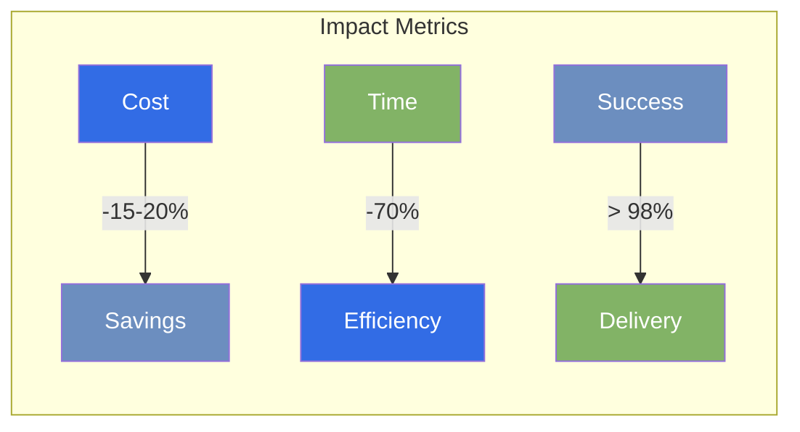

## Risk Management

### Risk Analysis
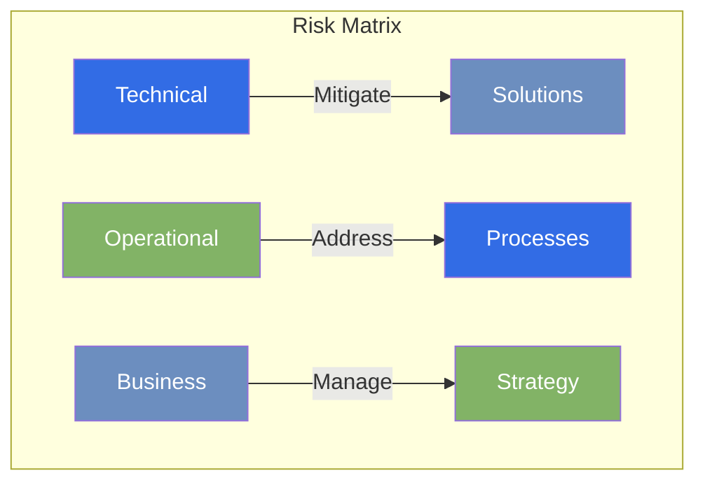

### Mitigation Strategies
- **Technical Risks**
    - Scalable infrastructure
    - Redundant systems
    - Performance monitoring
    - Fallback mechanisms

- **Operational Risks**
    - Process automation
    - Error handling
    - Quality assurance
    - Continuous monitoring

[View Security Requirements →](/tech/specs/security)

## Next Steps

### Implementation Roadmap
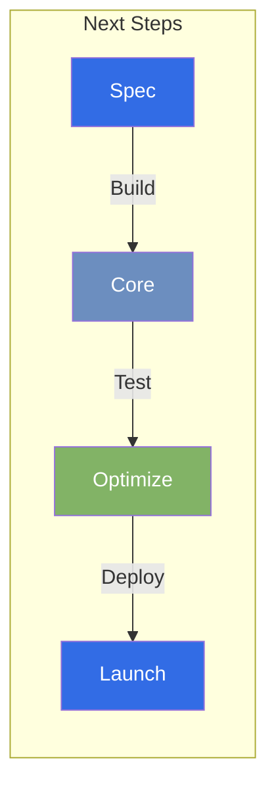

1. **Technical Foundation**
   - Specification finalization
   - Architecture validation
   - Component design

2. **Core Development**
   - Upload system
   - Route engine
   - Provider integration

3. **Enhancement**
   - Performance optimization
   - Security hardening
   - Monitoring setup

4. **Launch Preparation**
   - System testing
   - Performance tuning
   - Deployment planning

## Future Vision

### Enhancement Roadmap
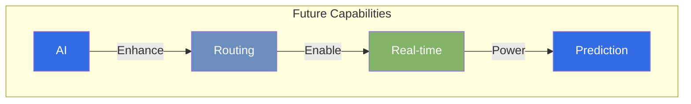

- **Advanced Intelligence**
    - Enhanced ML routing
    - Real-time adjustment
    - Smart provider matching
    - Demand prediction
    - Peak optimization

*Last Updated: 2024-12-20T07:00:28+08:00*
