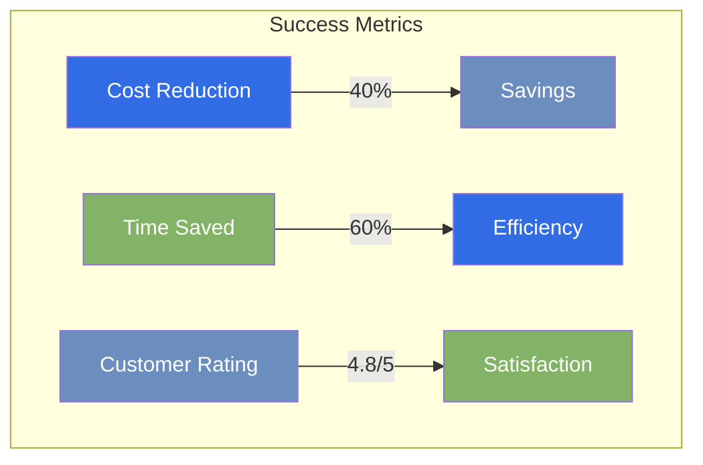
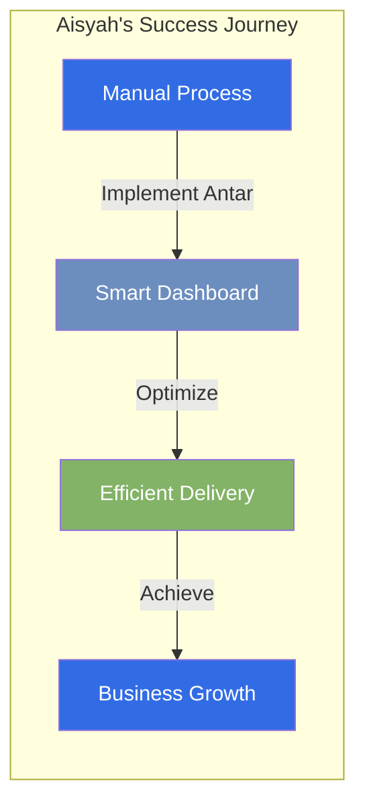
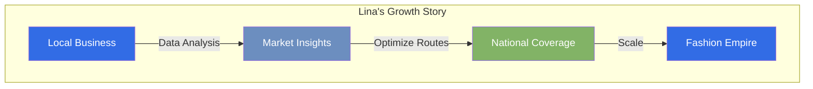
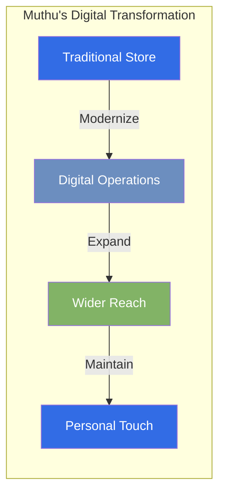
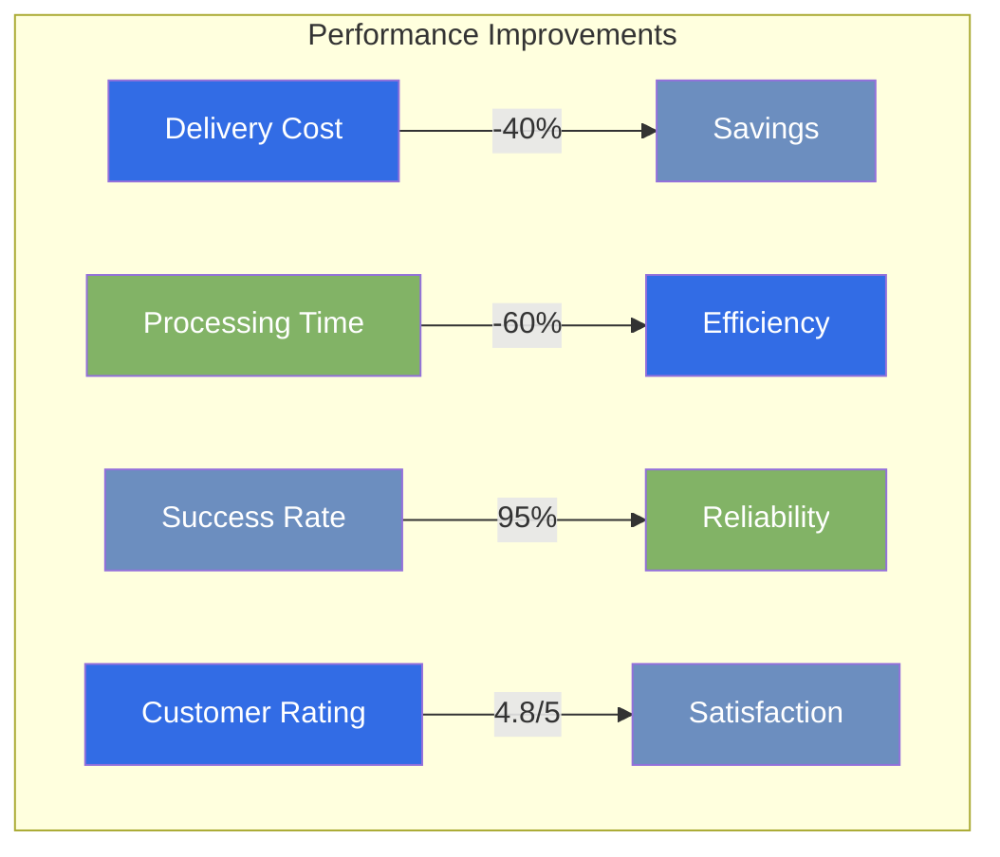
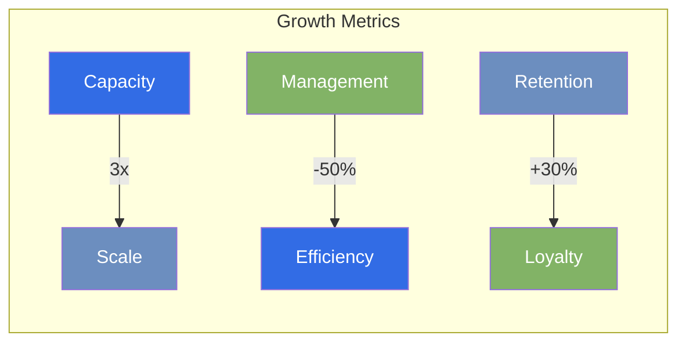
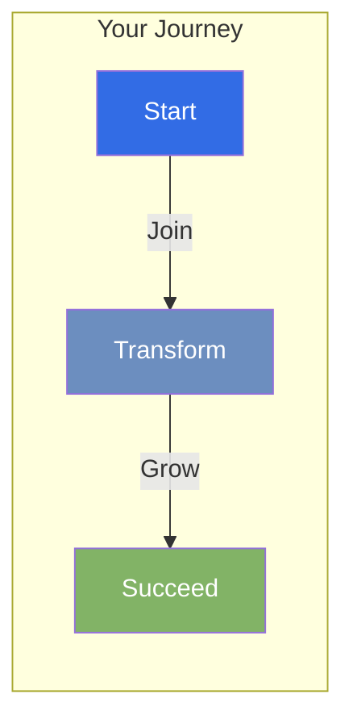

# Success Stories

## Transforming Southeast Asian Businesses
> "In the heart of Southeast Asia, where tradition meets technology, we're revolutionizing delivery management one business at a time. These are the stories of real merchants who have transformed their operations with Antar."

## Real Stories, Real Impact

### Aisyah's Bubble Tea Revolution 🧋

!!! quote "Aisyah | Bubble Tea Shop Owner, Kuala Lumpur"
    "Antar transformed my delivery operations from chaotic juggling to a seamless symphony of efficiency. Now I can focus on crafting perfect drinks while Antar handles the perfect deliveries."

#### Before Antar
- Manual order processing
- Multiple delivery apps
- Delayed deliveries
- Unhappy customers

#### After Antar
- **Smart Order Management**: Hot drinks reach customers within 30 minutes
- **Cost Optimization**: Merchandise ships through the most cost-effective routes
- **Automated Tracking**: Real-time updates for every order
- **Customer Satisfaction**: Increased by 40% with reliable deliveries

### Lina's E-commerce Empire 👗

!!! quote "Lina | Online Fashion Retailer, Jakarta"
    "From my small apartment to all of Indonesia - Antar didn't just deliver my products, it delivered on my dreams of building a nationwide fashion brand."

#### Business Intelligence
Antar's analytics platform revealed crucial insights:
- **Peak Delivery Times**: Optimal scheduling windows
- **Cost Patterns**: Most efficient delivery routes
- **Customer Hotspots**: High-demand areas
- **Performance Metrics**: Service level tracking

#### Growth Results
- 300% increase in delivery coverage
- 45% reduction in delivery costs
- 60% faster order processing
- 90% customer satisfaction rate

### Muthu's Family Grocery 🏪

!!! quote "Muthu | Family Grocery Store Owner, Bangkok"
    "Antar bridges the gap between our traditional family business and modern delivery demands. It respects our way of working while helping us serve customers better."

#### Cultural Integration
- Multilingual interface supporting Thai
- Localized terminology and preferences
- Business hours-aware scheduling
- Community-focused delivery options

#### Business Impact
- 50% increase in delivery radius
- 40% new customer acquisition
- 95% delivery success rate
- Maintained personal service quality

## Impact Metrics

### Customer Success Transformation

- **Cost Efficiency**: 40% reduction in delivery expenses
- **Speed**: 60% faster order processing
- **Reliability**: 95% successful delivery rate
- **Satisfaction**: 4.8/5 average customer rating

### Business Growth Impact

- **Operational Scale**: 3x increase in delivery capacity
- **Time Management**: 50% reduction in administrative tasks
- **Customer Loyalty**: 30% improvement in retention
- **Overall Efficiency**: 25% boost in business operations

## Your Success Story Starts Here

Ready to transform your delivery operations and write your own success story?

[Begin Your Transformation →](roadmap/phase-1-foundation.md)

*Last Updated: 2024-12-20T07:00:28+08:00*
