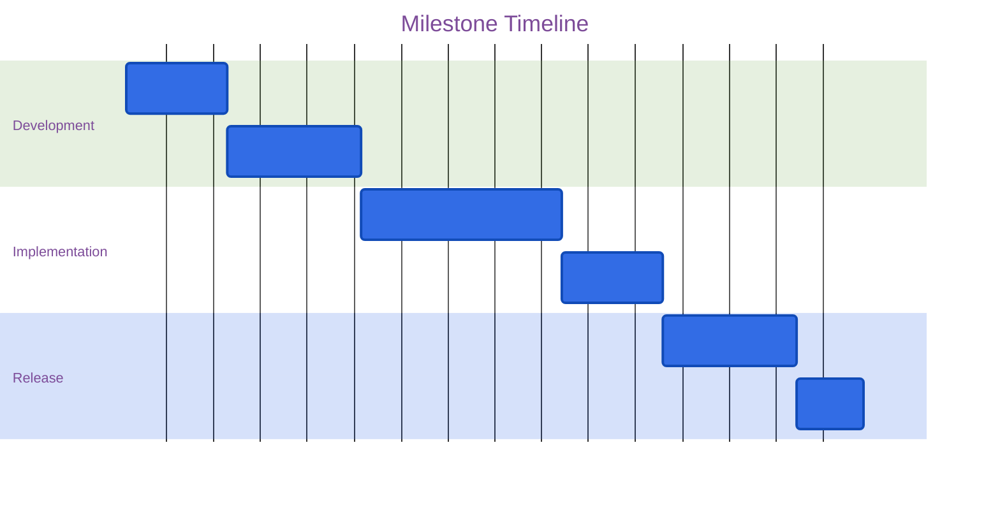

# Milestone Planning Template

## Milestone Overview
**Name**: [Milestone Name]
**Target Date**: [YYYY-MM-DD]
**Priority**: [High/Medium/Low]

## Objectives
1. [Primary objective]
2. [Secondary objective]
3. [Additional objectives]

## Deliverables
- [ ] Deliverable 1
    - Success criteria:
    - Dependencies:
- [ ] Deliverable 2
    - Success criteria:
    - Dependencies:

## Resource Requirements
- **Team Members**:
- **Tools/Technologies**:
- **External Dependencies**:

## Risk Assessment
| Risk | Impact | Probability | Mitigation |
|------|---------|------------|------------|
| Risk 1 | High/Med/Low | High/Med/Low | Strategy |

## Timeline

## Success Metrics
- [ ] KPI 1: [Target value]
- [ ] KPI 2: [Target value]

## Review Points
- [ ] Initial Review: [Date]
- [ ] Mid-point Check: [Date]
- [ ] Final Assessment: [Date]
