# Milestone Planning Template

## Vision
> "A clear path to measurable success"

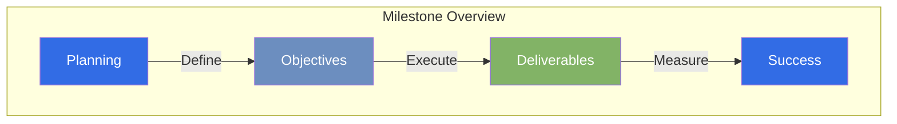

## Milestone Overview
**Name**: [Milestone Name]
**Target Date**: [YYYY-MM-DD]
**Priority**: [High/Medium/Low]

### Strategic Alignment
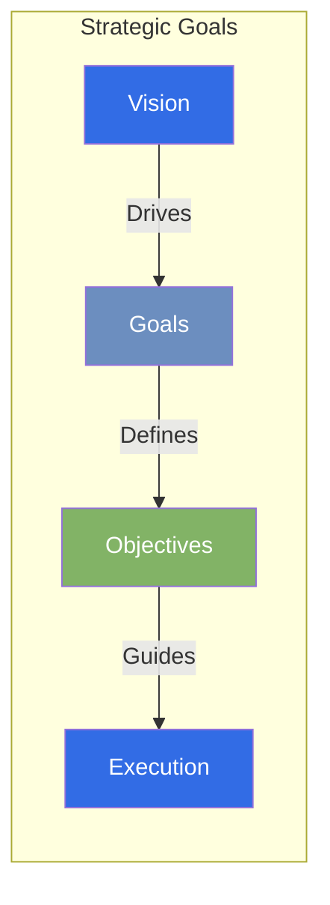

## Objectives
1. [Primary objective]
2. [Secondary objective]
3. [Additional objectives]

### Objective Hierarchy
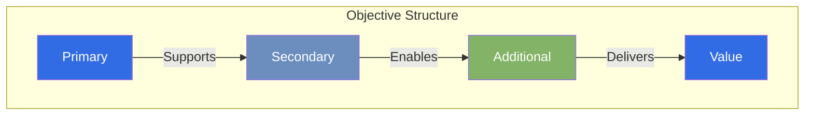

## Deliverables

### Delivery Structure
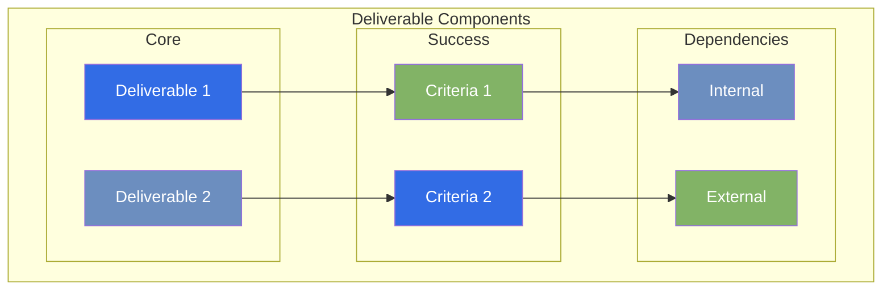

- [ ] Deliverable 1
    - Success criteria:
    - Dependencies:
- [ ] Deliverable 2
    - Success criteria:
    - Dependencies:

## Resource Requirements

### Resource Allocation
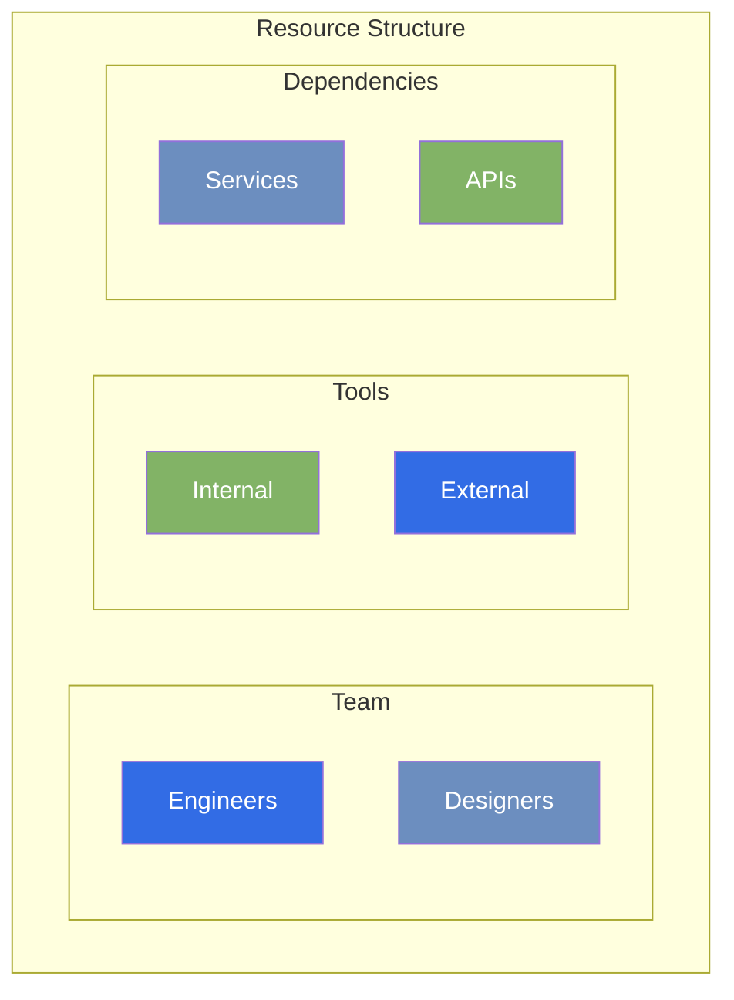

- **Team Members**:
- **Tools/Technologies**:
- **External Dependencies**:

## Risk Assessment

### Risk Matrix
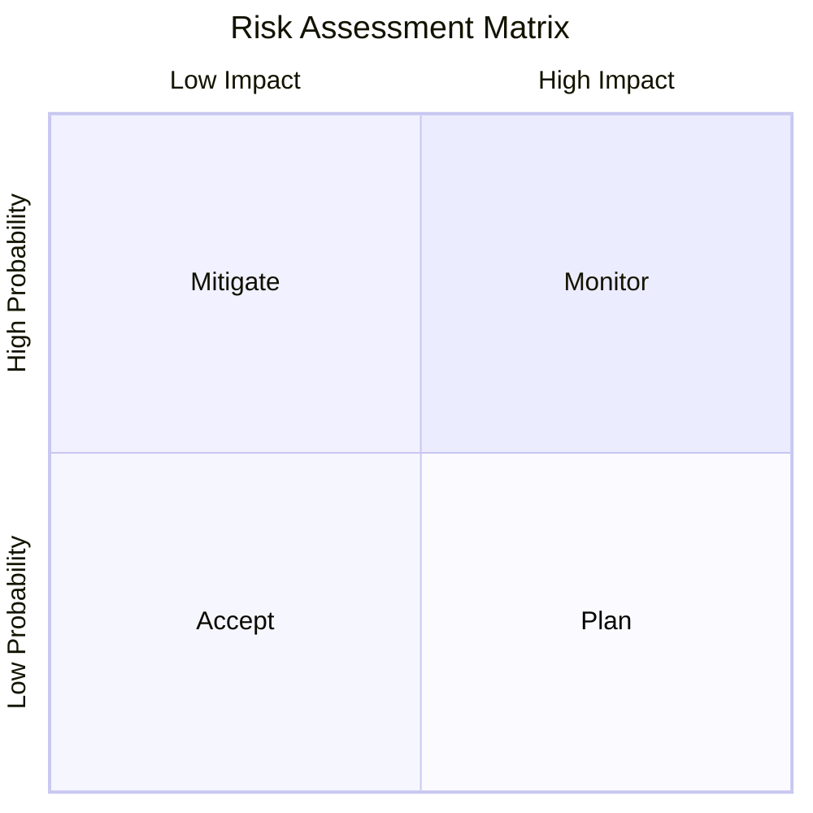

| Risk | Impact | Probability | Mitigation |
|------|---------|------------|------------|
| Risk 1 | High/Med/Low | High/Med/Low | Strategy |

### Risk Categories
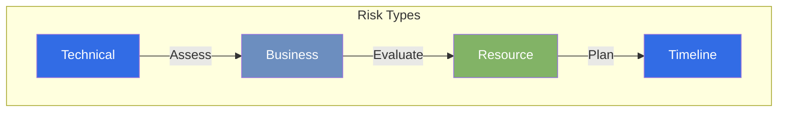

## Timeline

### Development Schedule
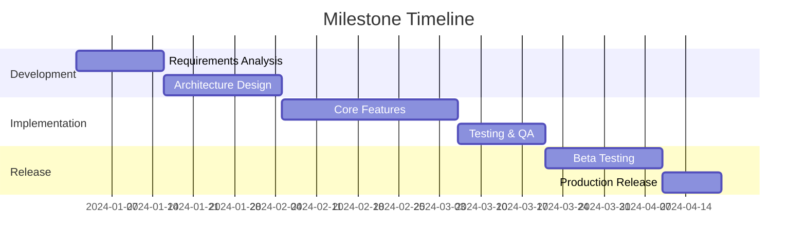

### Phase Dependencies
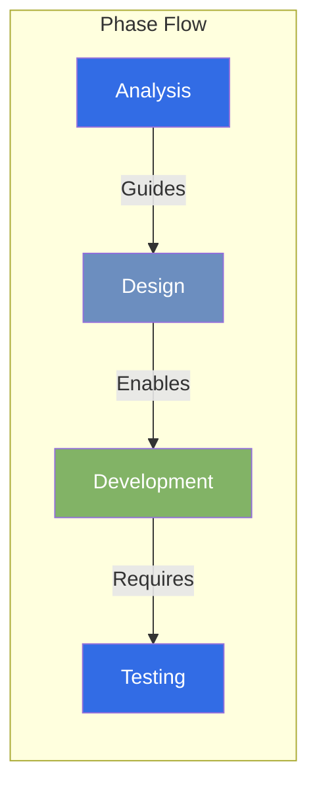

## Success Metrics

### KPI Dashboard
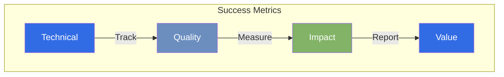

- [ ] KPI 1: [Target value]
- [ ] KPI 2: [Target value]

## Review Points

### Review Process
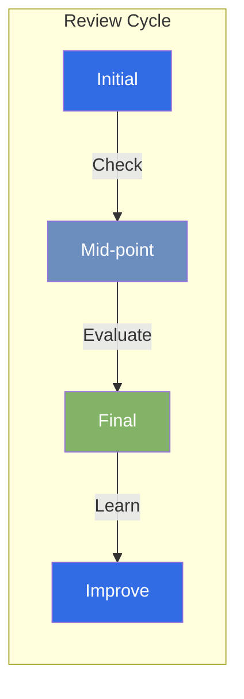

- [ ] Initial Review: [Date]
- [ ] Mid-point Check: [Date]
- [ ] Final Assessment: [Date]

## Stakeholder Communication

### Communication Flow
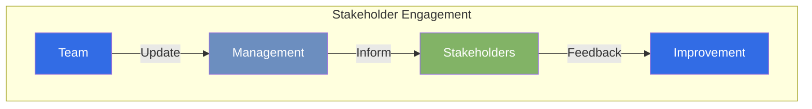

### Communication Plan
- Weekly Status Updates
- Bi-weekly Stakeholder Reviews
- Monthly Progress Reports
- Quarterly Strategic Reviews

*Last Updated: 2024-12-20T07:06:09+08:00*
