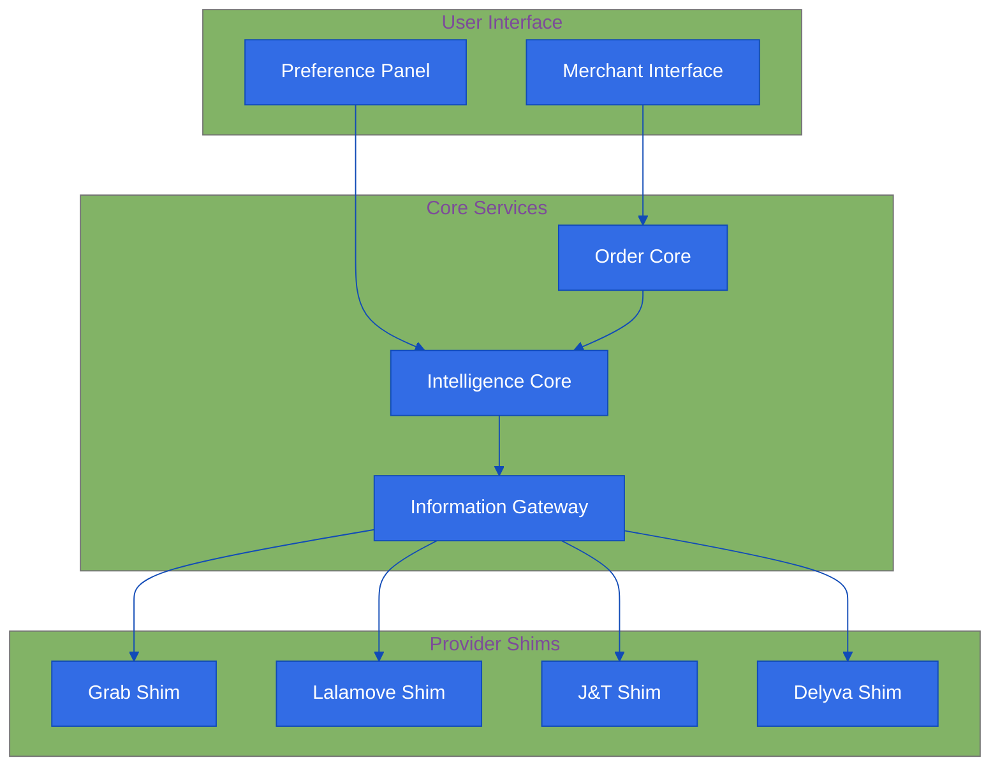

# Intelligent Delivery Service Aggregator Platform

!!! abstract "Quick Summary"
    An AI-powered platform that helps Malaysian merchants easily manage and choose between multiple delivery services (Grab, Lalamove, J&T, Delyva) based on their specific needs.

## The Challenge
Malaysian merchants struggle with delivery services because:

!!! danger "Pain Points"
    - Too Many Choices: Multiple delivery providers with different pricing
    - Time Waste: Hours spent comparing different options
    - Hard Decisions: Balancing speed, cost, and reliability
    - Management Headache: No single place to handle all deliveries
    - Complex Process: Difficult to pick the best option for each delivery

## Our Solution
We're building a smart platform with three main parts:

### 1. Intelligence Core 🧠
Makes smart decisions about your deliveries:
- Analyzes and categorizes options
- Learns your preferences
- Helps you make trade-offs
- Uses AI to predict and optimize

### 2. Order Core 📦
Handles all your delivery tasks:
- Manages and tracks orders
- Keeps status updated across providers
- Shows all orders in one place
- Analyzes past orders to help you improve

### 3. Information Gateway 🔄
Connects with delivery providers:
- Real-time integration with provider APIs
- Monitors service availability
- Tracks provider performance
- Makes all data consistent and usable

## Key Features

!!! tip "Smart Features"
    - Smart Categorization
    - Quick delivery options ⚡
    - Budget-friendly choices 💰
    - Premium/secure services 🔒
    - Balanced recommendations ⚖️
    - Easy Preferences
    - One-click selection
    - Dynamic adjustments
    - Visual trade-offs
    - Remembers your choices
    - Provider Support
        - Grab Express
        - Lalamove
        - J&T Express
        - Delyva

## How It Helps Merchants

!!! example "Real Use Cases"
    - "I want to see all delivery options when I enter pickup and delivery locations"
    - "Show me the best option based on what I care about (speed/cost/security)"
    - "Let me easily change my preferences and see what changes"
    - "Help me understand what I'm gaining or losing with each option"
    - "Let me track all my deliveries in one place"

## Future Growth 🚀

### Geographic Expansion
- More Southeast Asian markets
- Additional local providers

### New Features
- Bulk order handling
- Scheduled deliveries
- Advanced analytics
- Smart routing

### Smarter System
- Price predictions
- Smart provider selection
- Better delivery time estimates
- Merchant-specific optimizations

## Measuring Success 📊

### 1. Platform Growth
- Active merchant count
- Order volume
- Provider integration success

### 2. User Happiness
- Merchant satisfaction
- Time saved
- Good recommendations

### 3. Performance
- Cost savings
- Successful deliveries
- Platform reliability

*Last Updated: 2024-12-11T13:22:12+08:00*
