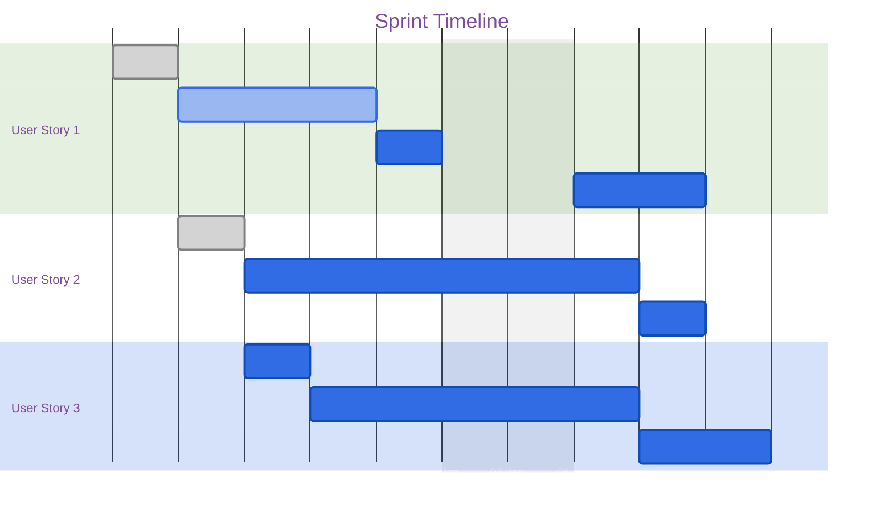

# Sprint Planning Template

## Sprint Overview
**Sprint**: [Sprint Number/Name]
**Duration**: [Start Date] - [End Date]
**Story Points**: [Total Points]

## Objectives
1. [Primary sprint goal]
2. [Secondary objectives]

## User Stories
### [Story Title]
- **ID**: [Story ID]
- **Points**: [Story Points]
- **Priority**: [High/Medium/Low]
- **Description**:
  ```
  As a [user type]
  I want to [action]
  So that [benefit]
  ```
- **Acceptance Criteria**:
  - [ ] Criterion 1
  - [ ] Criterion 2

## Technical Tasks
### [Task Title]
- **Related Story**: [Story ID]
- **Assignee**: [Name]
- **Estimated Hours**: [Hours]
- **Dependencies**:
  - [Task/Story IDs]
- **Subtasks**:
  - [ ] Subtask 1
  - [ ] Subtask 2

## Timeline


## Risk Assessment
| Risk | Impact | Mitigation |
|------|--------|------------|
| Risk 1 | High/Med/Low | Strategy |

## Resources
- **Team Members**:
  - [Name]: [Role]
- **External Dependencies**:
  - [Dependency]: [Status]

## Definition of Done
- [ ] Code reviewed
- [ ] Tests written and passing
- [ ] Documentation updated
- [ ] Deployed to staging
- [ ] Product owner approval

## Metrics
- [ ] Velocity target
- [ ] Quality metrics
- [ ] Technical debt addressed

## Notes
- Sprint planning notes
- Technical decisions
- Dependencies
