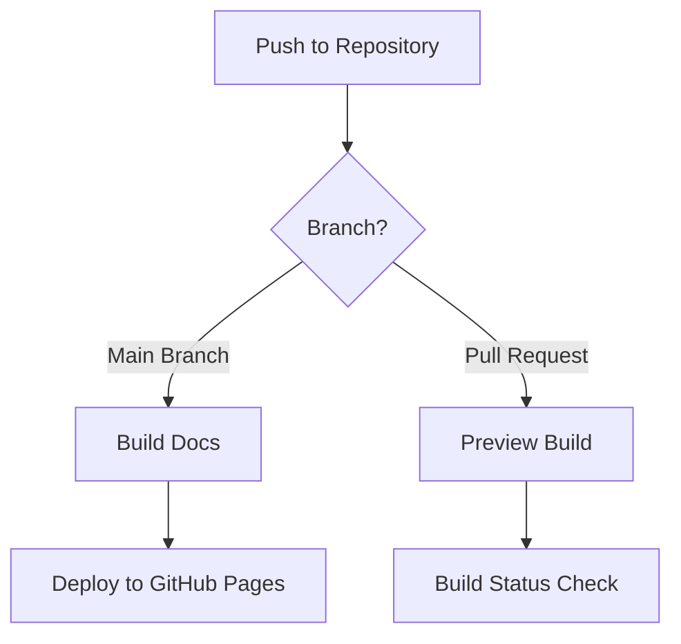

# Continuous Integration and Deployment

## Documentation Pipeline

Our documentation is automatically built and deployed using GitHub Actions. This ensures that our documentation is always up-to-date and easily accessible.

### Pipeline Overview



### Features

1. **Automatic Builds**
   - Triggers on every push to main
   - Triggers on pull requests
   - Uses caching for faster builds
   - Supports Mermaid diagrams

2. **Environment Setup**
   - Python 3.11 with pip caching
   - Node.js 18 for Mermaid support
   - All dependencies automatically installed

3. **Quality Checks**
   - Documentation builds verified
   - Preview builds for pull requests
   - Visual regression testing available

4. **Deployment**
   - Automatic deployment to GitHub Pages
   - Only deploys from main branch
   - Force pushes to keep history clean
   - Uses GitHub's built-in hosting

### Configuration

The pipeline is configured in `.github/workflows/docs.yml` and includes:

```yaml
name: Deploy Documentation

on:
  push:
    branches:
      - main
  pull_request:
    branches:
      - main

jobs:
  deploy:
    runs-on: ubuntu-latest
    steps:
      - uses: actions/checkout@v4
      - name: Setup Python
        uses: actions/setup-python@v4
      # ... additional steps
```

### Access and Monitoring

1. **Documentation Access**
   - Live site: [https://dolpheyn.github.io/antar/](https://dolpheyn.github.io/antar/)
   - Build status: Check GitHub Actions tab
   - PR previews: Available in PR comments

2. **Troubleshooting**
   - Check Actions tab for build logs
   - Verify dependencies in `requirements.txt`
   - Test locally using `python 00.py docs build`

### Best Practices

1. **Documentation Updates**
   - Test locally before pushing
   - Use preview builds in PRs
   - Keep diagrams up to date
   - Monitor build status

2. **Maintenance**
   - Regularly update dependencies
   - Monitor build times
   - Review and update workflows
   - Keep documentation fresh

*Last Updated: 2024-12-11T15:38:07+08:00*
