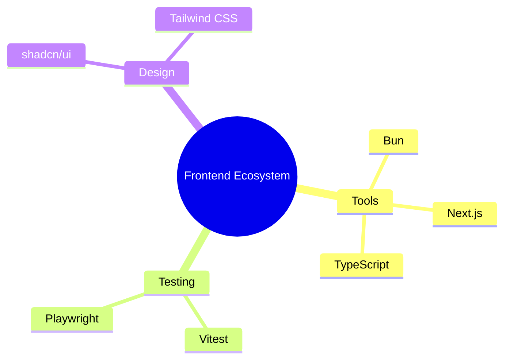
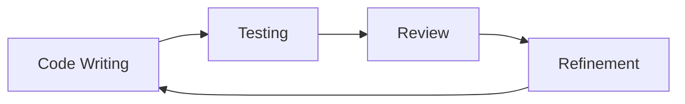

# The Frontend Development Journey: Crafting Digital Experiences with Intention 🚀

## Our Philosophical Approach

We don't just write code—we create experiences, solve problems, and build bridges of understanding.

### The Human Behind the Technology
Our frontend is more than pixels and interactions. It's a conversation between technology and human needs.

## Technology Landscape

### Core Technologies
- **Runtime**: Bun 1.0.x+ (Lightning-fast JavaScript runtime)
- **Framework**: Next.js 14.x+ (Intelligent React framework)
- **Language**: TypeScript 5.x+ (Bringing clarity and safety to our code)
- **Styling**: Tailwind CSS
- **Component Library**: shadcn/ui

### Ecosystem Overview



## Development Workflow: A Collaborative Symphony

### Project Initialization
Our journey begins with intentional setup:

1. **Tool Selection**
   - Performance-first approach
   - Flexibility for team creativity

### Continuous Improvement Ritual



## Quick Navigation

### Development
- [Workflow](development/workflow.md)
- [Technology Stack](development/technology-stack.md)

### Setup
- [Installation](setup/installation.md)
- [Dependencies](setup/dependencies.md)
- [Configuration](setup/configuration.md)

### Testing
- [Testing Strategy](testing/strategy.md)
- [Testing Tools](testing/tools.md)
- [Test Examples](testing/examples.md)

### Maintenance
- [Tasks and Improvements](maintenance/tasks.md)

## 🛠 Quick Start

### Prerequisites
- Basic JavaScript/TypeScript knowledge
- Familiarity with React
- Modern web development concepts

### Setup Steps
```bash
# Install Bun
curl -fsSL https://bun.sh/install | bash

# Clone project
git clone https://github.com/your-org/antar.git
cd antar/frontend

# Install dependencies
bun install

# Start development server
bun dev
```

## 🤝 Contribution Guidelines

1. Spot an issue? Open a GitHub Issue
2. Have a suggestion? Create a Pull Request
3. Unclear explanation? Request clarification

## 🌱 Continuous Learning

### Recommended Learning Track
1. **Foundations** (1-2 weeks)
   - TypeScript Deep Dive
   - React Hooks Mastery
   - State Management Principles

2. **Framework Expertise** (2-3 weeks)
   - Next.js Advanced Patterns
   - Server-Side Rendering
   - Static Site Generation

3. **Testing Mastery** (1-2 weeks)
   - Unit Testing Strategies
   - Component Testing
   - End-to-End Workflow Automation

## 🔭 Emerging Technologies Watch
- WebAssembly Integration
- AI-Assisted Development
- Serverless Architectures
- Edge Computing Patterns

*Last Updated*: 2024-12-22
*Crafted with ❤️ by the Antar Frontend Team*
