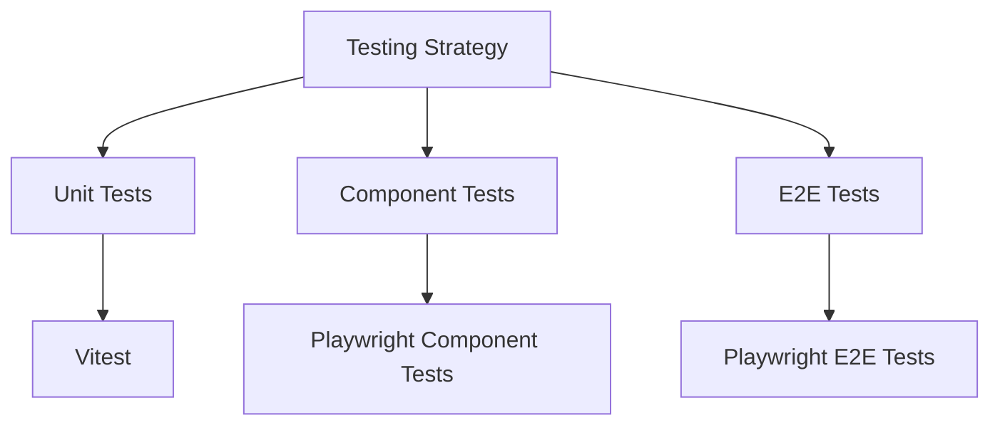

# Frontend Testing Strategy

## Testing Pyramid



## Testing Tools
- **Unit Testing**: Vitest
- **Component Testing**: Playwright Component Tests
- **End-to-End Testing**: Playwright

## Testing Layers
- **Unit Tests**: Validate individual functions
- **Component Tests**: Ensure UI component integrity
- **E2E Tests**: Simulate real-world user journeys

## Dependencies
```bash
# Install testing dependencies
bun add -D vitest 
bun add -D @testing-library/react 
bun add -D @testing-library/user-event
bun add -D @types/vitest 
bun add -D jsdom 
bun add -D c8
bun add -D @playwright/test 
bun add -D @playwright/experimental-ct-react
bunx playwright install
```

*Last Updated*: 2024-12-22
